---
demo:
    title: 'Legal Demo'
---

[Back to Index](https://microsoftlearning.github.io/MS-4021-Copilot-Immersion-Experience/)

# Legal Demo

**Scenario:**  

You’re a legal advisor at Contoso, responsible for assessing whether the company’s AI Resume Screening Software complies with the EU AI Act. Your goal is to research legal risks, draft an executive summary, and communicate recommendations to leadership.

## Demo Setup

There are no sample documents required for this demo.

## Demos

### Copilot Chat

Let’s start by researching the EU Artificial Intelligence Act and its potential impact on Contoso’s AI hiring tool.

1. Open a browser and navigate to [M365copilot.com](https://m365copilot.com/).

    

1. Ensure **Web** mode is selected.

    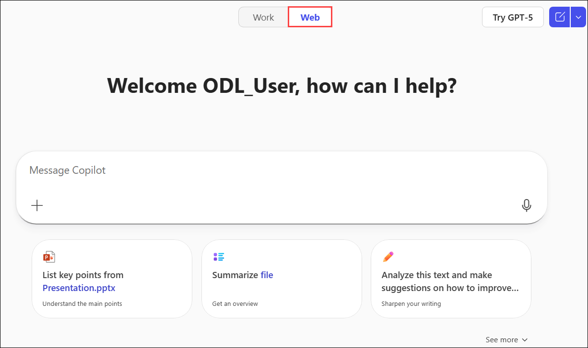

1. In the prompt window, type the following:

    ```text
      Contoso is launching an AI Resume Screening Software to evaluate job applicants. As a legal advisor, I need to assess whether it complies with the EU Artificial Intelligence Act. Summarize key provisions related to AI in hiring, compliance requirements for high-risk systems, and potential legal risks.
    ```

1. Review Copilot’s response and take notes on relevant legal risks and compliance requirements.

1. Now we will ask Copilot a series of follow up questions to gather more information:

    ```text
    Does the AI Act classify resume screening software as a high-risk AI system?
    ```

    ```text
    What are the key obligations for high-risk AI systems under the AI Act?
    ```

    ```text
    Are there any exemptions in the AI Act that could apply to Contoso’s system?
    ```

1. Now ask Copilot to summarize all the information so far:

    ```text
    Summarize all the information we've discussed into a structured list, ensuring no key details are missed. Then, export the summary to a Word document
    ```

1. Select the **hyperlink** that Copilot provides to the newly created file to **download** it to your Downloads folder.

    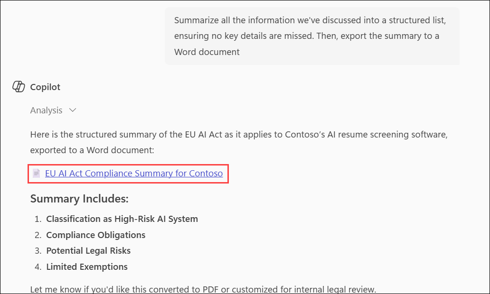

1. In the left navigation pane of the M365 Copilot homepage, click **Apps (1)**, then select **Word (2)** under the Apps section.

    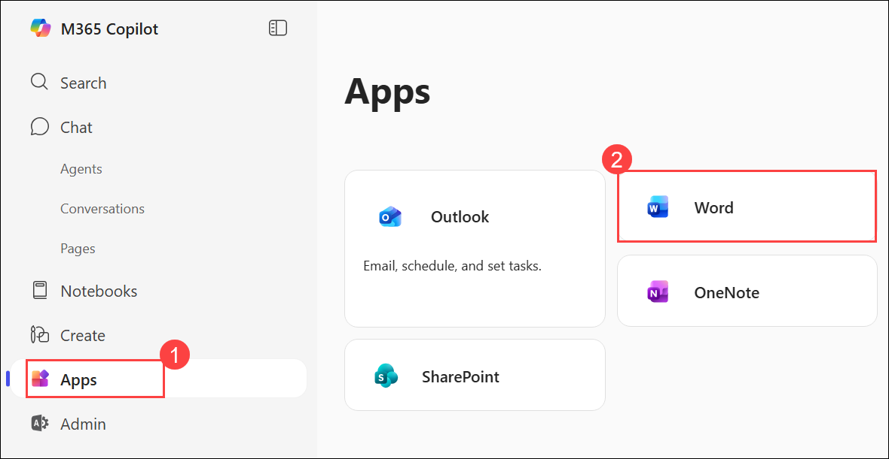

1. On the Word homepage, click **Upload a file (1)**. In the Open dialog, choose the file **(2)** you downloaded in the previous step, then click **Open (3)**.

    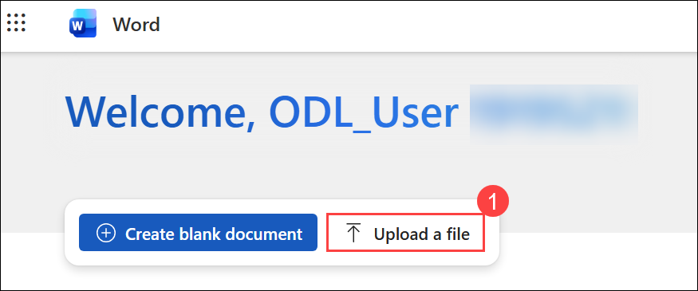

    .png)

1. After the document opens, click the **Share (1)** drop-down and select **Copy Link (2)** to copy the shared URL for the next step.

    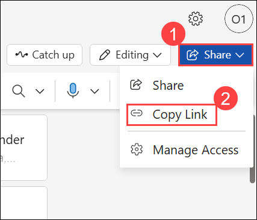

### Copilot in Word

Now, we’ll draft an executive summary outlining legal risks and recommendations for Contoso’s leadership.

1. Open a new instance of Word. On the Word homepage, click on **+ Create blank document**.

    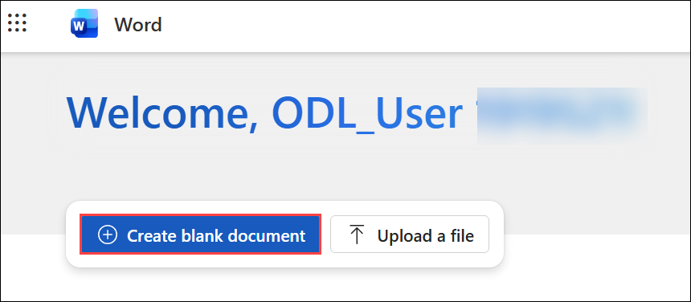

1. In the **What do you want Copilot to draft?** prompt box, paste the following text, add the link you copied in the previous task where indicated, and then press **Enter**.

    ```text
    Reference the following document [Link to exported Copilot Chat summary from the first task] and draft an executive summary outlining key legal risks, compliance requirements, and recommendations for Contoso’s AI Resume Screening Software.
    ```

    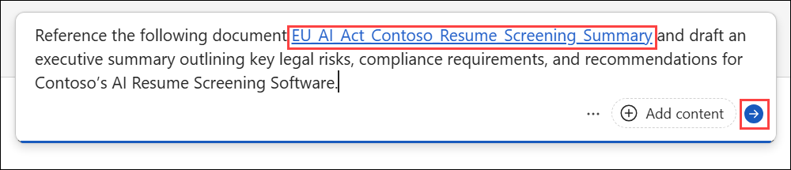

    > **NOTE:** Attach the document or paste the shared link directly into the prompt to ensure Copilot can access the relevant content.

1. Review Copilot’s output. Before selecting **Keep it**, refine the response by asking Copilot:

    ```text
    Add a section on the potential business impact of these compliance requirements.
    ```

    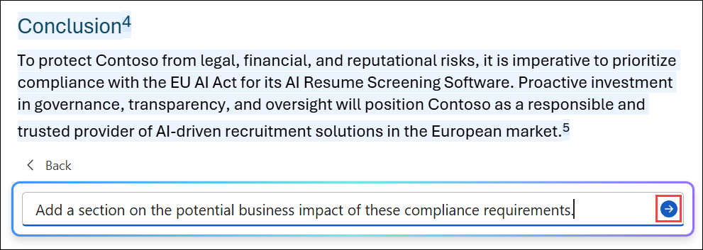

1. Other optional refinements:

    - Ask Copilot to reword sections for a more professional tone.
    - Request a shorter, more concise version if the summary is too long.
    - Expand with additional sections.

1. After reviewing and finalizing the document, copy the entire generated **Executive Summary** to your clipboard for use in the next task.

### Copilot in Outlook

Lastly, we’ll draft an email to Contoso’s leadership summarizing our findings and next steps.

1. Click on the **Apps (1)** fromt he left navigative apne and then select **Outlook (2)** under Apps section.

    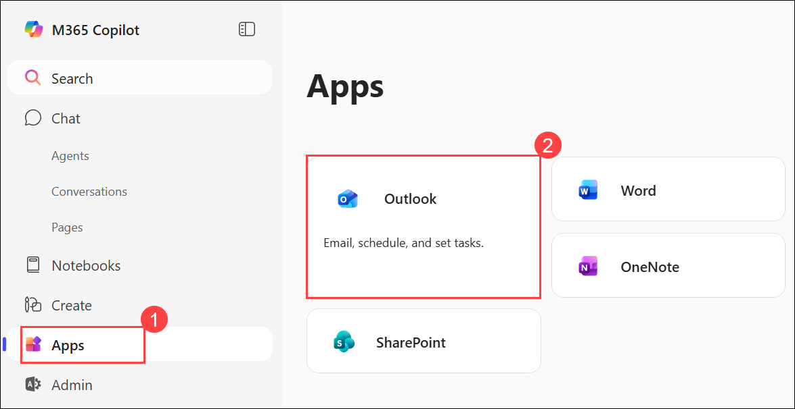

1. On the Outlook homepage, select **New Email**.

    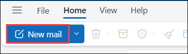

1. Click the **Copilot (1)** icon in the Outlook ribbon, then select **Draft (2)** from the drop-down menu.

    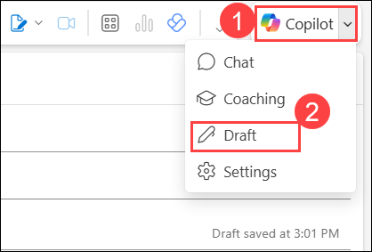

1. In the **What do you want this email to say?** prompt window, paste the following text and insert the Executive Summary you copied in the previous task where indicated, and then press **Enter**.

   ```text
    Draft an email to Contoso’s executive leadership summarizing our legal assessment of the AI Resume Screening Software under the EU AI Act. Use the following executive summary as a reference.

    [paste Executive Summary from the previous task]

    Conclude the email with a request for leadership’s input on the next steps, including a proposed compliance review meeting.
   ```

    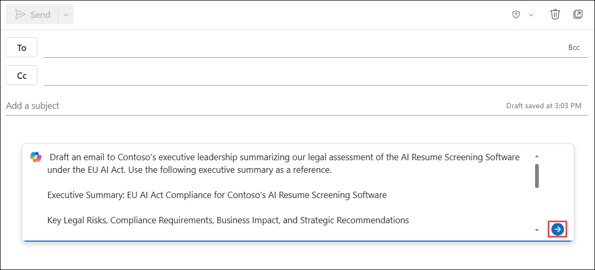

    > **NOTE:** Paste the Executive Summary contents that you copied from the previous demo.

1. Once the draft is generated, you can use the **Adjust** feature to modify the tone, length, or level of formality.

    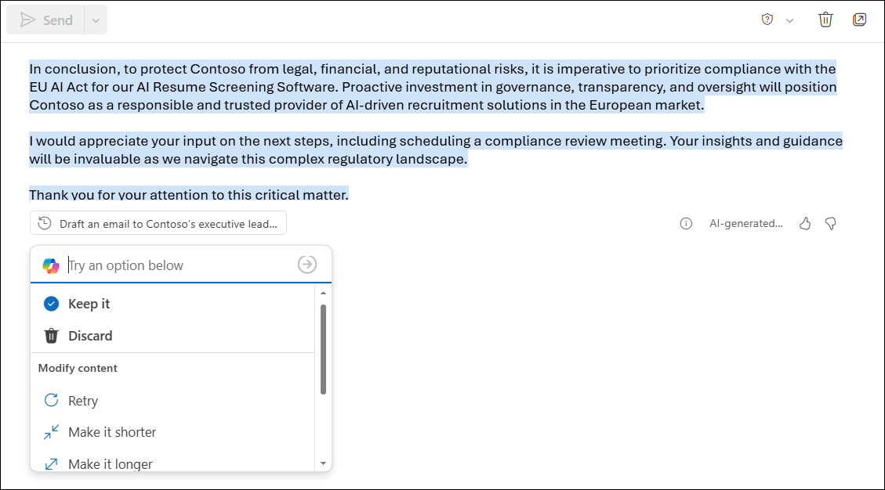

[Back to Index](https://microsoftlearning.github.io/MS-4021-Copilot-Immersion-Experience/)
