---
demo:
    title: 'Finance Demo'
---

[Back to Index](https://microsoftlearning.github.io/MS-4021-Copilot-Immersion-Experience/)

# Finance Demo

**Scenario:**  

You’re a financial analyst at Contoso, responsible for evaluating sales performance and market positioning in the EV charging industry. Your goal is to analyze sales data, generate insights, and prepare a summary for your team.

## Demo Setup

The sample documents can be found in the MS-4021 GitHub repository [here](https://github.com/MicrosoftLearning/MS-4021-Copilot-Immersion-Experience/tree/master/ResourceFiles):

The specific files needed for this demo are:

- [EV_Charger_Sales_Analysis_v1.xlsx](https://github.com/MicrosoftLearning/MS-4021-Copilot-Immersion-Experience/raw/master/ResourceFiles/EV_Charger_Sales_Analysis_v1.xlsx)

### Copilot in Excel  

Use Copilot in Excel to analyze sales data, identify key trends, and calculate financial metrics.

1. Click on the **Apps (1)** from the left navigative pane and then select **Excel (2)** under Apps section.

     

1. Click on the **Upload a file** button, and from the Open dialog, select the file `EV_Charger_Sales_Analysis_v1.xlsx` **(1)** and click on **Open (2)**.

    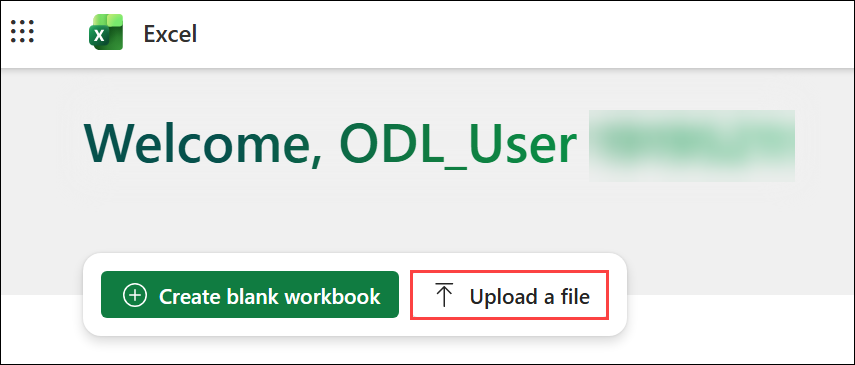

    .png)

1. Navigate to the **"Sales by Product"** tab.
    
    

1. From the **Home (1)** tab, select **Copilot (2)** from the excel ribbon, then select **App skills (3)** to open the Copilot pane.

    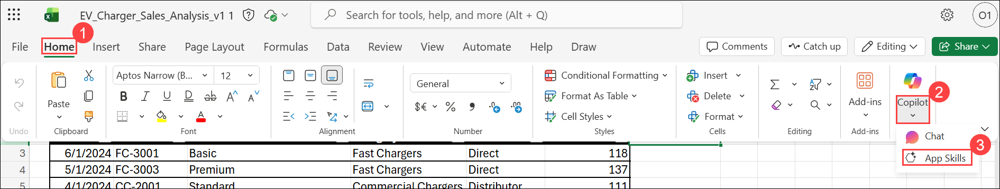

1. Use Copilot to sort the table by entering the following prompt:  

    ```text
    Sort the table by date in descending order, from the most recent to the oldest entry.
    ```  

    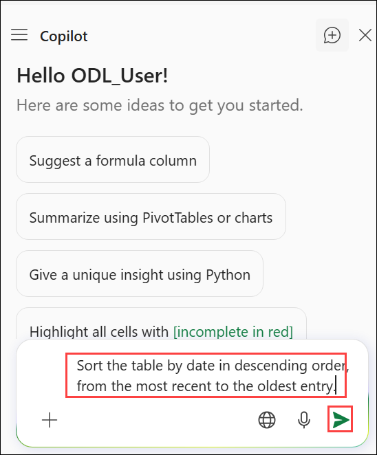

    - Copilot sorts the table and updates the dataset.  
    - Select **"Apply"** after sorting.

        .png)  

1. To Insert a ‘Total Revenue’ Column, use the following prompt in the Copilot pane:  

    ```text
    Add a new column named 'Total Revenue'. Populate it by multiplying 'Units Sold' by 'Product Price' for each row.
    ```  

    - Copilot creates the new column and applies the formula.  
    - Select **Insert Column**.

        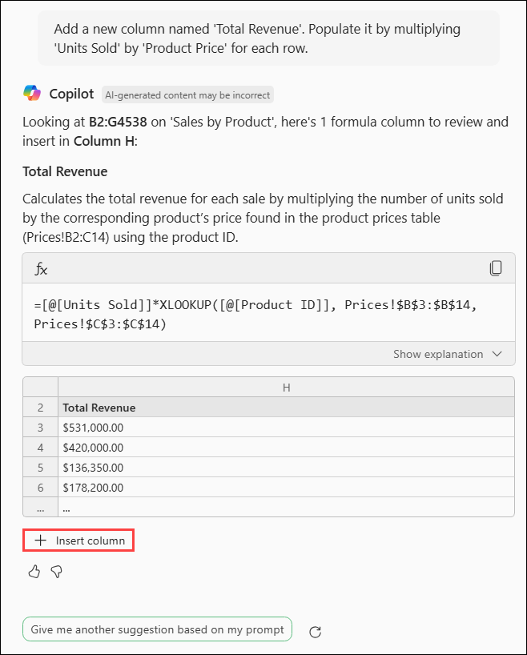  

1. Generate a Sales Summary Table for 2024. Enter the following prompt in the Copilot pane:  

    ```text
    Create a summary table for total sales in 2024. The table should include Product ID, total units sold, and total revenue.
    ``` 

    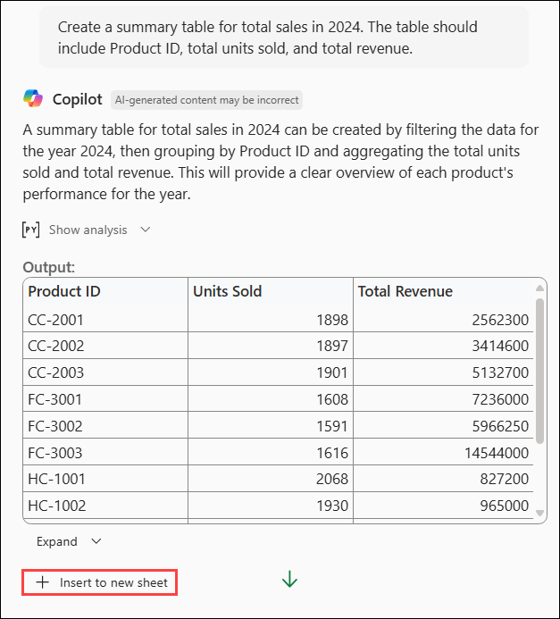   

    - Copilot generates a summary table.  
    - Select **Insert a new sheet** to store the table separately.  
    - Ensure the table includes **only 2024 data**.

        .png)

    - Navigate back to the **"Sales by Product"** tab or select **"Go back to data"** under Copilot’s last response.

1. Identify the Best-Selling Product. Enter the following prompt in the Copilot pane:  

    ```text
    Identify the product ID with the highest total revenue in 2024. Provide both total revenue and total units sold for better comparison.
    ```

    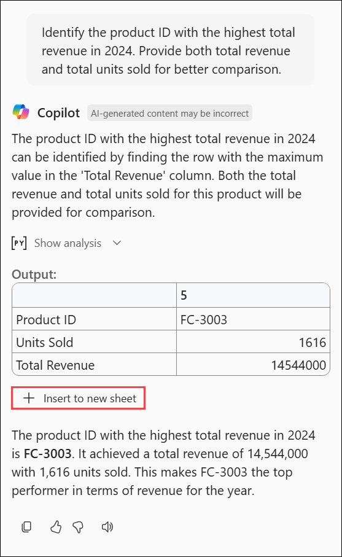   
  
    - Copilot analyzes the dataset and provides the top-selling product.

1. Sort Customers by Revenue:

    - Navigate to the **Customers** sheet in Excel. Enter the following prompt in the Copilot pane:  

        ```text
        Sort the 'Customers' tab by annual revenue in descending order.
        ```  

    - Copilot sorts the customers by **annual revenue**.  
    - Select **"Apply"** after sorting.

        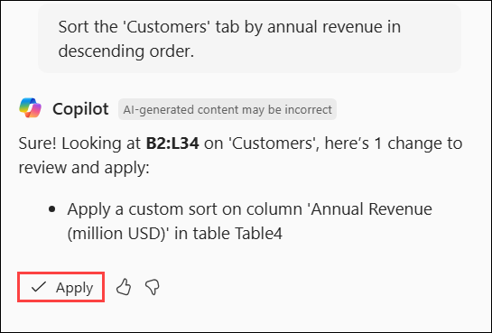   
  
1. Calculate Average Revenue Per Customer. Enter the following prompt:  

    ```text
    Calculate the average revenue per customer. Insert a row in the sheet.
    ```  

    - Copilot calculates the average and adds the result.  
    - Select **Insert Row** to store the average revenue value.

        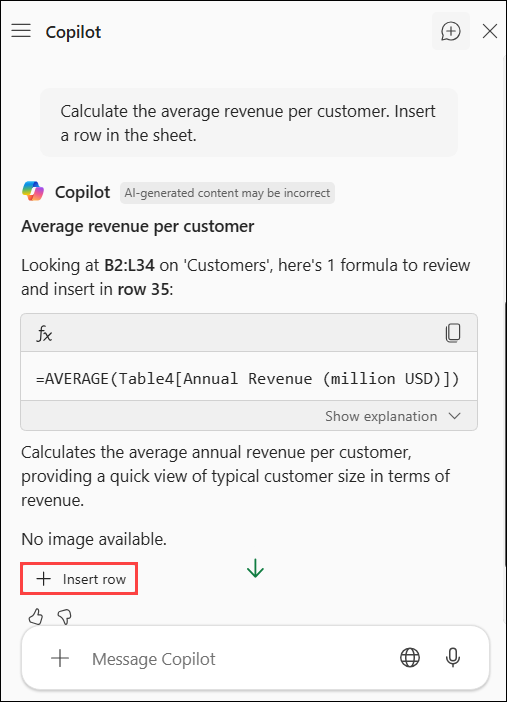   
  
1. Find the Industry Using the Most Power. Enter the following prompt in the Copilot pane:  

    ```text
    Analyze the data to determine which industry has the highest total power consumption. Provide the industry name and total power usage.
    ```  

    - Copilot processes the data and returns the industry with the highest power consumption.

        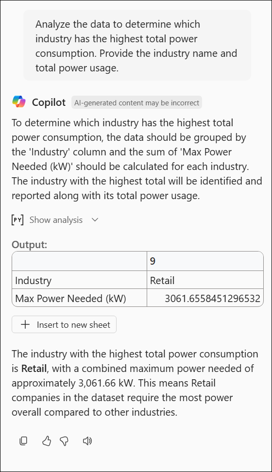 

1. Click on the **Share (1)** drop-down and select **Copy link (2)**.

    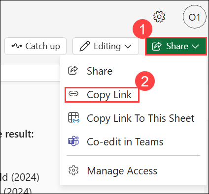

    .png)

### Copilot Chat

Use Copilot Chat to compare financial performance with industry benchmarks and competitors.

1. Open a browser and navigate to [M365copilot.com](https://m365copilot.com/).

1. Ensure **Web** Mode is selected.

    

1. In the prompt window, type the following:

    ```text
    Our total revenue for [EV chargers] exceeded $50,000,000 for firth half of 2024. Compare this to the industry average and provide insights on whether we are above or below industry standards. If possible, include market share estimates and trends
    ```

1. Now ask Copilot Chat to compare this to competitors:

    ```text
    Summarize the key financial statements of two major competitors in the [EV charging] industry. Include revenue, net profit, and any other relevant financial insights. If available, provide comparisons to our financial performance.
    ```

1. Lastly, ask copilot to export the chat history to date to a Word document:

    ```text
    Export this conversation, including financial insights, to a Word document for further review.
    ```

1. Select the linked file to download and then open the document.

    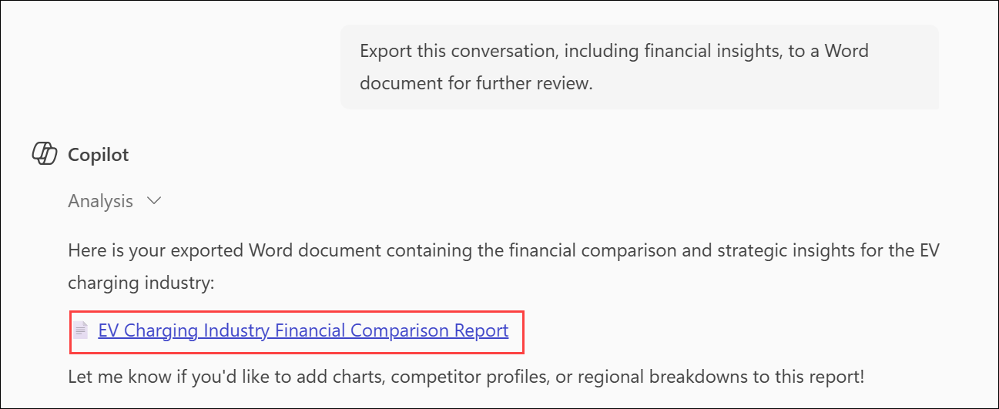

1. From the left navigation pane, select **Apps (1)** and then click on **Word (2)**.

    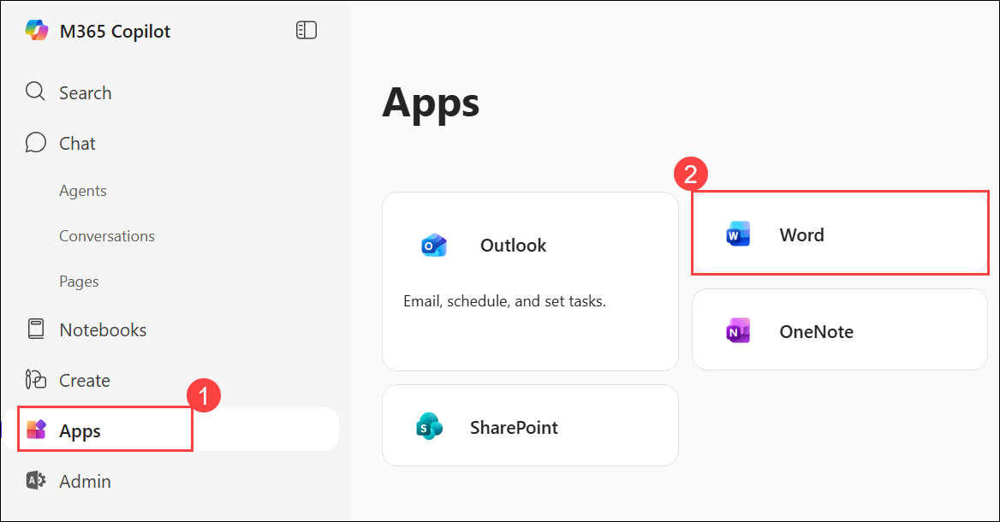

1. On the Word homepage, click on **Upload (1)**, and from the Open dialogue, select the **`EV_Charger_Sales_Analysis_v1.xlsx` (2)** and click on **Open (3)**.

    

    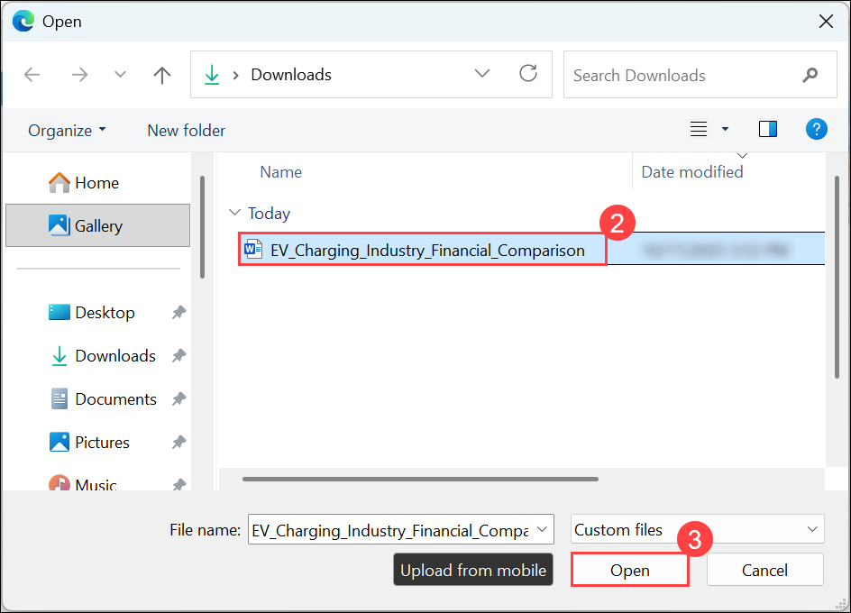

1. Change the name of the file by clicking **drop-down (1)** from the top and provide the name as **`Charging_industry_Financial_Summary` (2)**.

    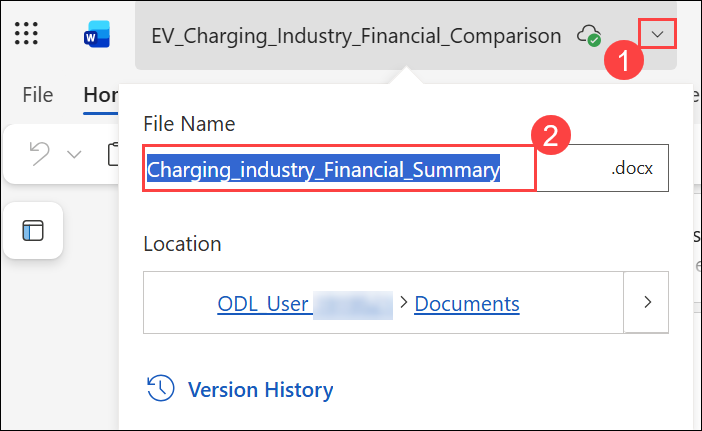

1. Click on the **Share (1)** drop-down and select **Copy link (2)** to copy the URL.

    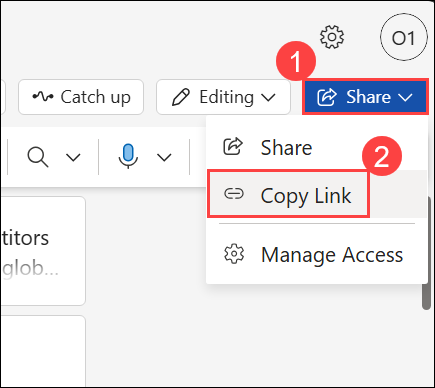

### Copilot in Word

Use Copilot in Word to summarize financial insights into an email for our team.

1. Open a new **Word** homepage and select **+ Create blank document**.

    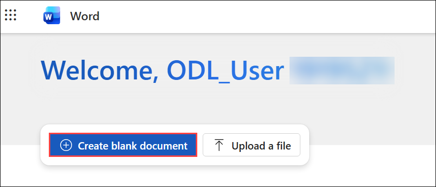

1. In the **What you want Copilot to draft?** prompt box, type the following:

    ```text
    Draft an email to my team summarizing the key insights from [Charging_industry_Financial_Summary.docx].
    ```

    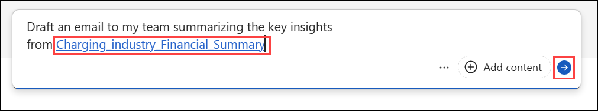

    > **NOTE:** Attach the Charging_industry_Financial_Summary.docx file created in the previous task or paste the shared link directly into the prompt to ensure Copilot has access to the relevant content.

1. Review Copilot’s output. Before selecting **Keep it**, refine the response by asking Copilot:

    ```text
    Shorten this email draft
    ```

    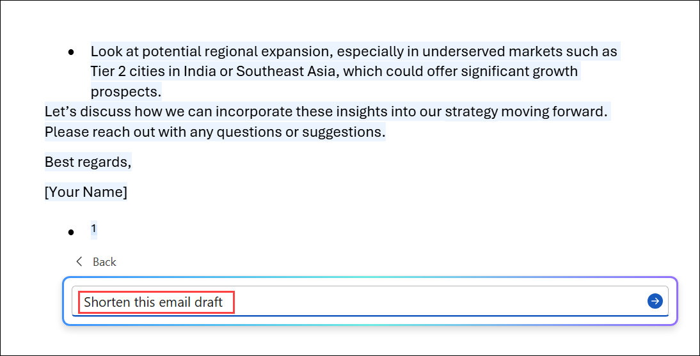

1. Other optional Refinements:

    - ask Copilot to reword sections for a more professional tone.
    - Expand with additional sections.
    - Make it less formal

1. Once finished, you can select **Keep it**.

    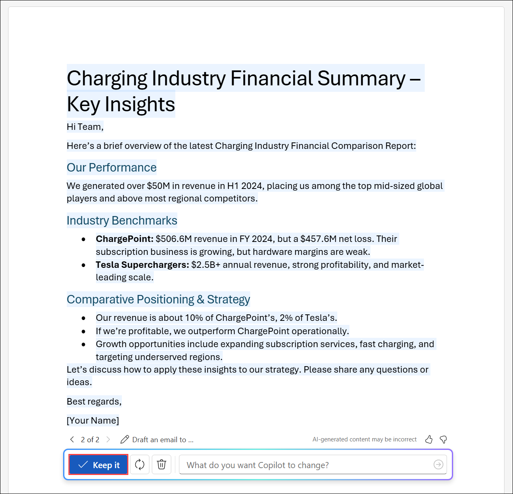

[Back to Index](https://microsoftlearning.github.io/MS-4021-Copilot-Immersion-Experience/)
