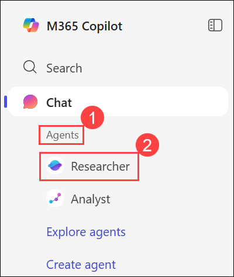
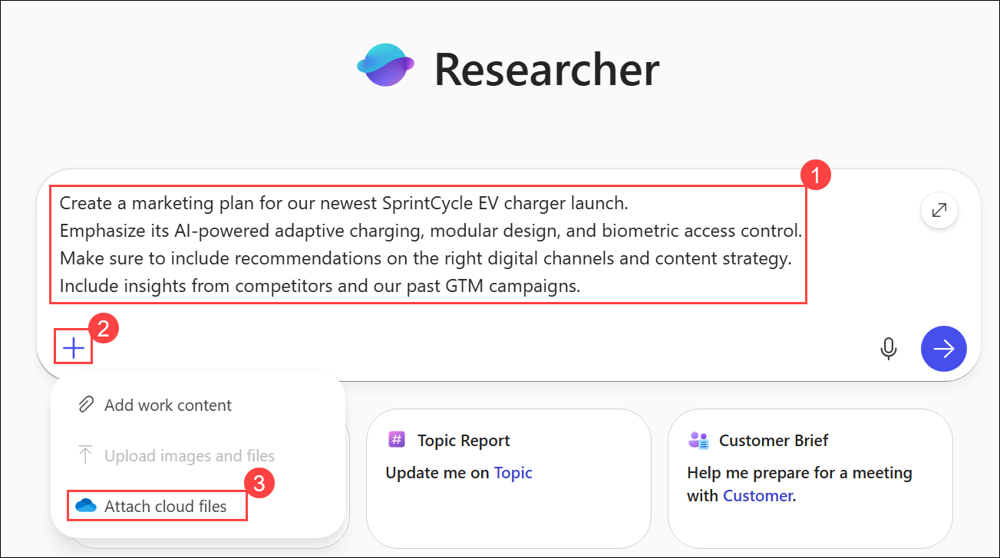
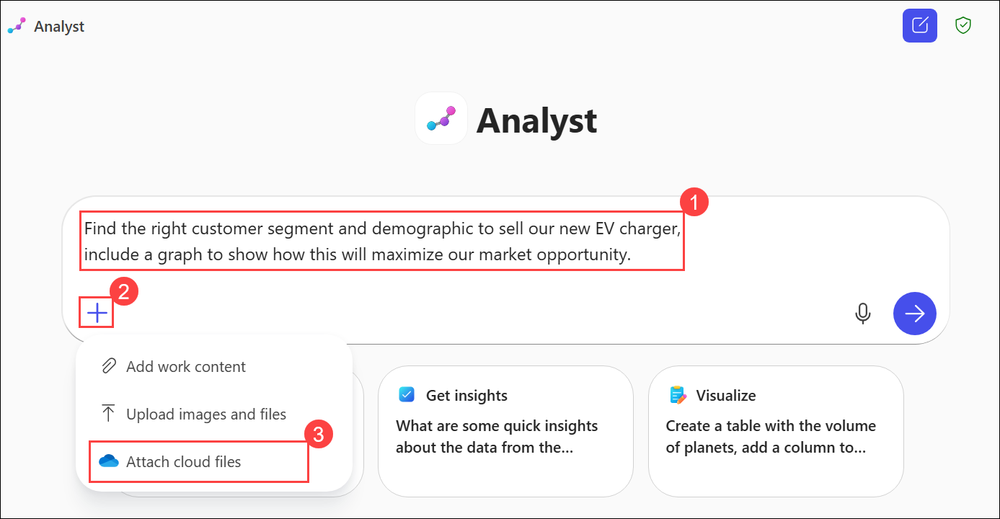
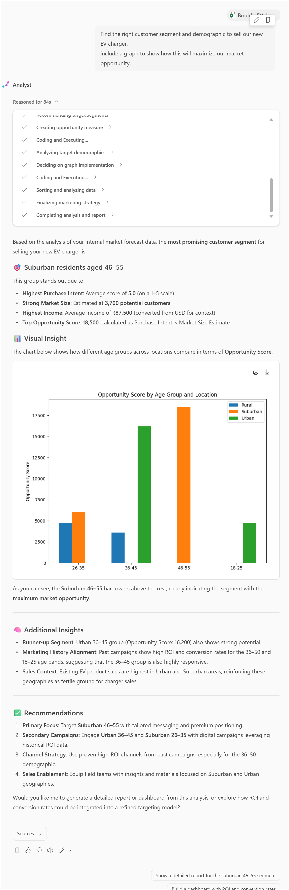
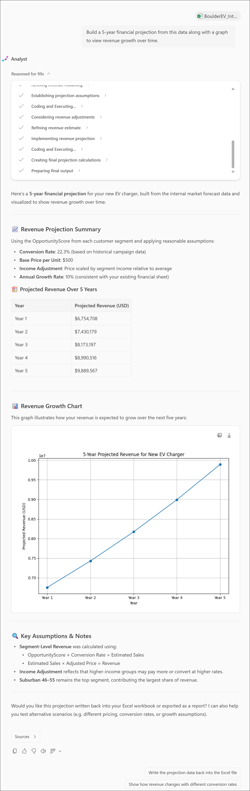

# Researcher and Analyst

### Estimated Duration: Minutes

## Overview

In this lab, you’ll explore how to use **Researcher** and **Analyst**, two expert agents built into the Microsoft Copilot app. You’ll learn how **Researcher** combines internal and web-based knowledge to build structured, well-supported marketing plans, and how **Analyst** applies data science techniques to uncover insights, perform modeling, and create visualizations. By the end, you’ll understand how both agents work together to accelerate decision-making, strategy development, and data analysis.

## Demo Setup

In order to complete these demos, you will need to download the [Researcher and Analyst Demo - Content Pack](https://microsoft.sharepoint.com/:u:/r/teams/MTTCentral/Immersion%20Experience%20Source%20Control/MS-4021%20Copilot%20Immersion%20Experience/Demos/Agent%20Demo%20Sample%20Docs/Researcher%20and%20Analyst%20Demo%20-%20Content%20Pack.zip?csf=1&web=1&e=384sFW), which contains all the necessary files and resources.  

## Talking Points

- **Researcher** acts like a highly paid consultant: it can build structured, well-cited deliverables by blending internal files, competitor intelligence, and web sources.  
- **Analyst** is like having a data scientist on hand: it builds models, runs Python code, and visualizes trends instantly.  
- Both agents explain their reasoning transparently so you can validate results.  
- Together, they accelerate strategic work—marketing plans, customer segmentation, financial projections—so you can move faster with confidence.  

## Objectives

- Task 1: Using Researcher build a Marketing Plan
- Task 2: Using Analyst for Customer Segmentation & Financial Modeling

## Task 1: Using Researcher to build a Marketing Plan

In this task, you’ll use the **Researcher** agent to create a comprehensive marketing plan for the SprintCycle EV charger launch. You’ll upload internal files, integrate competitor and campaign insights, and let Researcher generate a structured, well-cited plan that includes digital channel and content strategy recommendations.

1. From the left navigation menu, click on **Apps (1)** and then select **OneDrive (2)**.

    .png)

1. Click on **+ Create or upload (1)** and then select **Files upload (2)**. On the Open dialogue, select the following files:

    - `BoulderEV_Internal_Market_Forecast.xlsx`, `SprintCycle_Charger_Product_Launch.docx` and `Contoso-PedalPerks GTM Plan.docx` **(3)**
    - Click **Open (4)**.

        .png)

        .png)

1. From the left navigation menu, go to **Agents (1)** and then select **Researcher (2)**. 

    

1. Enter the following prompt **(1)**:

    ```text
    Create a marketing plan for our newest SprintCycle EV charger launch. 
    Emphasize its AI-powered adaptive charging, modular design, and biometric access control. 
    Make sure to include recommendations on the right digital channels and content strategy. 
    Include insights from competitors and our past GTM campaigns.
    ```
1. Click on **+ (2)** icon to add content and select **Attach cloud files (3)**. Click on **My files (4)** from the left menu, and select the following files:

    - `SprintCycle_Charger_Product_Launch.docx` and `Contoso-PedalPerks GTM Plan.docx` (Optional) **(5)**.
    - Click **Select (6)**.

        

        .png)

        .png)


1. When prompted by the Researcher to proceed, type `go ahead` and press **Enter**.

    .png)

    >**Note:** It will take few minutes to generate proper responce.

1. Researcher will:  

    - Combine insights from both internal files and the web.  
    - Structure a marketing plan with recommendations on channels and content strategy.  
    - Cite sources so you can validate its work.  

        > **Note:** Researcher shows its reasoning path (“chain of thought”), and can call other agents when needed.  

## Task 2: Using Analyst for Customer Segmentation & Financial Modeling

In this task, you’ll use the **Analyst** agent to analyze market data, identify high-value customer segments, and visualize how targeting them can maximize market opportunities. You’ll also explore additional prompts to perform financial projections, sales performance reviews, and campaign analysis using uploaded datasets.

1. Open **Analyst** from the navigation pane under **Agents** section.

    .png)
  

1. Enter the following prompt **(1)**:

    ```text
    Find the right customer segment and demographic to sell our new EV charger, 
    include a graph to show how this will maximize our market opportunity.
    ```

1. Click on **+ (2)** icon to attach content, then seelct **Attach cloud files (3)**. Then go to the My files (4) from the left menu and select the file `BoulderEV ebike Internal Market Forecast.xlsx` **(5)** and click on **Select (6)**. 

    

    .png)

1. Once the prompt is submitted, the analyst will return a response similar to the one shown in the image below.

    

1. Analyst will:  

    - Analyze the dataset.  
    - Identify high-value customer segments.  
    - Provide visualizations to back up recommendations.  

### Additional Analyst Scenarios

You can run these additional prompts for variety. Each follows the same pattern: **Prompt → Attach file → Submit → Review results.**

- **Financial Projection**  

    ```text
    Build a 5-year financial projection from this data along with a graph to view revenue growth over time.
    ```  

    File: **`BoulderEV ebike Internal Market Forecast.xlsx`**  

    

- **Sales Performance**  

    ```text
    Analyze sales volume across locations to identify our highest and lowest performing stores, 
    along with a visualization of the best-selling products.
    ```  

    File: **`BoulderEV ebike Internal Market Forecast.xlsx`**  

- **Campaign Performance**  

    ```text
    Analyze and visualize how the marketing campaign performed across each target segment 
    and help me decide where to re-target our next campaign.
    ```  

    File: **`BoulderEV ebike Internal Market Forecast.xlsx`**  

## Summary
In this lab, you used **Researcher** to create a detailed marketing plan for the SprintCycle EV charger by combining company documents and online insights. You then used **Analyst** to perform customer segmentation, financial modeling, and data visualization to identify key market opportunities. Together, these exercises demonstrated how Copilot’s built-in agents help you move from research to actionable insights quickly and confidently.

### Congratulations! You've successfully completed the Hands-on lab.
