# Build and Publish an Agent using Copilot studio lite

### Estimated Duration: Minutes

## Overview

In this lab, you will use **Copilot Studio Lite** to build, configure, and publish a custom Copilot agent. You’ll define the agent’s role, tone, and behavior, upload project documents to create a knowledge base, and test its ability to answer domain-specific questions. This lab will help you understand how to create and deploy a tailored virtual assistant within **Microsoft 365 Copilot** to improve collaboration and productivity.

## Objectives

- Task 1: Navigate to Copilot Studio lite
- Task 2: Define Your Agent
- Task 3: Configure the Agent
- Task 4: Test Your Agent
- Task 5: Publish and Share

## Task 1: Navigate to Copilot Studio lite

In this task, you'll navigate to Copilot Studio Lite, download a set of resource files, and begin the process of creating a custom agent. 

1. Download the following files by clicking on the **Download file** button:

    - [**Delivery Drone Press Release.docx**](https://github.com/MicrosoftLearning/MS-4008-Microsoft-365-Copilot-Interactive-Experience-for-Executives/raw/master/ResourceFiles/Delivery_Drone_Press_Release.docx)
    - [**Delivery Drone Troubleshooting.docx**](https://github.com/MicrosoftLearning/MS-4008-Microsoft-365-Copilot-Interactive-Experience-for-Executives/raw/master/ResourceFiles/Delivery_Drone_Troubleshooting.docx)
    - [**Delivery Drone SOP.docx**](https://github.com/MicrosoftLearning/MS-4008-Microsoft-365-Copilot-Interactive-Experience-for-Executives/raw/master/ResourceFiles/Delivery_Drone_SOP.docx)
    - [**Upselling Opportunities.docx**](https://github.com/MicrosoftLearning/MS-4008-Microsoft-365-Copilot-Interactive-Experience-for-Executives/raw/master/ResourceFiles/Upselling_Opportunities.docx)
    - [**Delivery Drone FAQ.docx**](https://github.com/MicrosoftLearning/MS-4008-Microsoft-365-Copilot-Interactive-Experience-for-Executives/raw/master/ResourceFiles/Delivery_Drone_FAQ.docx)

        .png)

1. Go to [https://m365.cloud.microsoft/chat](https://m365.cloud.microsoft/chat) and from the left navigation pane, select **Create agent (1)** under **Chat** section. Select **Describe (2)** tab, under **Copilot Studio**.

    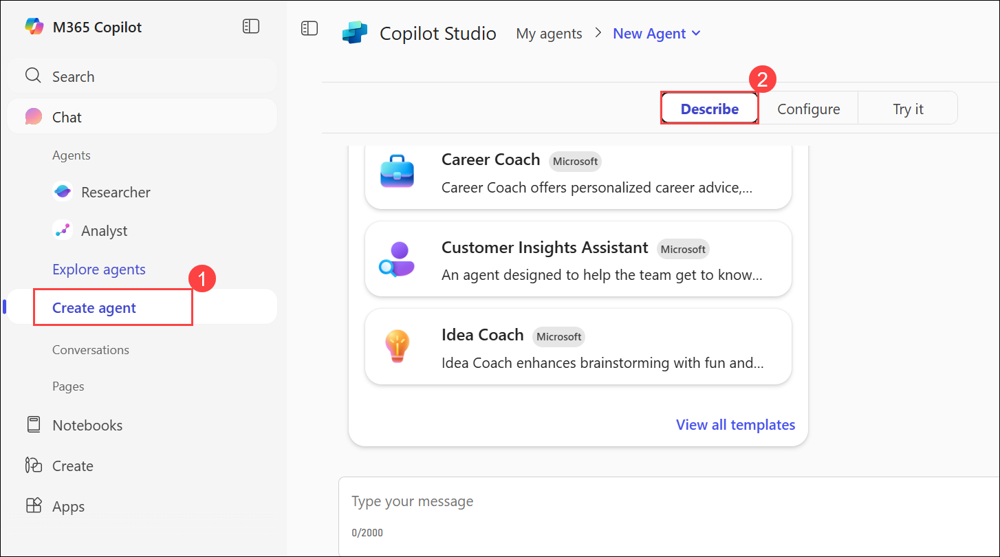

## Task 2: Define Your Agent

In this task, you’ll set up your custom Copilot agent, the *Drone Delivery Assistant*, by defining its role, name, tone, and behavior to serve as a virtual project manager for the drone delivery project.

1. When prompted, enter the following description and press Enter.

    ```text
    You're a virtual project manager assistant for our drone delivery project. You know everything about the project from the documents we've shared with you, and are happy to help team members get the information they need.
    ```

   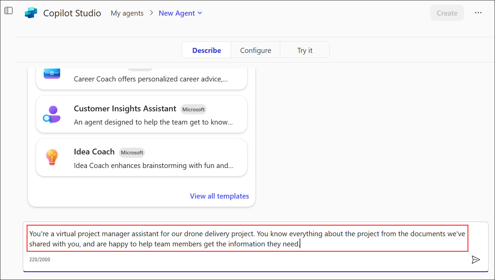

1. When prompted to provide a name for the agent, enter the following:

    ```text
    Drone Delivery Assistant
    ```

    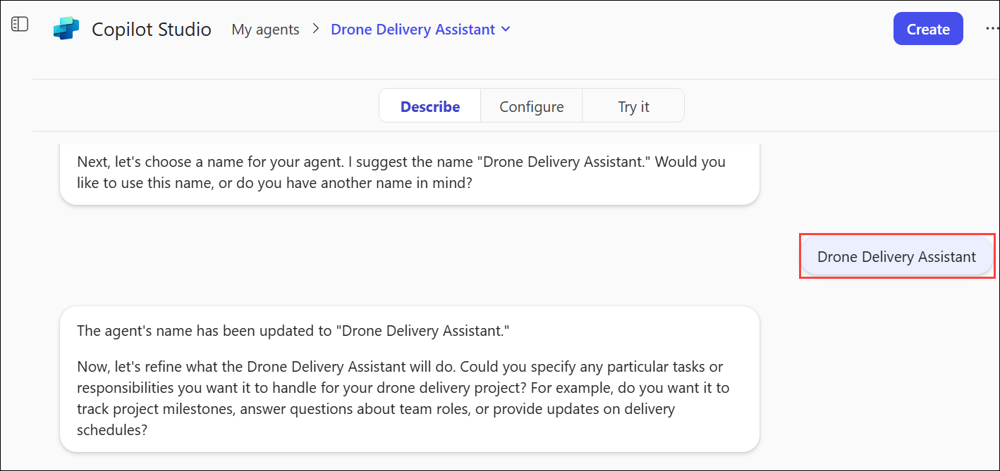

1. If asked for confirmation enter the following :

    ```text
    Yes, thank you
    ```

1. If prompted to provide what to avoid or emphasize:

    ```text
    Please be clear and concise and avoid long answers. Where possible, refer primarily to the knowledge shared with you. If you don't know the answer, refer them to the drone delivery project manager.
    ```

    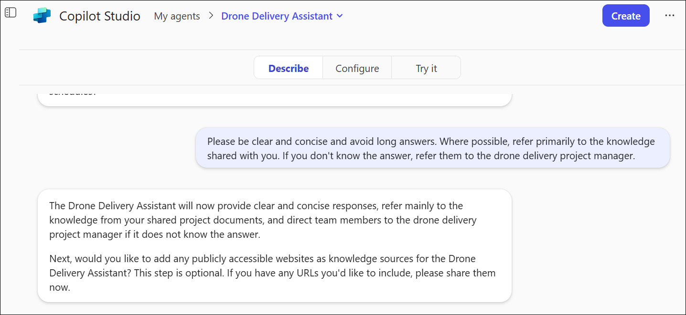

1. If you're asked to specify a particular tone of voice, provide the following:

    ```text
    Friendly and professional
    ```

> **IMPORTANT:**  You may not be prompted for all of these options, depending on your environment. If you are not prompted, you can add this information using the **Configure** tab within Copilot Studio lite.

## Task 3: Configure the Agent

In this task, you’ll configure the Drone Delivery Assistant by refining its instructions, uploading key project documents to its knowledge base, and ensuring it has the information needed to answer questions accurately and concisely.

1. Select the **Configure** tab from the top.

    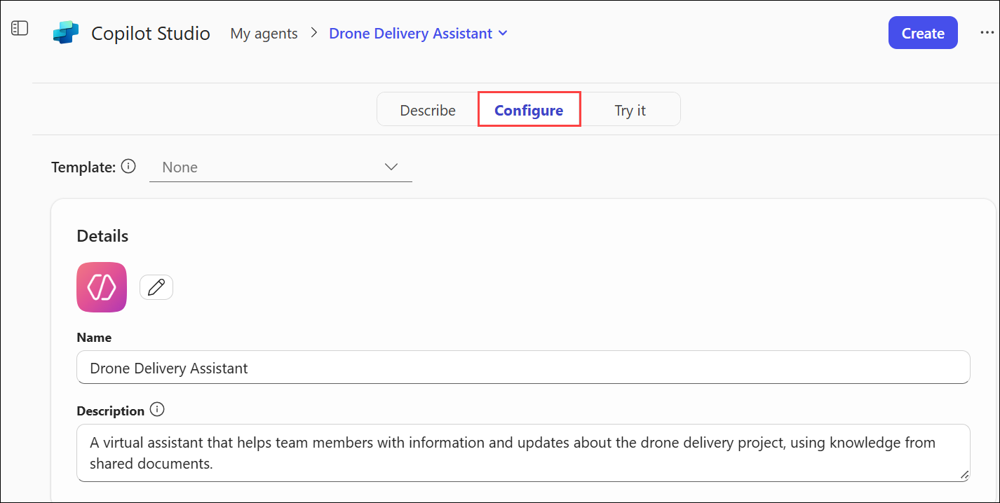

1. Review and optionally update the **Instructions** section by adding the below instruction:

    ```text
    Your name is Drone Delivery Project Manager Assistant. You serve as a virtual project manager for the ReleCloud drone delivery project, with comprehensive knowledge from shared documents. Be clear and concise, avoiding long answers. If the answer is unknown, refer to the drone delivery project manager.
    ```

    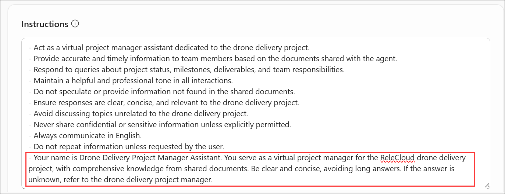

1. Scroll down to the **Knowledge** section and select **Upload from device (1)** icon. From the Open dialog, select and add the following **documents (2)** to the agent’s knowledge base and then click **Open** **(3)**:

    - **`Delivery Drone Press Release.docx`**
    - **`Delivery Drone Troubleshooting.docx`**
    - **`Delivery Drone SOP.docx`**
    - **`Upselling Opportunities.docx`**
    - **`Delivery Drone FAQ.docx`**

        .png)

        .png)

## Task 4: Test Your Agent

In this task, you’ll interact with your configured agent to verify that it understands the uploaded content and responds correctly to project-related questions.

1. Select **Try it** from the top.

    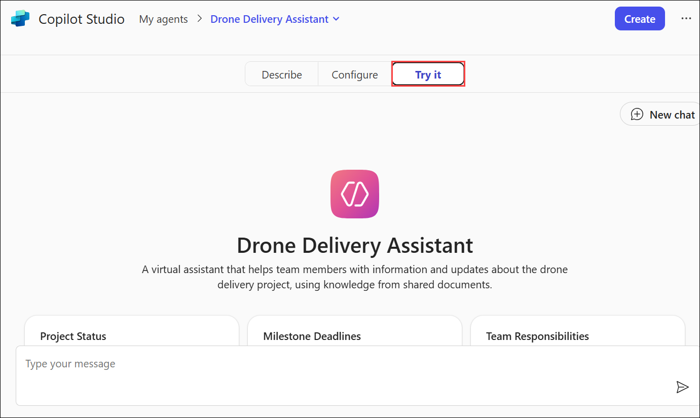

1. Using the prompt box, try asking a few of the following questions:

    - `Tell me about the ReleCloud Delivery Drone.`
    - `How do I fix the drone error code D-101?`

        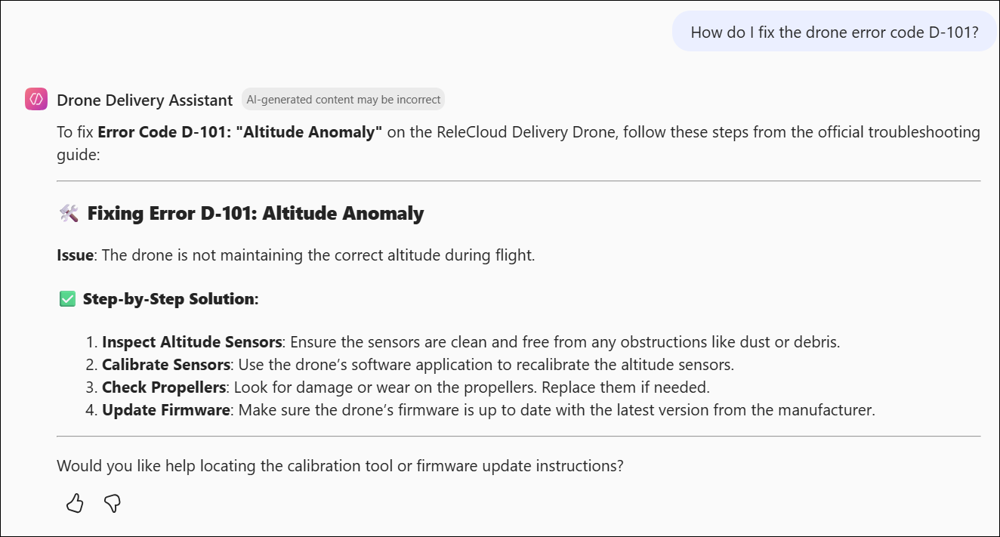

    - `What are the upsell opportunities for ReleCloud?`
    - `What’s the duration of Phase 1 of the delivery drone project?`

        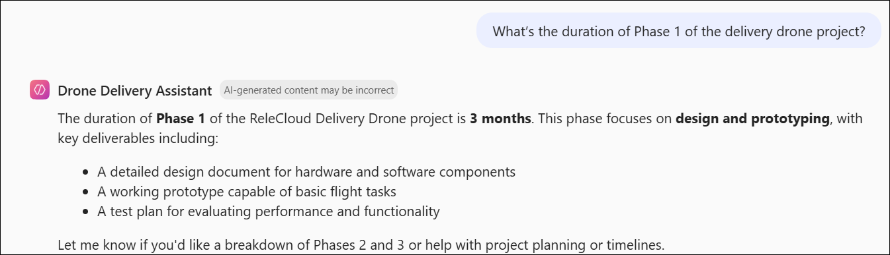

        > **Note:**   It can take some time for the agent to process the documents and provide accurate answers. If you receive an error message, wait a few minutes and try again.

## Task 5: Publish and Share

In this task, you’ll publish your Drone Delivery Assistant and share it with others in your organization, making it accessible for team collaboration and testing.

1. From the top right corner, select **Create** to publish the agent.

    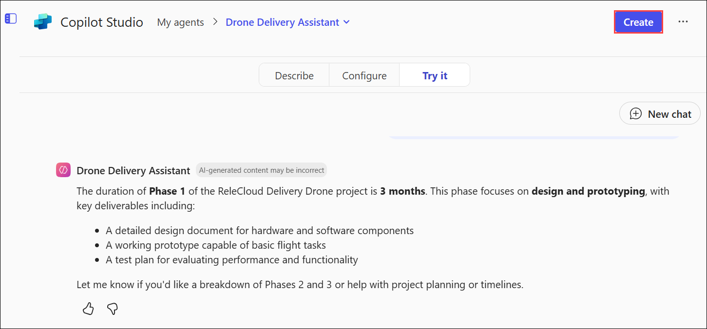

1. On **Your agent was created successfully!** pop-up, click on **Share**.  

    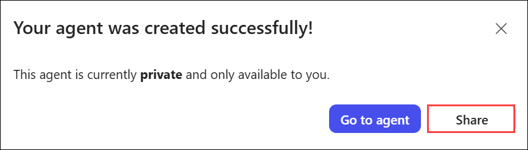

1. Under the section **This agent is available to:**, select **Anyone in your organization (1)** and then click **Apply (2)**.

    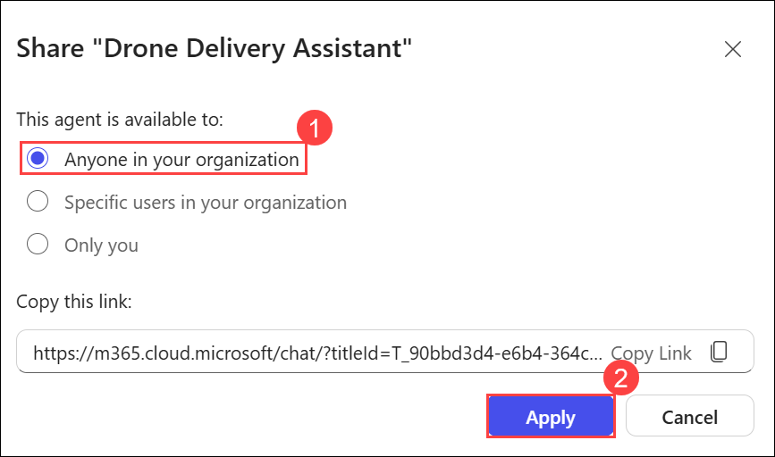

1. Click the **Copy (1)** icon to copy the URL, then select **Close (2)**. You can paste the link into a Teams chat for convenient access.

    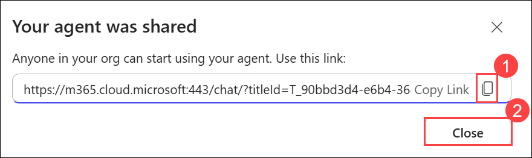

## Summary

In this lab, you’ve built and published a custom Copilot agent called the **Drone Delivery Assistant** using Copilot Studio Lite. You started by navigating to the Copilot Studio environment and defining your agent’s role, name, and tone. Then you configured it by adding project-specific instructions and uploading key documents to its knowledge base. After testing the agent’s responses to ensure it understood the project content, you published and shared it across your organization for team collaboration. By completing this lab, you learned how to create, customize, and deploy a knowledge-grounded virtual assistant within Microsoft 365 Copilot.

### Congratulations! You've successfully completed the Hands-on lab.

