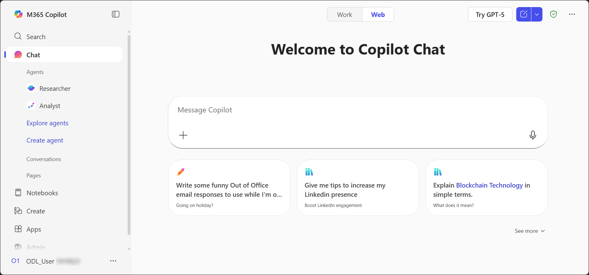
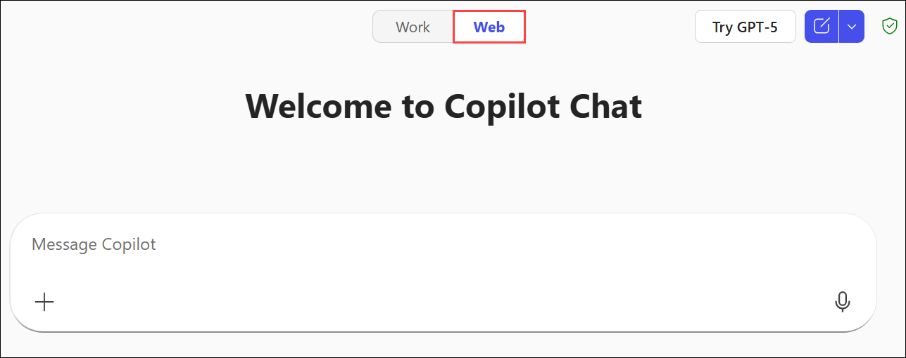
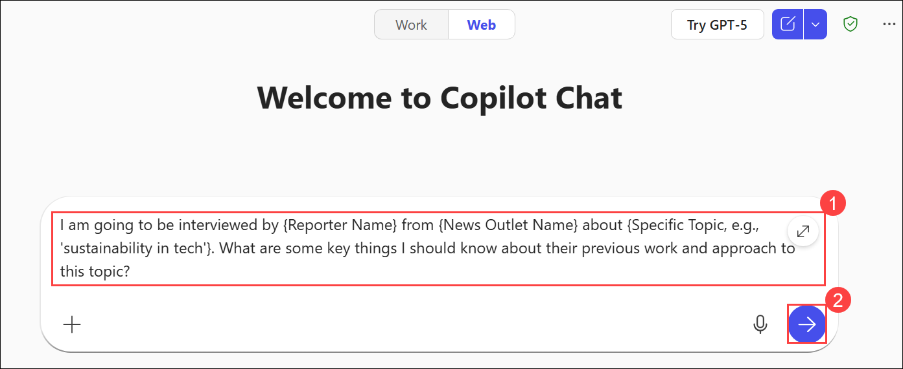
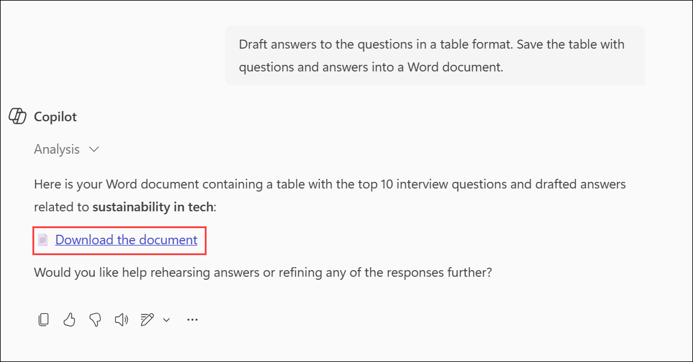
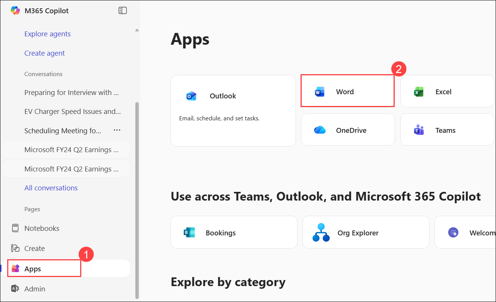
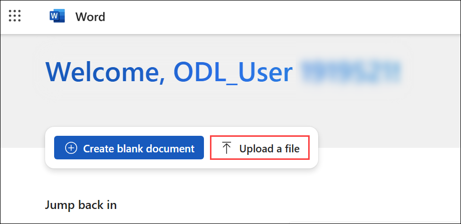
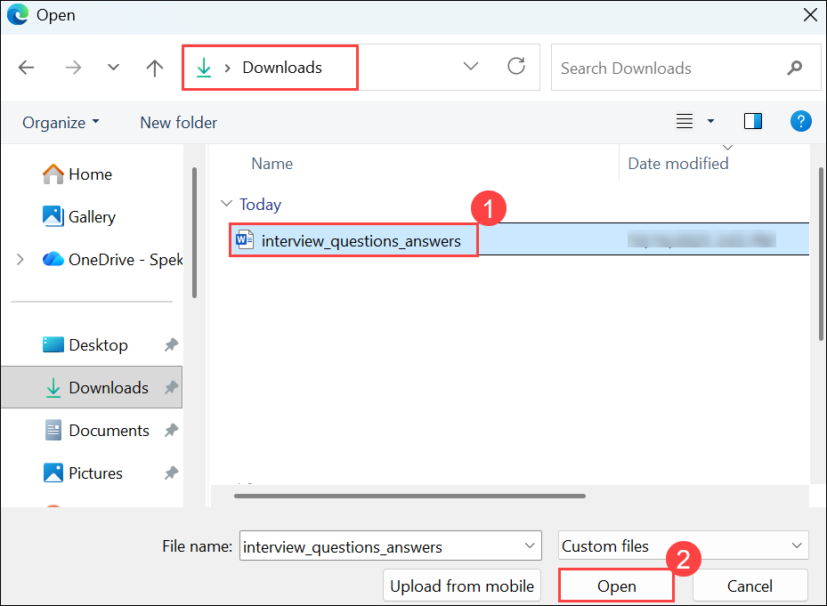
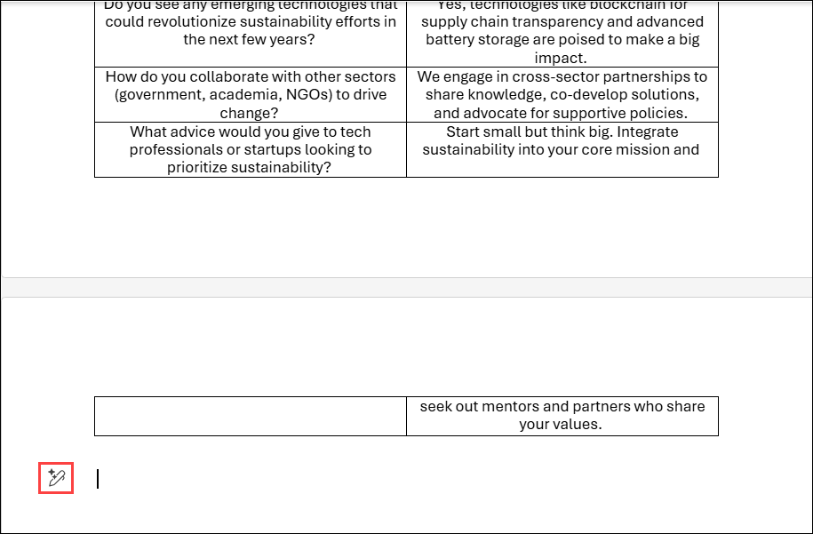
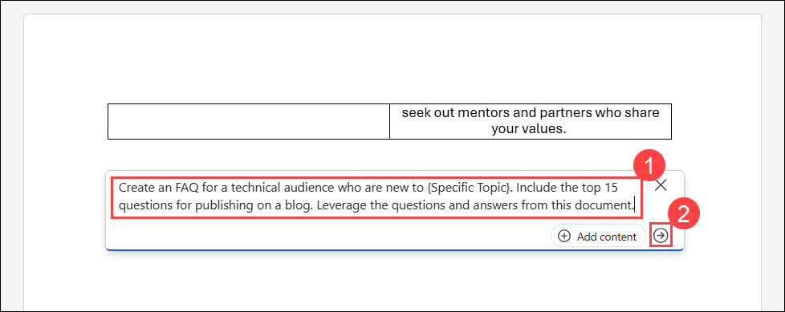
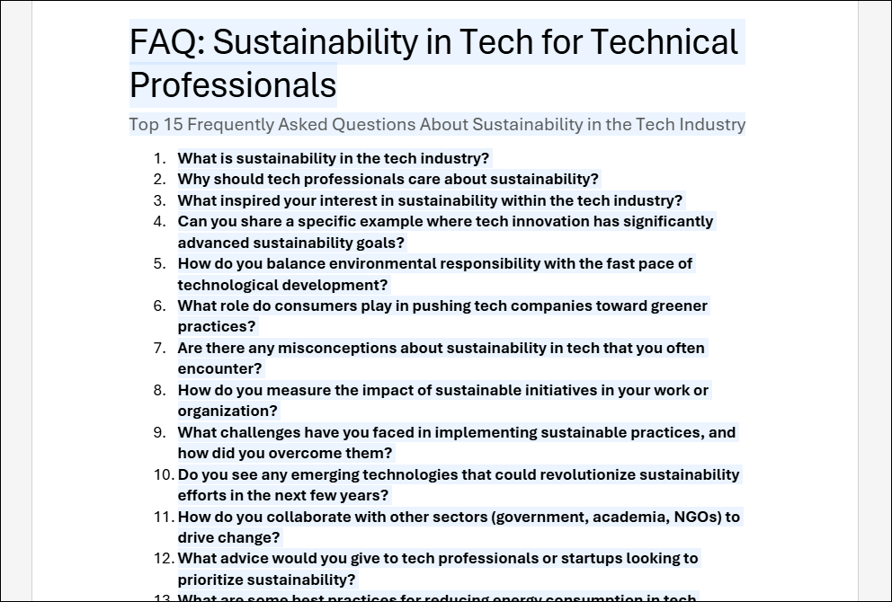

---
demo:
    title: 'Communications Demo'
---

[Back to Index](https://microsoftlearning.github.io/MS-4021-Copilot-Immersion-Experience/)

# Communications Demo

**Scenario:**  
You're preparing for an interview with a reporter from a prominent news outlet. Your goal is to gather insights about the reporter, tailor your messaging to their audience, and develop well-crafted answers to potential interview questions. Copilot assists you throughout this process.

## Demo Setup

There are no sample documents required for this demo.

## Demos

### Copilot Chat

1. Open a browser and navigate to [M365copilot.com](https://m365copilot.com/) `https://m365copilot.com/`.

    

1. Ensure **Web** mode is selected.

    

1. In the prompt window, **paste (1)** the following prompt and then click on the **arrow (2)** or press **Enter**:

    ```text
    I am going to be interviewed by {Reporter Name} from {News Outlet Name} about {Specific Topic, e.g., 'sustainability in tech'}. What are some key things I should know about their previous work and approach to this topic?
    ```

    

    .png)

1. Tailor your approach by understanding the news outlet's audience. Use Copilot to analyze their demographic and interests. Enter the following prompt:

    ```text
    Tell me about {News Outlet Name}'s demographic and their audience's interests and knowledge level on {Specific Topic}.
    ```

1. Anticipate potential interview questions by prompting Copilot. Enter the following prompt:

    ```text
    Generate the top 10 questions that {Reporter Name} might ask in my interview. They should be informed by the research conducted above and crafted to be conversational yet concise.
    ```

1. Draft answers to the anticipated questions and organize them in a table format. Save the table into a Word document for future use.

    Input the following prompt:

    ```text
    Draft answers to the questions in a table format. Save the table with questions and answers into a Word document.
    ```

    

    > **NOTE:** This Word document will be referenced in the next demo.

### Copilot in Word

The insights and drafts generated in Copilot Chat will now be refined and structured into an FAQ in Word.

1. Open the saved Word document with the Q&A table from Step 5.

    

1. Upload 
    

    

1. Copilot

    


1. Select anywhere in the body of the document and select the Copilot icon. Type in the following prompt:

    ```text
    Create an FAQ for a technical audience who are new to {Specific Topic}. Include the top 15 questions for publishing on a blog. Leverage the questions and answers from this document.
    ```

    

1. Review and refine the FAQ. Ensure it:
    - Includes accurate, relevant, and concise answers.
    - Is logically structured for clarity and readability.

        

1. Reflect on the FAQ. Are there any gaps in information? Add additional questions as needed to ensure it provides comprehensive value to the audience.

[Back to Index](https://microsoftlearning.github.io/MS-4021-Copilot-Immersion-Experience/)
