# HR

### Estimated Duration: Minutes

## Overview

In this lab, you’re managing the hiring process for a Senior Animation Designer at the Graphic Design Institute. Your goal is to create a compelling job description, evaluate candidate resumes, and communicate your recommendations to the hiring team. Using Microsoft 365 Copilot, you will draft the job description in Word, analyze resumes using Copilot Chat, and craft a professional email in Outlook to share your hiring insights and next steps.

## Objectives

- Task 1: Copilot in Word
- Task 2: Copilot Chat
- Task 3: Copilot in Outlook

## Task 1: Copilot in Word

In this task, you’ll use Copilot in Word to create a detailed and tailored job description based on role responsibilities.

1. Download the following files by clicking on the **Download file** button:

    - [Design_Team_Responsibilities.docx](https://github.com/MicrosoftLearning/MS-4021-Copilot-Immersion-Experience/raw/master/ResourceFiles/Graphic_Design_Institute_Design_Team_Responsibilities.docx)

    - [Resume_Patti_Fernandez.docx](https://github.com/MicrosoftLearning/MS-4021-Copilot-Immersion-Experience/raw/master/ResourceFiles/Resume_Patti_Fernandez.docx)

    - [Resume_Nestor_Wilke.docx](https://github.com/MicrosoftLearning/MS-4021-Copilot-Immersion-Experience/raw/master/ResourceFiles/Resume_Nestor_Wilke.docx)

    - [Resume_Holly_Dickson.docx](https://github.com/MicrosoftLearning/MS-4021-Copilot-Immersion-Experience/raw/master/ResourceFiles/Resume_Holly_Dickson.docx)

    - [Resume_Alex_Wilber.docx](https://github.com/MicrosoftLearning/MS-4021-Copilot-Immersion-Experience/raw/master/ResourceFiles/Resume_Alex_Wilber.docx)

        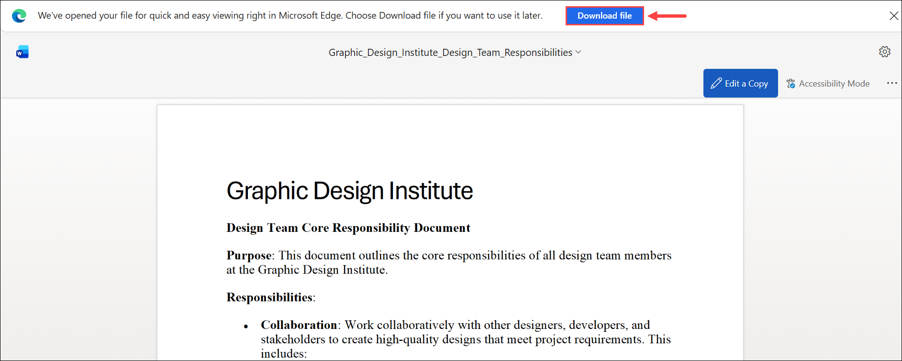

1. Click on the **Apps (1)** fromt he left navigative apne and then select **Word (2)** under Apps section.

    .png)

1. On the Word window, click on **Upload a file**.

    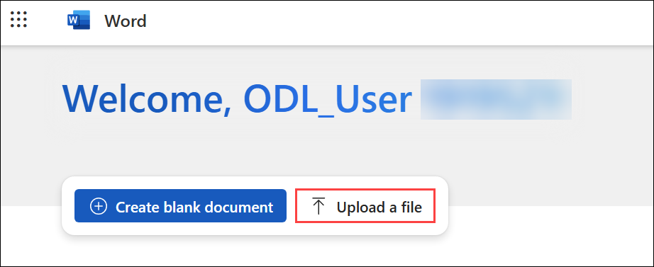

1. In the Open window, select the file `Graphic_Design_Institute_Design_Team_Responsibilities.docx` **(1)** and click **Open (2)**.

    .png)

1. In the **What you want Copilot to draft?** prompt box, paste **(1)** the following and the click on the **+ Add content (2)** and select the `Graphic_Design_Institute_Design_Team_Responsibilities.docx` **(3)** and then click on the **Generate (4)** icon:

    ```text
    I'm the HR Manager at the Graphic Design Institute. We've currently started the hiring process for a new Senior Animation Designer. Please review the attached document outlining the job responsibilities for this role and generate a detailed job description based on this information.
    ```

    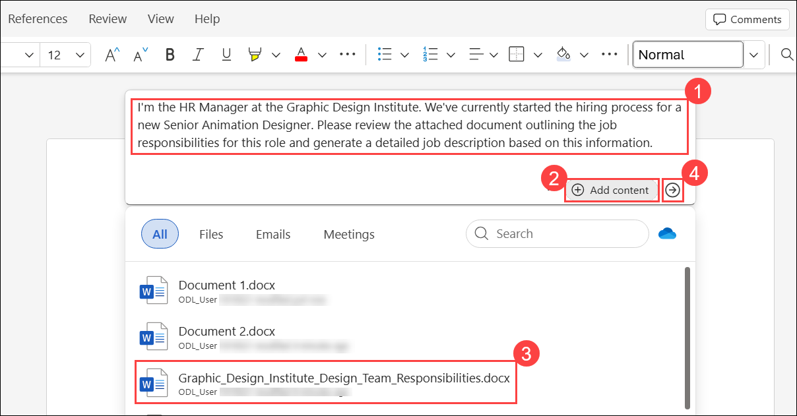

    > **NOTE:** Attach the Design_Team_Responsibilities.docx file or paste the shared link directly into the prompt to ensure Copilot has access to the relevant content.

1. Review the response and then click on **Keep it**.

    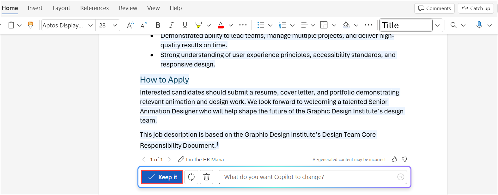

1. After reviewing and finalizing the job description, click on the drop-down (1) and rename the document as **GDI_Job_Description (2)**. 

    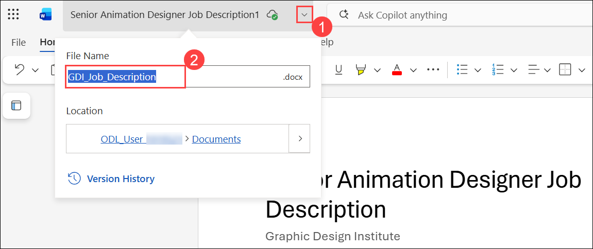

1. Click on the **Share (1)** drop-down and select **Copy link (2)**.

    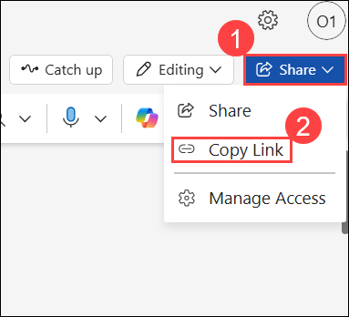

1. Close the **Link copied** pop-up window.

    .png)

## Task 2: Copilot Chat

In this task, you’ll use Copilot Chat to analyze candidate resumes, compare them against the job requirements, and rank the candidates by suitability.

1. Open a browser and navigate to [M365copilot.com](https://m365copilot.com/).

    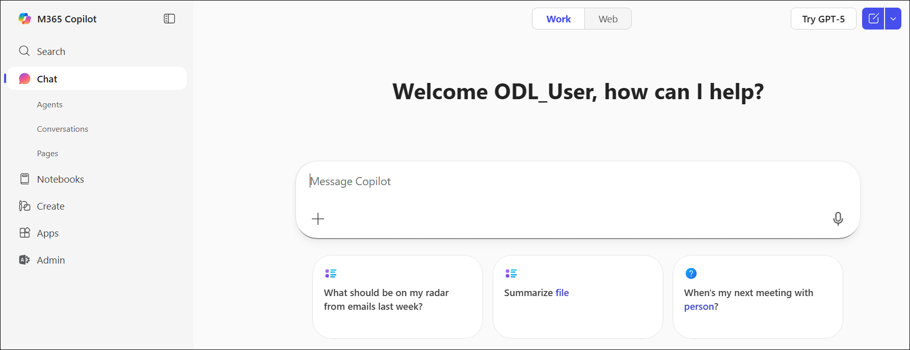

1. Ensure **Work** mode is selected.

    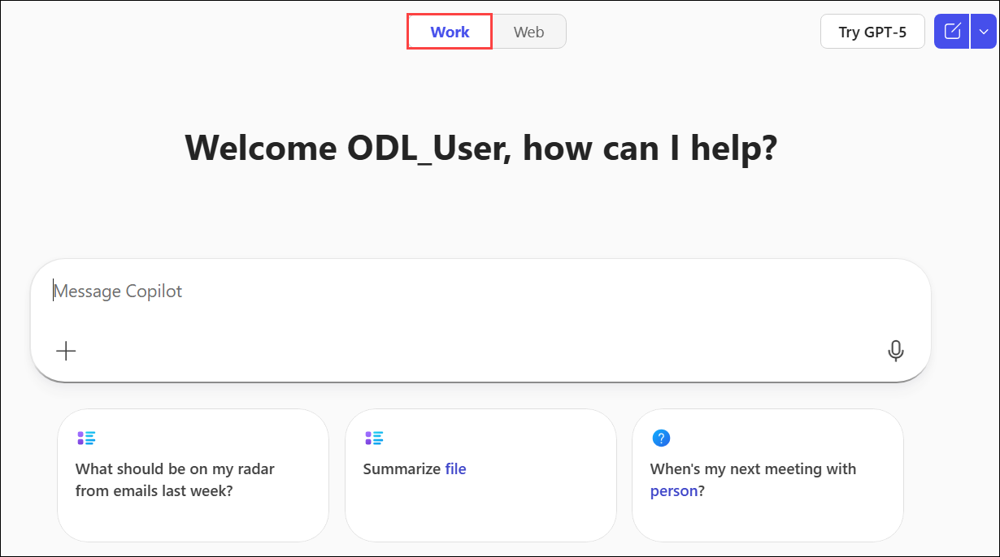

1. In the prompt window, paste the following text and include the link copied from the previous task. Click **+ Add content and agents (1)**, then select **Upload images and files (2)**. In the Open dialog, choose the files **`Resume_Patti_Fernandez.docx`**, **`Resume_Nestor_Wilke.docx`**, **`Resume_Holly_Dickson.docx`**, and **`Resume_Alex_Wilber.docx` (3)**, then click **Open (4)**:

    ```text
    We are hiring for the position of Senior Animation Designer. Please analyze the attached resumes and compare them to the requirements outlined in the job description provided here: [paste link to GDI_Job_Description.docx]. Rank the candidates from most qualified to least qualified, based on their alignment with the role.
    ```

    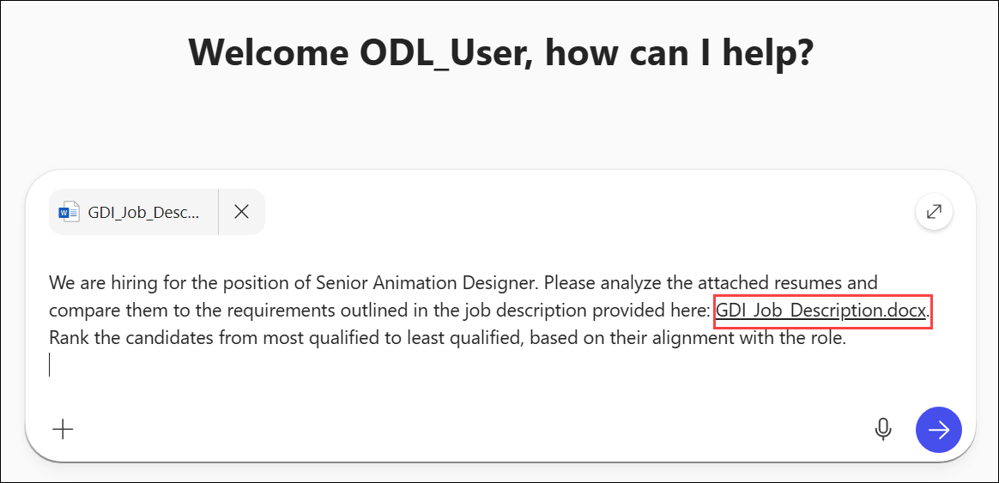

    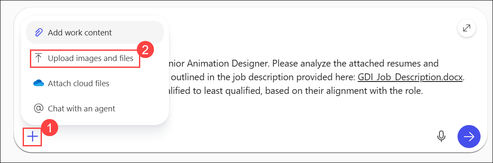

    .png)

    > **NOTE:** Attach the resumes or upload them to the prompt window. Alternatively, reference each file using the shared links or filenames in your OneDrive.

1. Check the prompt to ensure it resembles the image below.

    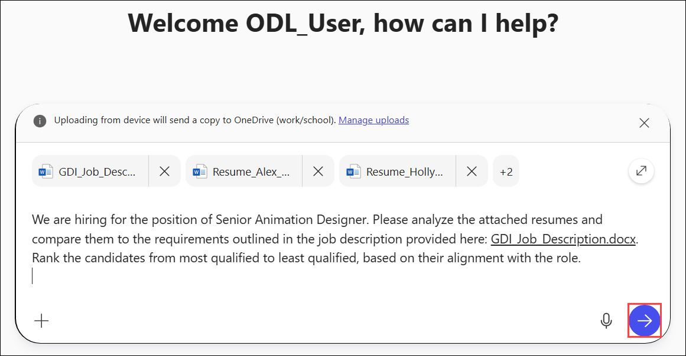

1. Review the response.

    .png)

1. Optionally, you can ask Copilot Chat to export its response to a Word document to highlight this feature.

## Task 3: Copilot in Outlook

In this task, you’ll use Copilot in Outlook to draft a professional email to the hiring team summarizing the top candidates and recommending next steps.

1. Click on the **Apps (1)** fromt he left navigative apne and then select **Outlook (2)** under Apps section.

    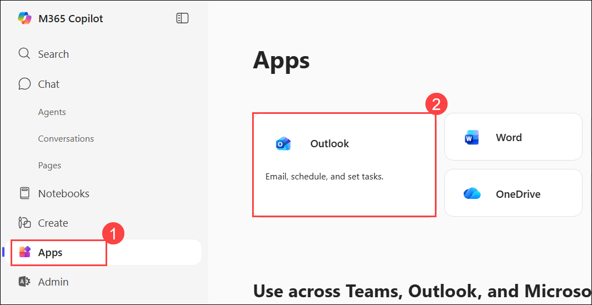


1. On the outlook window, select **New Email**.

    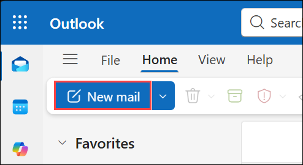

1. Click the **Copilot (1)** icon in the Outlook ribbon, then select **Draft (2)** from the drop-down menu.

    .png)

1. In the **"What do you want this email to say?"** prompt window, paste the following:

    ```text
    Please draft an email to the hiring team to share that Nestor Wilke and Patti Fernandez align best with the Senior Animation Designer role based on their qualifications. Include a recommendation to schedule interviews for these candidates and request feedback on next steps.
    ```

    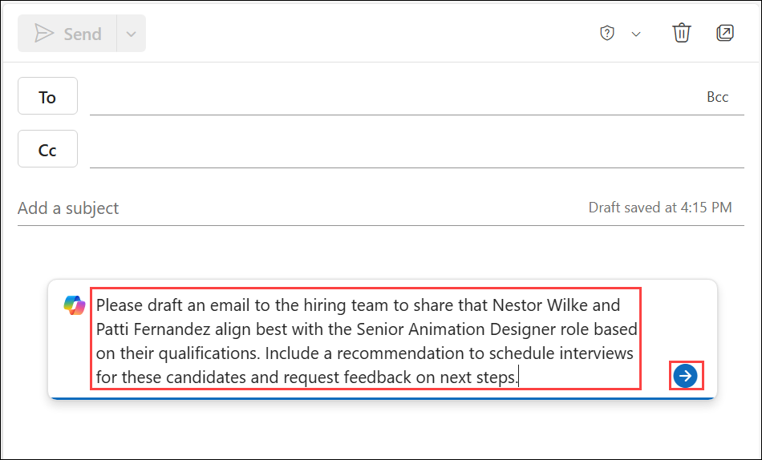

1. Click on the **Keep it**.

    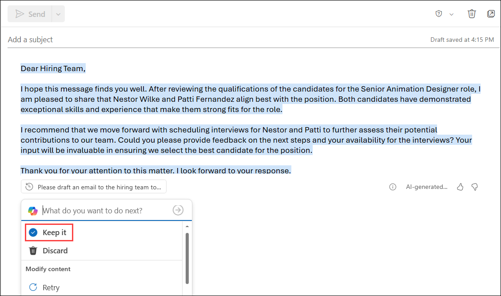

## Summary

In the lab, you’ve:

- Used Copilot in Word to generate a detailed job description based on the design team’s responsibilities.
- Used Copilot Chat to compare four candidate resumes against the job description and rank them by qualification.
- Used Copilot in Outlook to draft an email recommending interviews for the top candidates—Nestor Wilke and Patti Fernandez—and requesting feedback from the hiring team.

### You have successfully completed the exercise. Click on Next >> to proceed with the next exercise.

