---
demo:
    title: 'Sales Demo'
---

[Back to Index](https://microsoftlearning.github.io/MS-4021-Copilot-Immersion-Experience/)

# Sales Demo

**Scenario:**  

You're in sales for an EV charging company and are developing a strategic plan for the upcoming year.

## Demo Setup

The sample documents can be found in the MS-4021 GitHub repository [here](https://github.com/MicrosoftLearning/MS-4021-Copilot-Immersion-Experience/tree/master/ResourceFiles):

The specific files needed for this demo are:

- [Charger_sales_report_2022-2024.xlsx](https://github.com/MicrosoftLearning/MS-4021-Copilot-Immersion-Experience/raw/master/ResourceFiles/Charger_sales_report_2022-2024.xlsx)

> **NOTE:** Allow up to 10 minutes for these files to sync to your OneDrive after downloading. To avoid delays during the demo, ensure these files are downloaded and available in your OneDrive well in advance. If the files are not available, open the documents and copy the shared file links to use in the demo.

## Demos

### Copilot Chat

1. Open a browser and navigate to [M365copilot.com](https://m365copilot.com/).

1. Ensure Web mode is selected.

   

1. Let’s start by asking Copilot to research a key metric. In the **Copilot Chat** prompt field, input:

    ```text
    What is the ratio of EV cars to EV chargers by region in the US for the past 3 years? Please show it in a table organized by region.
    ```

    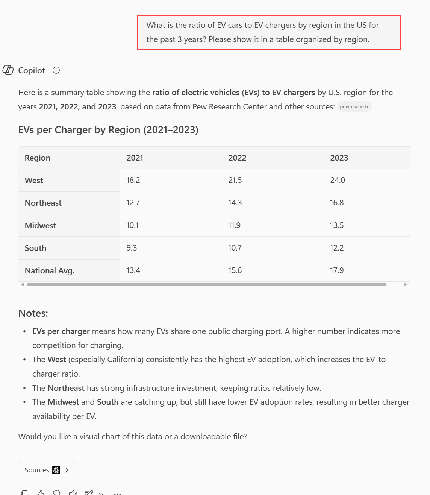

1. Now let’s compare national trends to your company’s sales performance. You’ll upload the provided dataset and ask Copilot to visualize the data:

    In the prompt field, type:

    ```text
    I need to know the quarterly trends for each of our sales regions. Create a quarterly revenue line graph for the past 2 years based on:
    ```

    > **NOTE:** Do not submit the prompt yet. Move to the next step to upload the file.

1. Select **Add Content** and upload [**Charger_sales_report_2022-2024.xlsx**](https://github.com/MicrosoftLearning/MS-4021-Copilot-Immersion-Experience/raw/master/Resourcefiles/Charger_sales_report_2022-2024.xlsx). Then submit the prompt.
    
    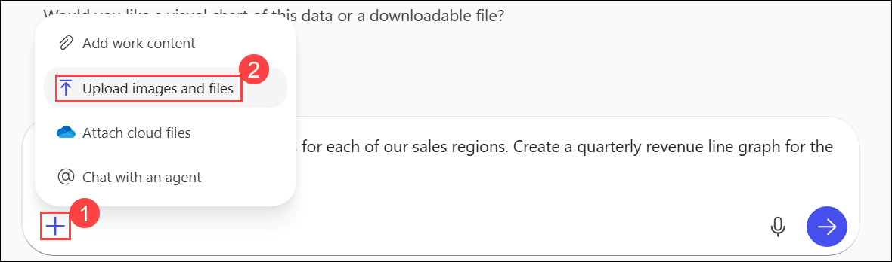

    .png)

1. Review the result.

    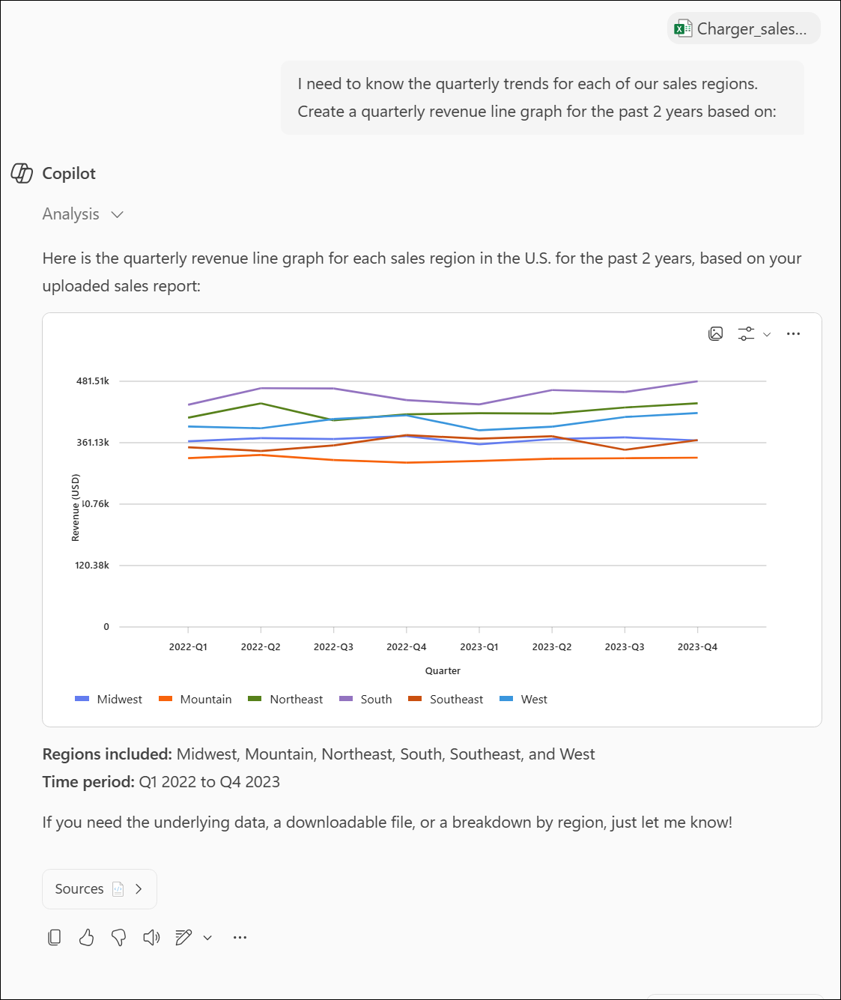

1. Let’s take it a step further by asking Copilot for recommendations exported to a Word document:

    In the prompt field, type:

    ```text
    Based on the trend, suggest two ways I can increase EV charger sales in the Mountain and Midwest regions. Export the recommendations to a Word Document.
    ```

1. Select the hyperlink Copilot provides for the new Word document to open it.

    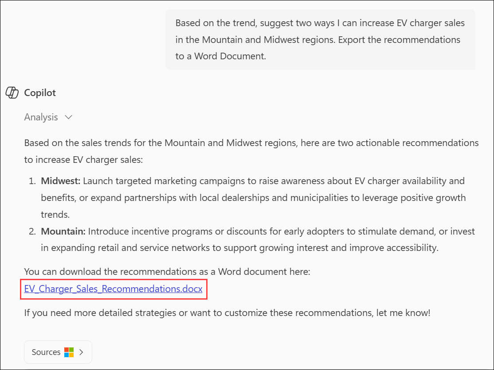

1. Once opened, select **Enable Editing** and then turn on "AutoSave". Select your OneDrive account when prompted.

### Copilot in Word

We'll now ask Copilot to expand on these strategies and draft proposals on how to implement them.

1. The generated Word document from the previous demo should already be open, if not open it now (either in your browser or desktop application).

    

1. Upload word file.

    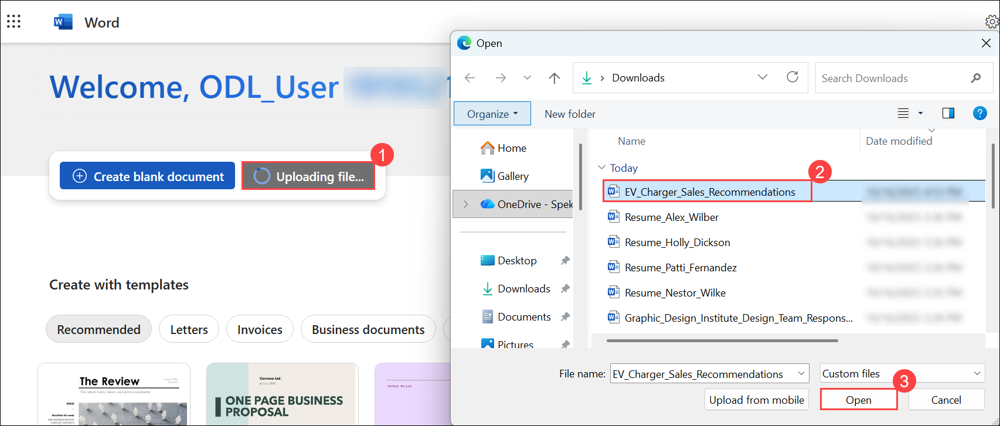

1. Select anywhere in the body of the document and select the Copilot icon.

    Type in the following prompt:

    ```text
    Draft a detailed proposal on how we could implement each of the strategies outlined in this document. Ensure the plan is actionable and includes resource requirements, timelines, and key stakeholders.
    ```

    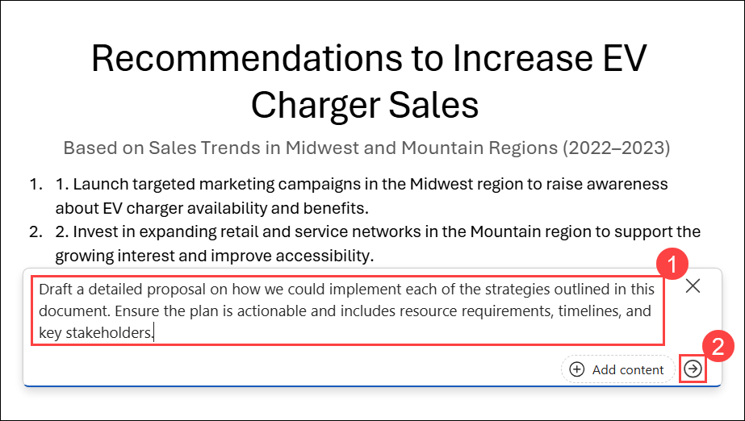

1. Select **Keep it** or, if time permits, demonstrate how to tweak the document using Copilot.

    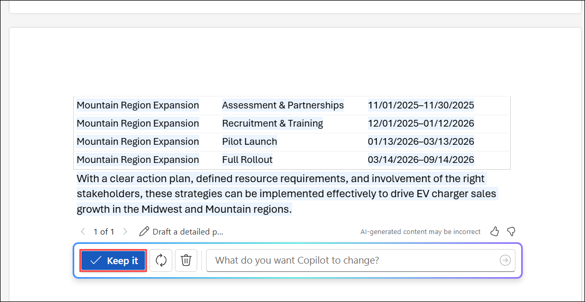

1. Once finished, save the document as **EV Sales Proposal.docx**.

    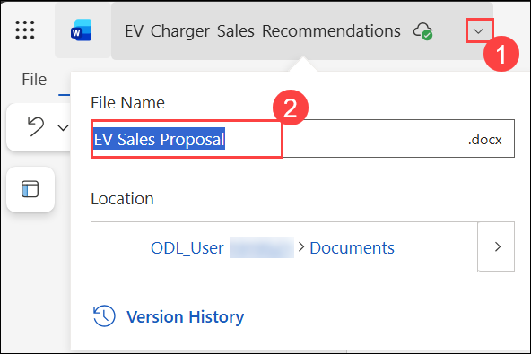

1. copy the shared URL to be used in the next step (enable AutoSave and select your OneDrive account).

    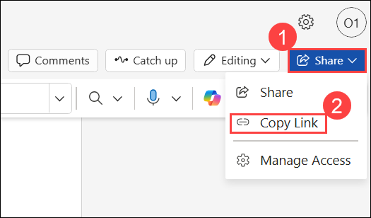

    > **Trainer Tip:** Use this step to demonstrate how Copilot builds on prior outputs, refining ideas into a cohesive proposal.

### Copilot in PowerPoint

1. Launch Microsoft PowerPoint from your browser [PowerPoint.new](https://PowerPoint.new) or use the desktop application.

    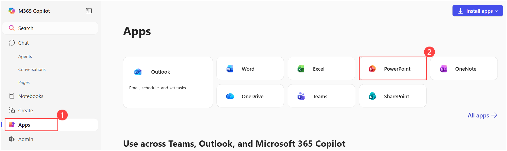

1. Open a new blank presentation.

    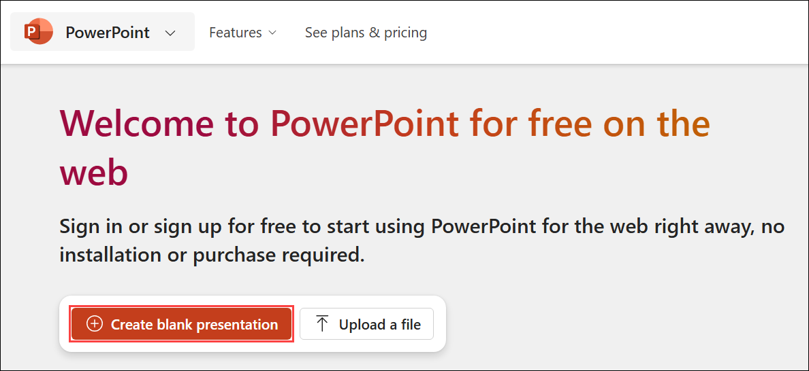

1. AI that works for you- Microsoft 365 Premium.

    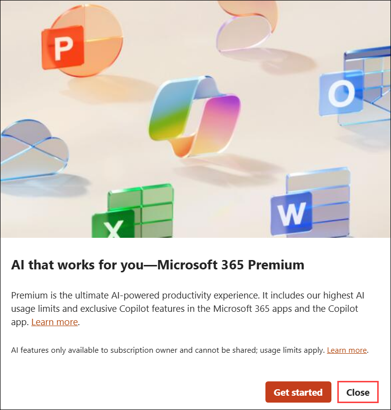

1. In the Copilot pane, select the "Create presentation from file" prompt.

    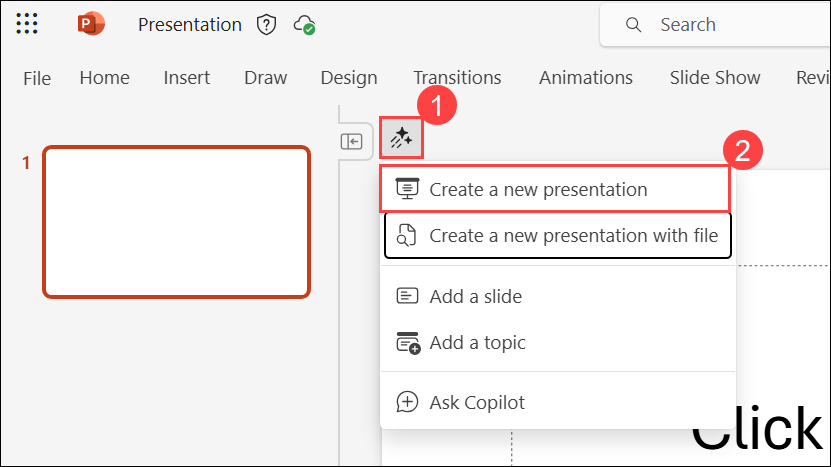

1. Paste the **EV Sales Proposal.docx** link after "Create a presentation from" and select **Send**.

    The full prompt should look like:

    ```text
    Create a presentation from [Link to EV Sales Proposal.docx].
    ```

    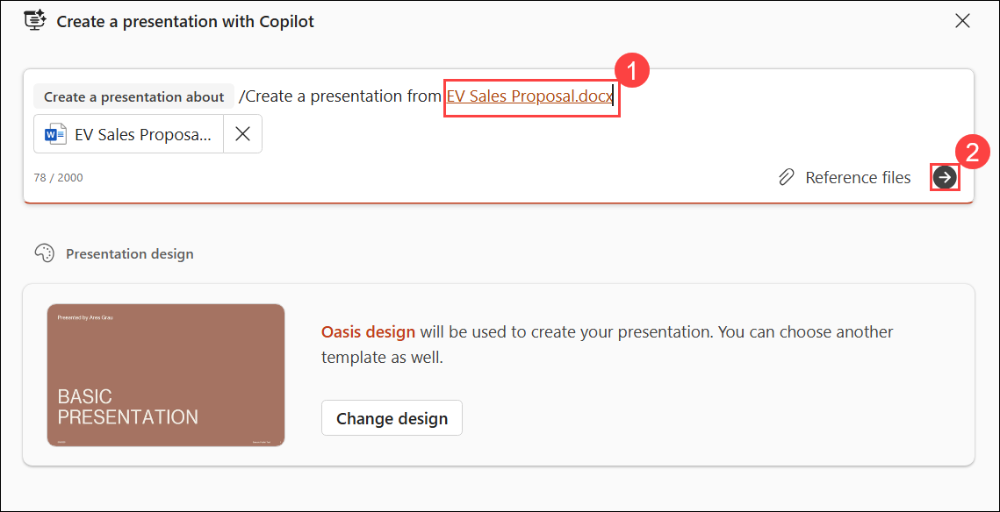

1. Copilot begins generating slides based on the EV Sales Proposal, providing an outline along with features like speaker notes, images, slide layouts, and a General sensitivity label.

    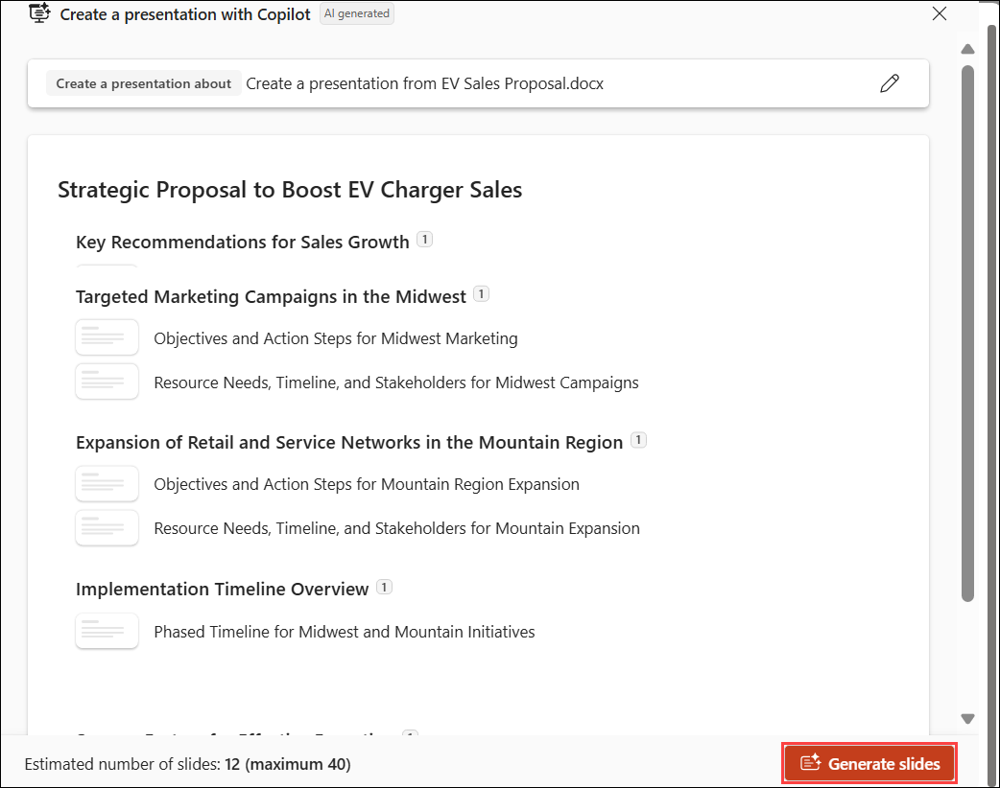

1. Keep it.

    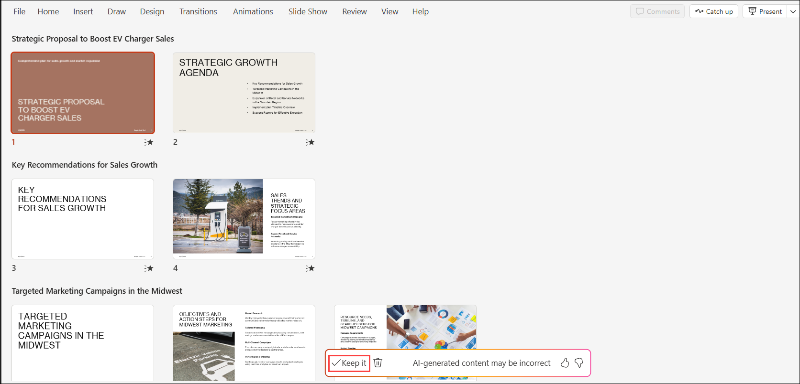


[Back to Index](https://microsoftlearning.github.io/MS-4021-Copilot-Immersion-Experience/)
