# Lab 01: IT Demo

### Estimated Duration: 40 Minutes

## Overview

In this lab, you’ll use Microsoft Copilot across Copilot Chat, Word, and PowerPoint to plan and document the deployment of a new network security product in a corporate environment. You’ll learn how to create detailed project plans, expand strategies into actionable steps, and generate professional presentations. The lab demonstrates how natural language prompts can streamline project planning, documentation, and communication, helping IT managers execute deployments efficiently.

## Objectives

- Task 1: Copilot Chat
- Task 2: Copilot in Word
- Task 3: Copilot in PowerPoint

## Task 1: Copilot Chat

In this lab, you'll use Copilot Chat to create a detailed project implementation plan for deploying a new network security product, including milestones, resources, risks, and timelines.

1. Download the following files by clicking on the **Download file** button:

    - [Contoso_CipherGuard_Product_Specification.docx](https://github.com/MicrosoftLearning/MS-4021-Copilot-Immersion-Experience/raw/master/ResourceFiles/Contoso_CipherGuard_Product_Specification.docx)

        .png)

1. Open a new tab in the browser and navigate to [M365copilot.com](https://m365copilot.com/).

    

1. Ensure **Web** mode is selected.

    

1. In the prompt window, paste the following prompt:

    ```text
    You are an IT infrastructure manager at Contoso. Your task is to create a detailed project implementation plan for installing a new network security product in your corporate network. Your plan should include key milestones, resource allocation, potential risks, and a timeline to ensure successful deployment and minimal disruption to operations.
    ```

    > **NOTE:** Role-based prompts help Copilot understand the user's responsibilities and context, improving the relevance and specificity of the output.

1. Now we'll refine the project plan by asking Copilot to add new sections to the project plan. Paste the following prompt:

    ```text
    Please add the following sections to the existing plan: testing and QA, training, communication, documentation and reporting, stakeholder analysis, project timeline, and risk assessment and mitigation. Ensure these sections provide detailed action steps and align with the existing content. Avoid duplicating any items already included in the original plan.
    ```

1. Lastly, have Copilot output the proposed project plan to a Word document. Paste the following prompt and then select the **link** that Copilot provides to the newly created file to **download** it to your Downloads folder.

    ```text
    Please export the project plan to a Word document.
    ```

    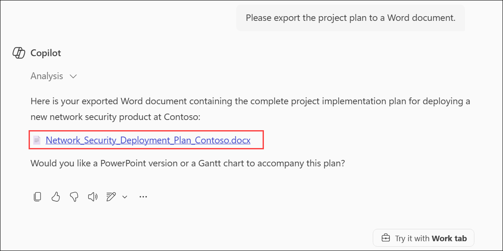

1. Click on the **Apps (1)** from the left navigation pane, and then select **OneDrive (2)** under the Apps section.

    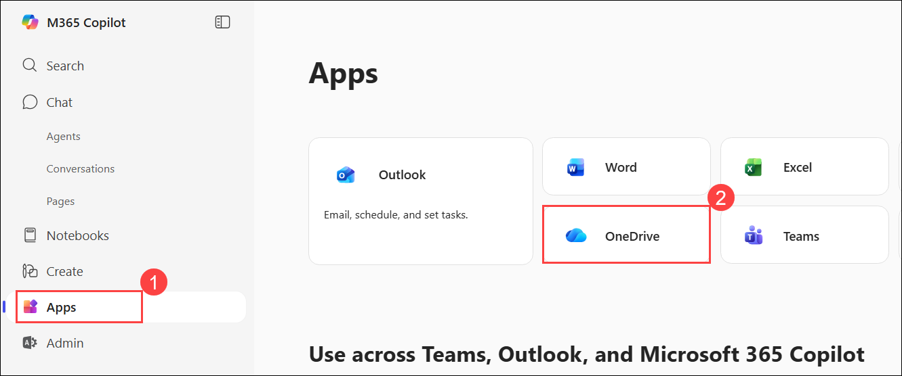

1. On the OneDrive window, click on **+ Create or upload (1)** and select **Files upload (2)**. Then in Open dialog, select the following files **(3)** and then click on **Open (4)**.

    - `Contoso_CipherGuard_Product_Specification.docx`
    - `Network_Security_Deployment_Plan_Contoso.docx`
    
        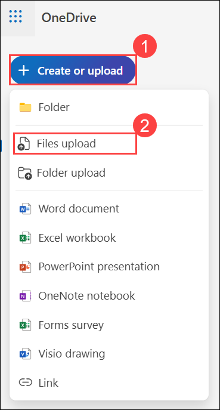

        .png)

## Task 2: Copilot in Word

In this lab, you'll use Copilot in Word to expand and refine the project plan into a comprehensive, structured document aligned with product specifications.

1. In the left navigation pane of the M365 Copilot homepage, click **Apps (1)**, then select **Word (2)** under the Apps section.

    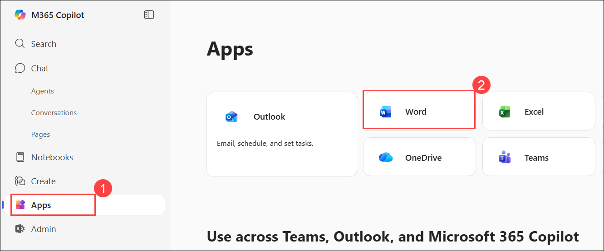

1. On the Word homepage, click on **+ Create blank document**.

    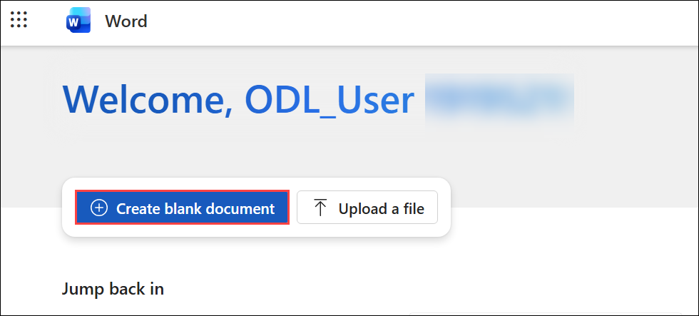

1. In the **What do you want Copilot to draft?** prompt box, paste the prompt **(1)**, then click **+ Add content (2)**. From the list, select the two files **(3)** you uploaded in the previous task, one at a time. Finally, click **Generate (4)** or press **Enter**.

    ```text
    Using the Contoso "CipherGuard Product Specification.docx" and the 'Project Implementation Plan' template provided in "Project_Implementation_Plan.docx", draft a comprehensive project implementation plan for deploying Contoso CipherGuard. Ensure the plan aligns with the product specifications and follows the structure outlined in the template.
    ```

    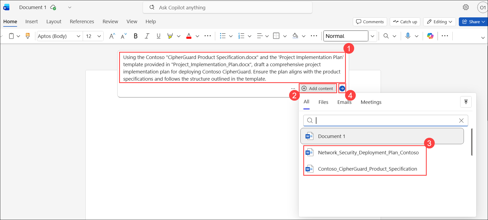

1. Select **Keep it** or, if time permits, demonstrate how to tweak the document using Copilot.

    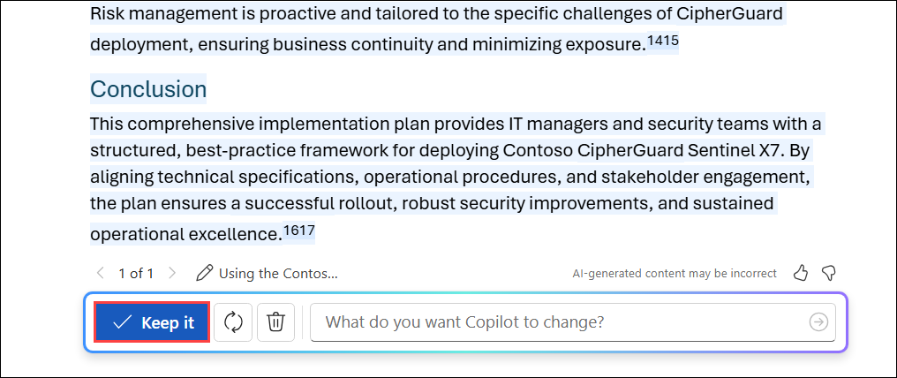

1. When you’re done, click the **drop-down (1)** icon in the top-left corner of the page. Enter **Contoso_Project_Plan (2)** as the file name, then click anywhere outside the field to save it.

    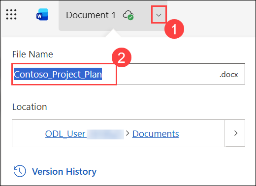

1. Click the **Share (1)** drop-down and select **Copy Link (2)** to copy the file link. You’ll need it later in the exercise.

    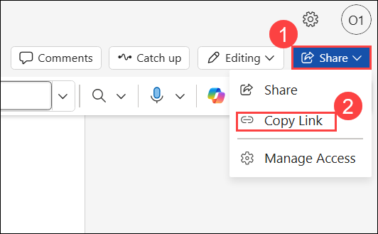

## Task 3: Copilot in PowerPoint

In this lab, you'll use Copilot in PowerPoint to automatically generate a professional presentation from the project plan, complete with slides, speaker notes, and visual enhancements for stakeholder communication.

1. Click on the **Apps (1)** fromt he left navigative apne and then select **PowerPoint (2)** under Apps section.

    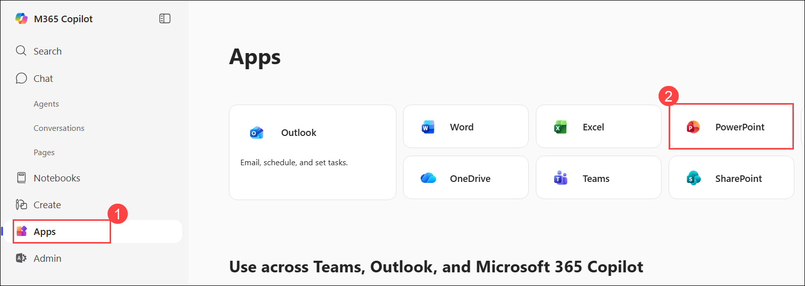

1. Click on **Create blank presentation**.

    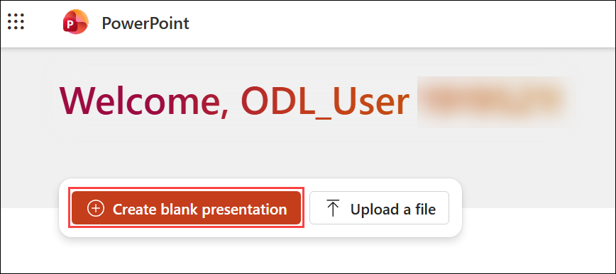

1. Click on the **Copilot (1)** icon and select the **Create a new presentation (2)**.

    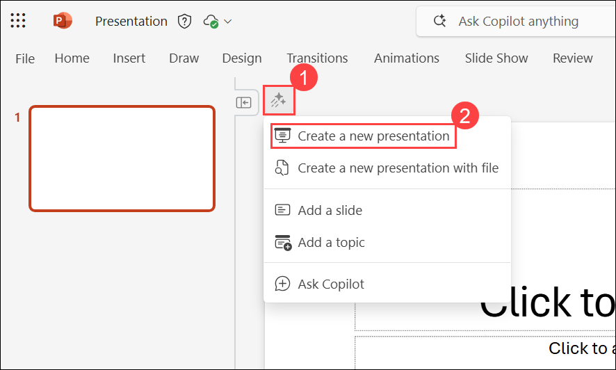

1. Paste the shared link for the **Contoso_Project_Plan.docx** document and then click **Send**.

    The full prompt should look like:

    ```text
    Create a presentation from [Link to Contoso_Project_Plan.docx].
    ```

    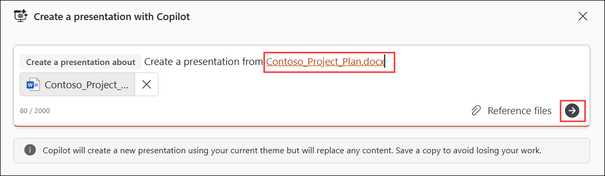

1. Click on **Generate slides**. 

    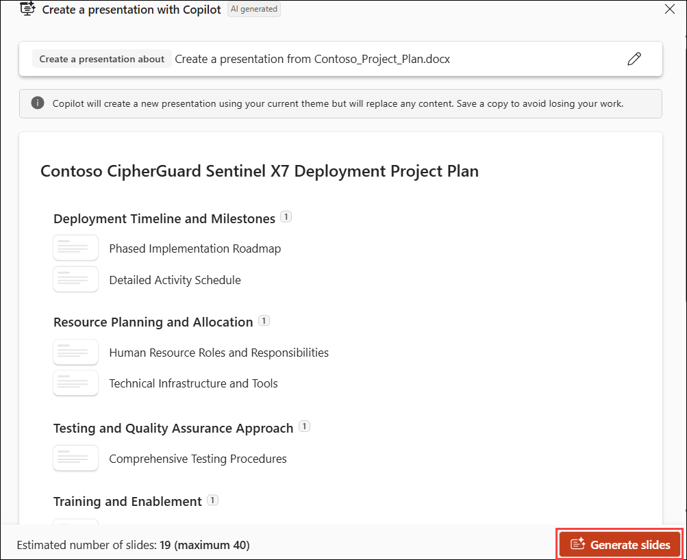

1. Copilot begins generating slides based on the project plan, providing an outline along with features like speaker notes, images, slide layouts, and a General sensitivity label.Click **Keep it**.

    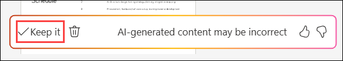

    > **NOTE:** Generating slides may take up to two minutes, depending on the document’s complexity and number of slides.

## Summary

In this lab, you used Copilot Chat to create a detailed project implementation plan for deploying the Contoso CipherGuard network security product, including milestones, resource allocation, risks, and timelines. You then leveraged Copilot in Word to draft a comprehensive project plan aligned with the product specifications and structured templates. Finally, you used Copilot in PowerPoint to generate a professional presentation from the project plan, complete with slides, speaker notes, and layouts for executive communication. The lab highlights how Copilot can accelerate IT project planning, documentation, and stakeholder reporting by combining strategy, structure, and clear presentation.

### You have successfully completed the exercise. Click on Next >> to proceed with the next exercise.

