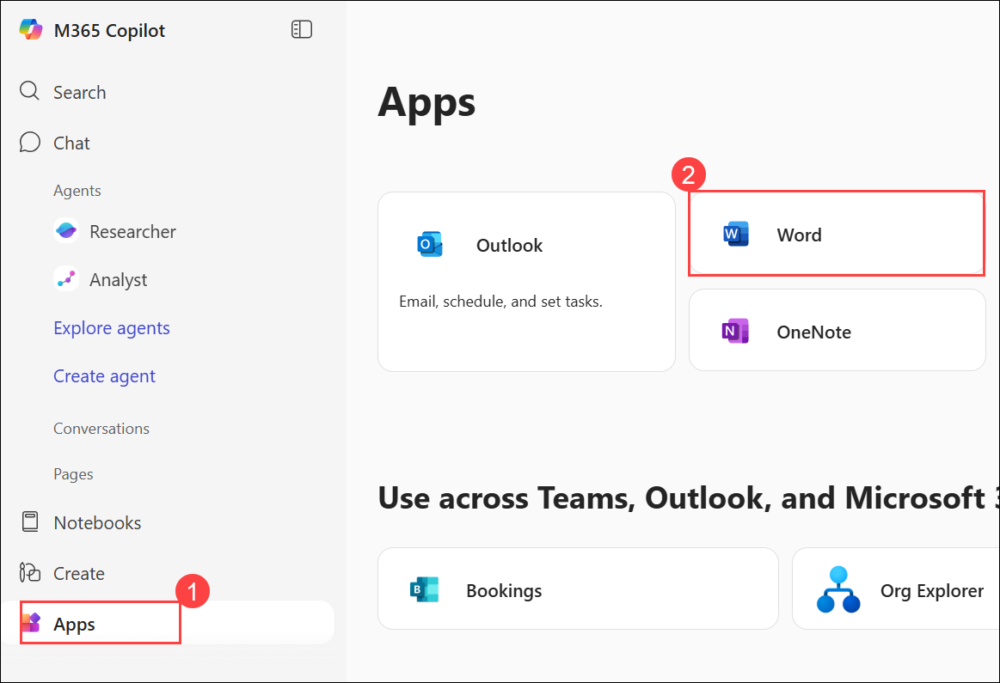
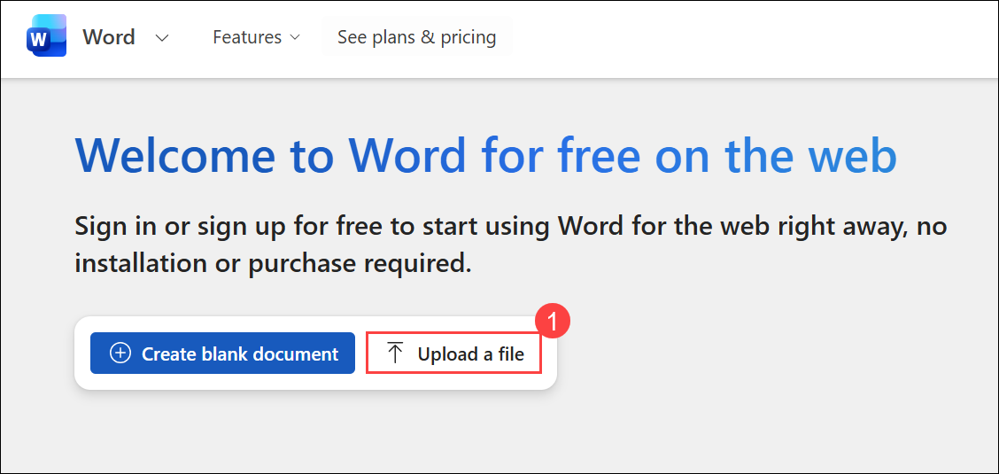
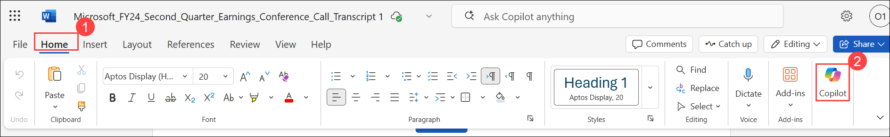
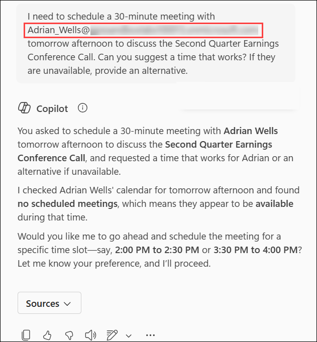
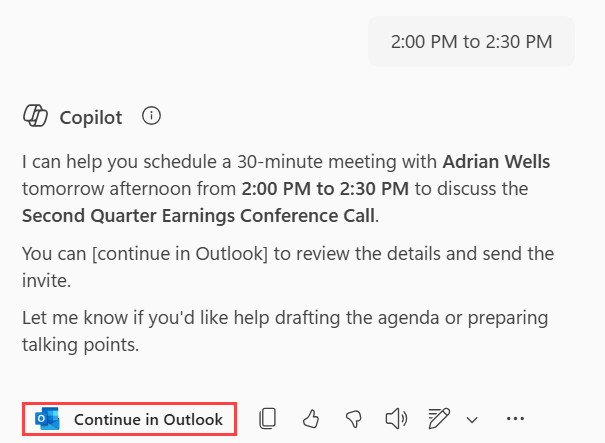
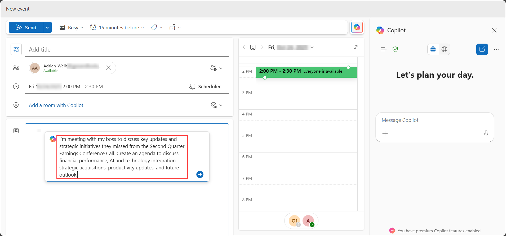
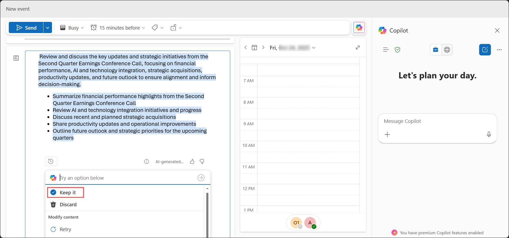

# Lab 01: Executive Assistant Demo

### Estimated Duration: 30 Minutes

## Overview

In this lab, you’ll take on the role of an Executive Assistant responsible for summarizing a company’s latest earnings conference call. The goal is to use Microsoft 365 Copilot tools across Word, Copilot Chat, and Outlook to analyze information, generate summaries, and prepare meeting materials for an executive.

You’ll start by extracting key insights from the Microsoft FY24 Second Quarter Earnings Conference Call transcript, then refine that content into an executive summary and actionable talking points. Finally, you’ll schedule a follow-up meeting with your executive, complete with a structured agenda created using Copilot in Outlook.

## Objectives

- Task 1: Copilot in Word
- Task 2: Copilot Chat
- Task 3: Copilot in Outlook

## Task 1: Copilot in Word

In this task, you'll start by reviewing the transcript from the most recent earnings call and summarizing the key points for your executive.

1. Download the following file by clicking on the **Download file** button:

    - [Microsoft_FY24_Second_Quarter_Earnings_Conference_Call_Transcript.docx](https://github.com/MicrosoftLearning/MS-4021-Copilot-Immersion-Experience/raw/master/ResourceFiles/Microsoft_FY24_Second_Quarter_Earnings_Conference_Call_Transcript.docx)

        .png)

1. Open a new tab in the browser and navigate to [M365copilot.com](https://m365copilot.com/).

    

1. Click on the **Apps (1)** from the left navigation pane, and then select **Word (2)** under the Apps section.

    

1. In the Word window, click **Upload a file (1)**. In the **Open** dialog box, select **`Microsoft_FY24_Second_Quarter_Earnings_Conference_Call_Transcript.docx` (2)** and click **Open (3)**.
    
    

    .png)

1. Under the **Home (1)** tab, select the **Copilot (2)** icon from the Ribbon.

    

1. The Copilot pane should open. Enter the following prompt where it says **+ What do you want Copilot to draft?**:

    ```text
    Summarize the key points from the Microsoft FY24 Second Quarter Earnings Conference Call.
    ```

1. Imagine your executive wants to know what Satya Nadella specifically discussed during the call. Use the following prompt:

    ```text
    Provide a brief summary of Satya Nadella's remarks during the earnings call.
    ```

   - Show how Copilot includes references for each bullet point, enabling quick navigation to specific sections.  
   - Click one reference to demonstrate how Copilot instantly brings you to the relevant content in the document.

1. To create a detailed report, ask Copilot:

    ```text
    Analyze the Microsoft FY24 Second Quarter Earnings Conference Call document to provide a comprehensive report that includes:
    - A summary of the key points from each speaker
    - Identification of the top three growth areas and their contributing factors.
    - A detailed breakdown of the financial performance, including revenue, operating income, and earnings per share.
    - Trends in AI adoption and its influence on Microsoft's business strategy.
    - A comparison of this quarter's performance with the same quarter last year, highlighting significant changes.
    - Key strategic initiatives and future outlook as discussed in the call.
    ```

    > **Tip:** Mention that this is a complex prompt and Copilot may take some time to generate the response.

1. Once Copilot completes the analysis, select the **Copy** icon to save the results for the next step.

    

## Task 2: Copilot Chat

In this task, you'll use Copilot Chat, to help us create an executive summary.

1. Open a browser and navigate to [M365copilot.com](https://m365copilot.com/).

1. Ensure **Web** mode is selected.

    

1. Paste the response from Copilot in Word into Copilot Chat with the following prompt:

    ```text
    Based on the following information, provide an executive summary on the following information:

    [paste the Word output here]
    ```

    > **Note:** Clean up any extraneous text from the copied content to ensure clarity.

1. Refine the summary into a concise format:

    ```text
    Summarize this executive summary into a more concise format by focusing on the most critical insights and metrics for each speaker. Use a structured format with headings and bullet points to improve readability. Export to a Word document.
    ```

   - If Copilot doesn’t export the document, rephrase the request: “Save this summary as a Word document.”

1. With the executive summary complete, ask Copilot:

    ```text
    Based on the summarized executive summary, generate 5-7 concise and impactful talking points my manager can use in their next leadership call. Focus on key achievements, growth areas, and strategic priorities.
    ```

## Task 3: Copilot in Outlook

In this task, you'll use Copilot in Outlook to set up a meeting with the executive to get them up to speed on everything that happened during the Second Quarter Earnings Conference Call.

1. Open a browser and navigate to [outlook.office.com](https://outlook.office.com.com/).

1. Click on the **Apps (1)** from the left navigation pane, and then select **Outlook (2)** under the Apps section.

    

1. In the Outlook ribbon, select the **Copilot** icon to open up the Copilot pane.

    

1. Use the following prompt to schedule a sync-up:

    ```text
    I need to schedule a 30-minute meeting with [/Pick a colleague] tomorrow afternoon to discuss the Second Quarter Earnings Conference Call. Can you suggest a time that works? If they are unavailable, provide an alternative.
    ```

    - **Email:** <inject key="User01UPN"></inject>

        

        >**Note:** After pasting, add the user’s email mentioned in the point that follows the prompt.

1. Copilot will suggest a few possible dates and times for the meeting. Review the options, enter your preferred one, wait for Copilot’s response, and then click **Continue in Outlook**.

    

1. A new browser tab will open. In that window, under the **Draft an agenda for me (Alt + I)** section, press **Spacebar** to display the **Open Copilot** icon, then paste the following prompt into the prompt box:

    ```text
    I’m meeting with my boss to discuss key updates and strategic initiatives they missed from the Second Quarter Earnings Conference Call. Create an agenda to discuss financial performance, AI and technology integration, strategic acquisitions, productivity updates, and future outlook.
    ```

    

1. Optionally, before selecting **Keep it**, you can ask Copilot to make it longer, shorter, or change the tone of the drafted agenda.

    

## Summary

By completing this lab, you practiced using Copilot across multiple Microsoft 365 apps to streamline executive support tasks:

- In Word, you analyzed the earnings call transcript to summarize key financial highlights, strategic insights, and speaker contributions.

- In Copilot Chat, you refined the content into a concise, structured executive summary and generated clear talking points for leadership communication.

- In Outlook, you scheduled a sync-up meeting and created a professional agenda covering financial performance, AI strategy, acquisitions, productivity, and future outlook.

### You have successfully completed the exercise. Click on Next >> to proceed with the next exercise.


