# Lab 02: Business Manager Demo

### Estimated Duration: 40 Minutes

## Overview

In this lab, you’ll step into the role of a Business Manager analyzing sales performance and customer feedback for an electric vehicle (EV) charger product line. Your goal is to identify performance issues, research potential improvements, and collaborate with your team to plan next steps, all using Microsoft 365 Copilot across Excel, Copilot Chat, and Outlook.

You’ll begin by exploring sales data in Excel to uncover trends, highlight underperforming products, and identify recurring customer concerns. Then, you’ll use Copilot Chat to research industry insights and generate strategic discussion points. Finally, you’ll use Copilot in Outlook to schedule a meeting and create a structured agenda for addressing the product issues.

## Objectives

- Task 1: Copilot in Excel
- Task 2: Copilot Chat
- Task 3: Copilot in Outlook

## Task 1: Copilot in Excel

In this task, you'll use Excel to analyze sales data, calculate revenue, visualize category performance, and pinpoint low-performing products. You will also summarize key customer concerns to identify the primary issue, slow charging speeds.

1. Download the following file by clicking on the **Download file** button:

    - [EV_Charger_Sales_Analysis_v1.xlsx](https://github.com/MicrosoftLearning/MS-4021-Copilot-Immersion-Experience/raw/master/ResourceFiles/EV_Charger_Sales_Analysis_v1.xlsx)

        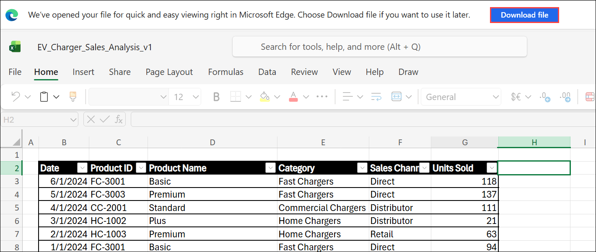

1. Open a new tab in the browser and navigate to [M365copilot.com](https://m365copilot.com/).

    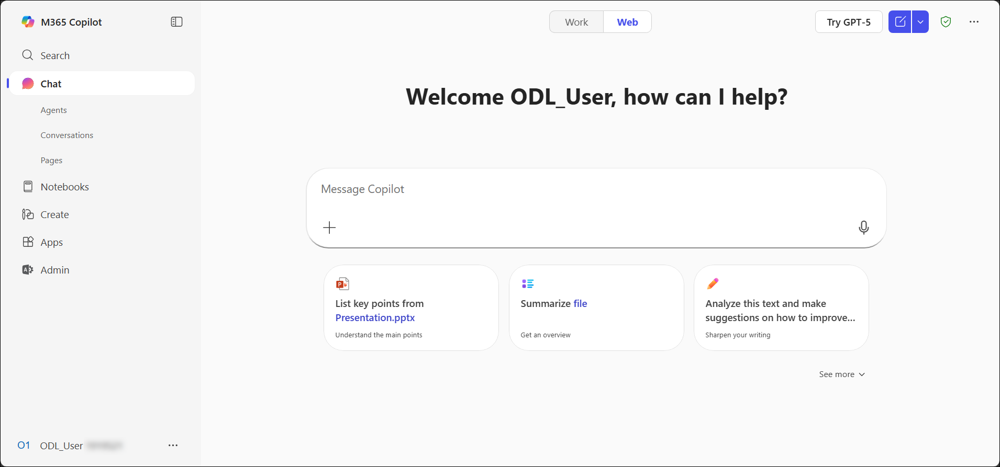

1. Click on the **Apps (1)** from the left navigation pane, and then select **Excel (2)** under the Apps section.

    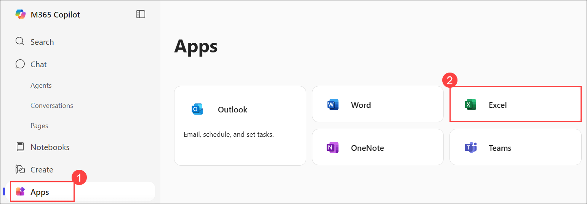

1. In the Excel window, click **Upload a file (1)**. In the **Open** dialog box, select **`EV_Charger_Sales_Analysis_v1.xlsx` (2)** and click **Open (3)**.

    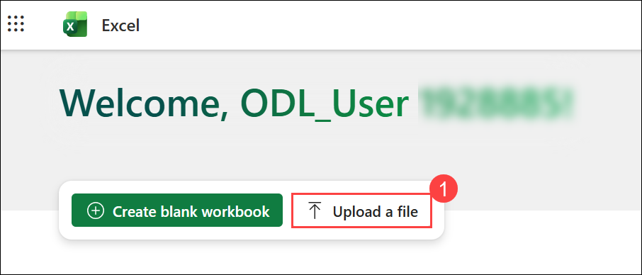

    .png)

1. Navigate to the **Sales by Product** tab in the Excel file.

    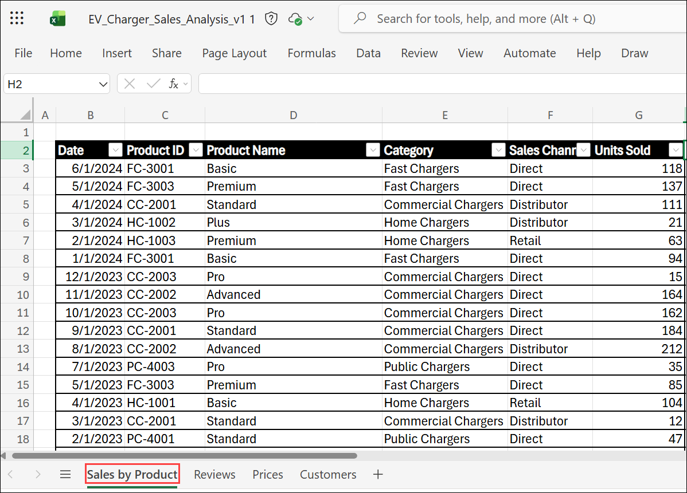

1. From the **Home (1)** tab, select **Copilot (2)** from the excel ribbon, then select **App skills (3)** to open the Copilot pane.

    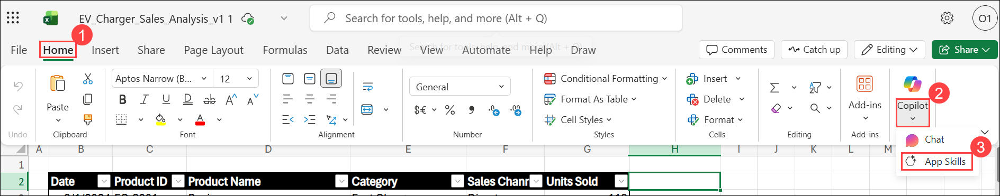

    >**Note:** If *Sign in to access copilot* pop-up window appears, click on **Sign in**.

    .png)

1. Use Copilot to Calculate Monthly Revenue:  

   Let's start by figuring out which category of your business is driving the most revenue. This sheet contains three years of sales data, with thousands of rows showing sales by product by month. Although it's a routine task, this volume of data can be unwieldy. You can ask Copilot to quickly calculate the monthly revenue by product.

   Use the following prompt:

   ```text
   Calculate monthly revenue by product and add a column with total revenue - refer to the Prices worksheet.
   ```

    - Copilot knows how to do that and which data to reference across tabs.
    - Copilot creates a plan for how it runs those numbers, executes that plan showing its work as it goes, and prompts you to ask questions or iterate on the solution it reached.
    - Select **+ Insert column**, then navigate back to the **Sales by Product** tab.

        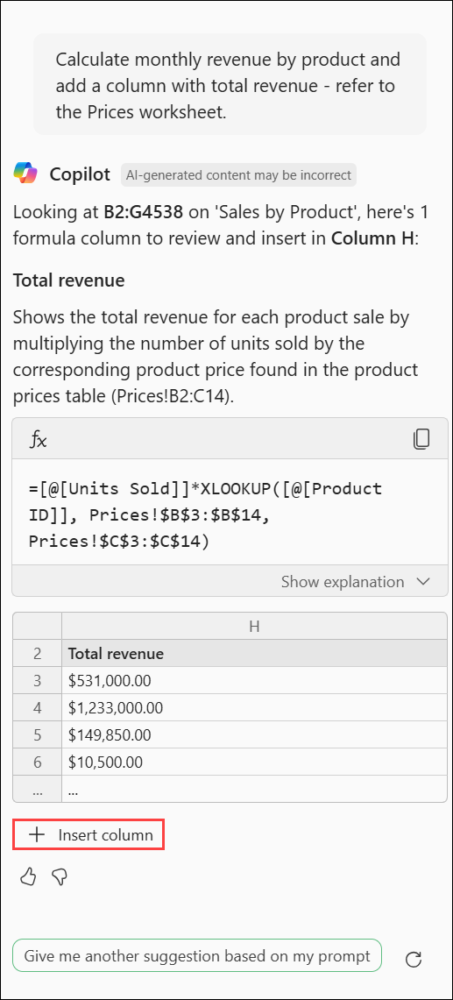

1. Use Copilot to analyze revenue by entering the following prompt in the Copilot pane:

    ```text
    What is the total revenue for each category so far in 2024?
    ```

    - Copilot runs the numbers and creates a bar chart that you can add to your workbook.
    - Select **+ Insert to new sheet**, then navigate back to the **Sales by Product** tab.

        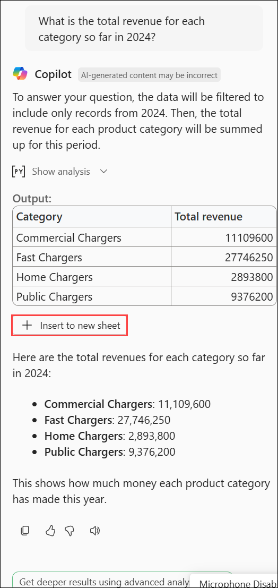

1. Now, use Copilot to highlight products with low sales by entering this prompt:

    ```text
    Highlight rows where the value in column H is less than $100K.
    ```

    - Click on **Apply** so copilot applies conditional formatting, helping you identify products that aren’t performing to your standards. 

        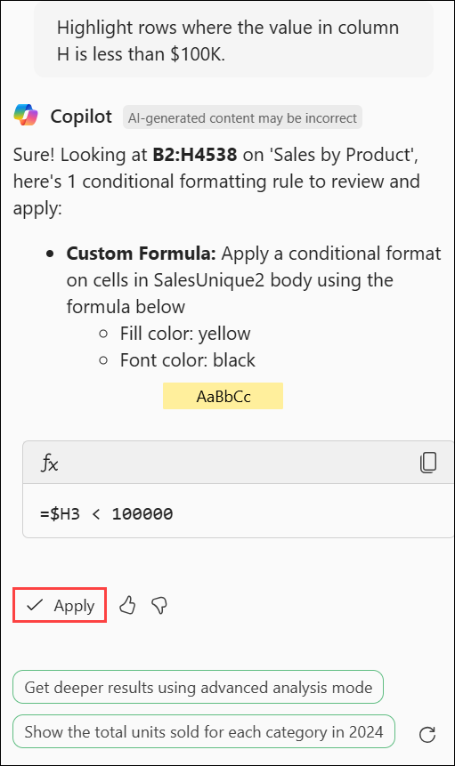

1. Navigate to the **Reviews** tab to analyze customer feedback.

    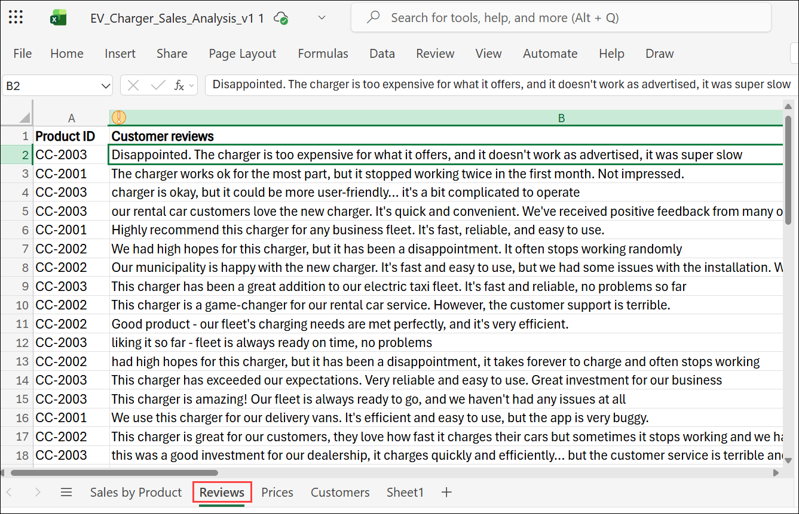

1. Ask Copilot to summarize the top concerns by entering the following prompt:

    ```text
    Summarize the top 3 customer concerns we should focus on.
    ```

    - Copilot analyzes the feedback and surface the top three customer concerns. It looks like charging speed is an emerging issue.

1. Next, highlight reviews mentioning charging speed by entering this prompt:

    ```text
    Highlight reviews that mention issues related to charging speeds.
    ```

    - Copilot highlights all relevant reviews in the dataset.

## Task 2: Copilot Chat

In this task, you'll use **Copilot Chat** to explore the problem further and identify potential solutions.

1. Open a browser and navigate to [M365copilot.com](https://m365copilot.com/).  

1. Ensure **Web** mode is selected.  

    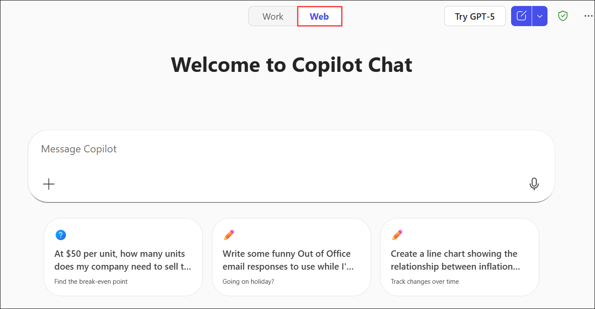

1. To research the issue, enter the following prompt:
  
    ```text
    Research common issues with EV charger speeds and identify potential causes or solutions. Summarize findings in a format suitable for a business presentation. Highlight any relevant industry benchmarks or competitor data.
    ```

   - Review Copilot’s summary and ask for additional context or recent trends, if needed.  

        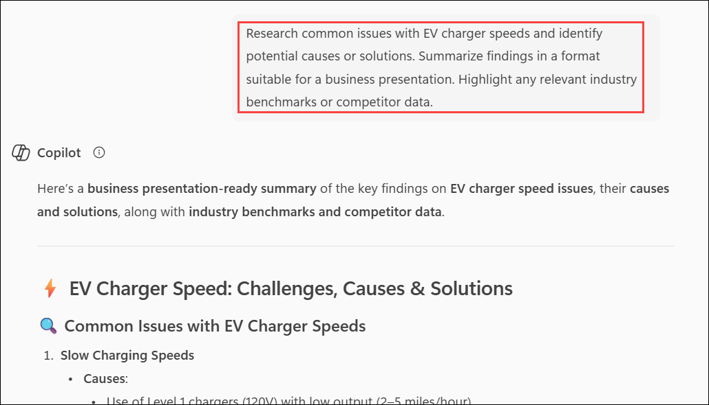

1. Optionally, refine the output:

   - Ask Copilot for recent trends or technologies addressing EV charger efficiency:

        ```text
        What are the latest innovations or technologies addressing slow EV charger speeds in 2024?
        ```

        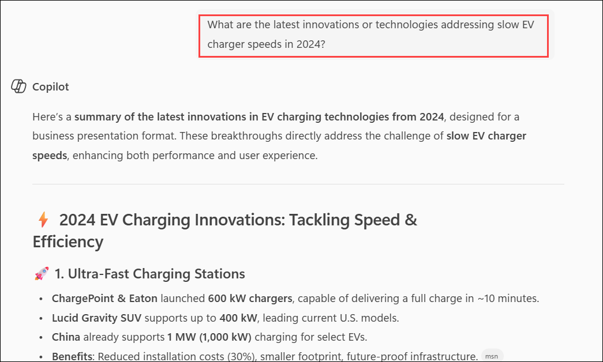

   - Request competitor insights:

        ```text
        Assuming competitors in the EV charging market are improving speed by 20% annually, suggest how we could position our CC-2001 and CC-2000 models to stay competitive.
        ```

        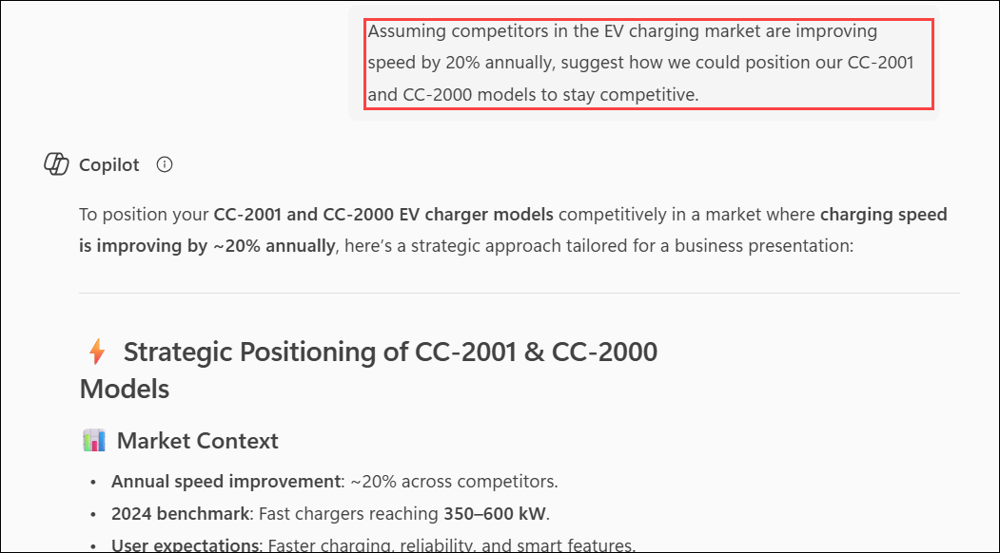

1. Ask copilot to come up with five strategic questions to ask the project lead for EV chargers:

    ```text
    Based on this information, suggest 5 strategic questions to ask the product team during our meeting tomorrow. Focus on identifying root causes, assessing risks, and brainstorming potential improvements.
    ```

    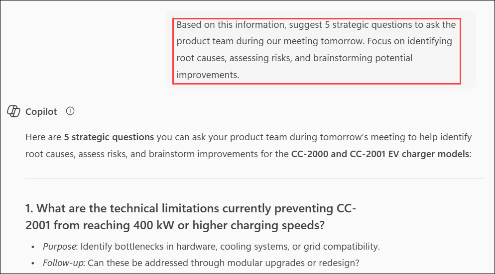

## Task 3: Copilot in Outlook

In this task, you'll use Copilot in Outlook to set up a meeting with the Project lead in charge of the EV charger product line to discuss potential solutions.

1. Open a browser and navigate to [outlook.office.com](https://outlook.office.com.com/).

1. Click on the **Apps (1)** from the left navigation pane, and then select **Outlook (2)** under the Apps section.

    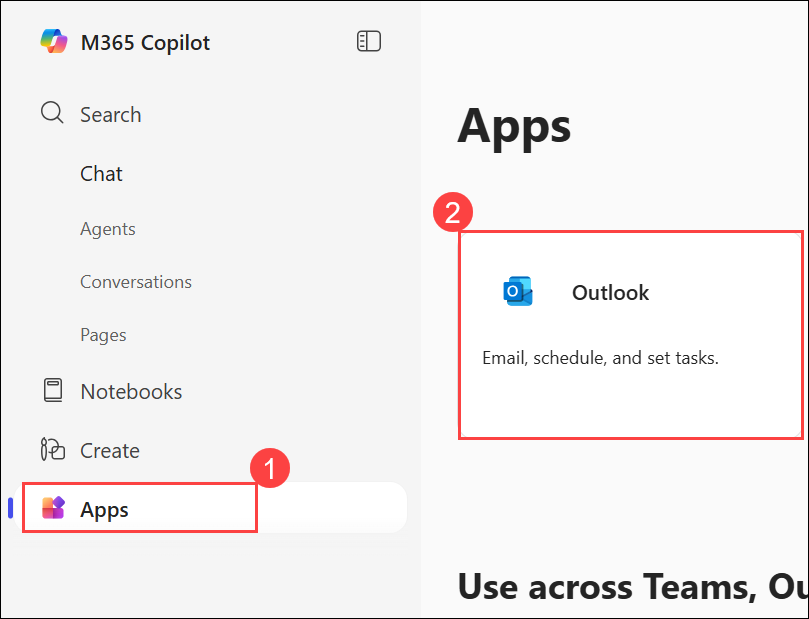

1. In the Outlook ribbon, select the **Copilot** icon to open up the Copilot pane.

    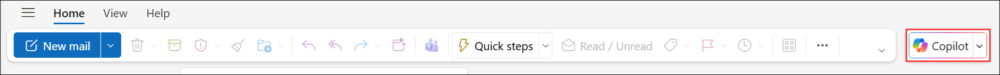

1. In the prompt window, type the following:

    - **Email:** <inject key="User01UPN"></inject>

        ```text
        I need to schedule a meeting with [/Pick a colleague] tomorrow afternoon to discuss the EV charger issue reports. Can you suggest a time that works? If they are unavailable, please suggest an alternative time.
        ```

        >**Note:** After pasting, add the user’s email mentioned in the point that follows the prompt.

1. Copilot will suggest a few possible dates and times for the meeting. Review the options, enter your preferred one, wait for Copilot’s response, and then click **Continue in Outlook**.

1. A new browser tab will open. In that window, under the **Draft an agenda for me (Alt + I)** section, press **Spacebar** to display the **Open Copilot** icon, then paste the following prompt into the prompt box:

    ```text
    Create an agenda for a meeting to discuss slow charging speeds with our CC-2001 and CC-2000 models. Include time for an introduction to the issue, a review of any available data or customer feedback, and a brainstorming session for potential solutions.  
    ```

    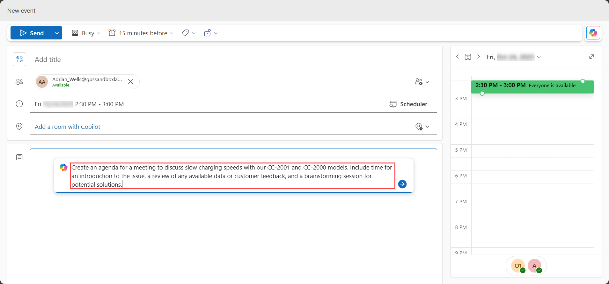

1. Optionally, before selecting **Keep it** you can ask copilot to make it longer, shorter, or change the tone of the drafted agenda.

    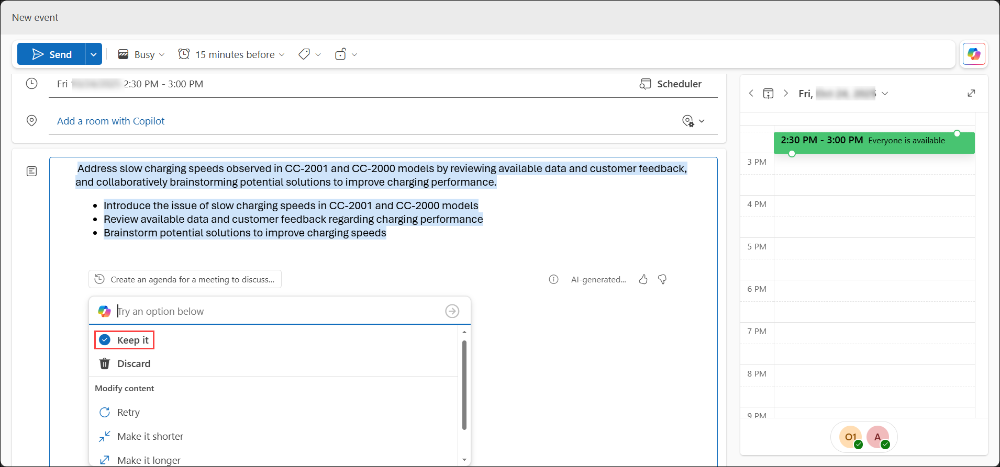

## Summary

By completing this lab, you learned how to apply Copilot to real-world business analysis and collaboration tasks:

- In Excel, you analyzed sales data, calculated revenue, visualized category performance, and pinpointed low-performing products. You also summarized key customer concerns to identify the primary issue, slow charging speeds.

- In Copilot Chat, you conducted quick market research, explored the root causes of charging issues, gathered competitor insights, and formulated strategic questions for the upcoming team discussion.

- In Outlook, you scheduled a meeting with the project lead and generated a focused agenda to guide the conversation on solutions and product improvements.


### Congratulations! You've successfully completed the Hands-on lab.