# Lab 04: Marketing Demo

### Estimated Duration: 35 Minutes

## Overview

In this lab, you’re developing a marketing strategy for Mystic Spice Premium Chai Tea tailored to the Latin American market. Your goal is to analyze market trends, craft creative campaign ideas, and evaluate their effectiveness. Using Microsoft 365 Copilot, you will generate a market analysis report in Word, refine campaign strategies through Copilot Chat, and analyze engagement data in Excel to support data-driven marketing decisions.

## Objectives

- Task 1: Copilot in Word
- Task 2: Copilot Chat
- Task 3: Copilot in Excel

## Task 1: Copilot in Word

In this task, you'll use Copilot in Word to create a comprehensive market analysis report for Mystic Spice Premium Chai Tea, incorporating product details, market trends, and promotional strategies for the Latin American market. You'll also brainstorm creative social media campaign ideas with tailored messaging and taglines for the target audience.

1. Download the following files by clicking on the **Download file** button:

    - [Promotion_Plan_for_Chai_Tea_in_Latin_America.docx](https://github.com/MicrosoftLearning/MS-4021-Copilot-Immersion-Experience/raw/master/ResourceFiles/Promotion_Plan_for_Chai_Tea_in_Latin_America.docx)

    - [Mystic_Spice_Premium_Chai_Tea_product_description.docx](https://github.com/MicrosoftLearning/MS-4021-Copilot-Immersion-Experience/raw/master/ResourceFiles/Mystic_Spice_Premium_Chai_Tea_product_description.docx)

    - [Contoso_Chai_Tea_market_trends.docx](https://github.com/MicrosoftLearning/MS-4021-Copilot-Immersion-Experience/raw/master/ResourceFiles/Contoso_Chai_Tea_market_trends.docx)

    - [Contoso_Chai_Tea_social_marketing_trends.xlsx](https://github.com/MicrosoftLearning/MS-4021-Copilot-Immersion-Experience/raw/master/ResourceFiles/Contoso_Chai_Tea_social_marketing_trends.xlsx)

        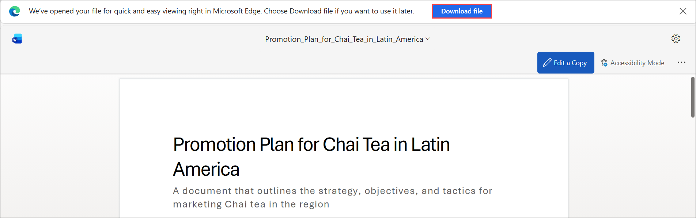

1. Click on the **Apps (1)** fromt he left navigative apne and then select **OneDrive (2)** under Apps section.

    .png)

1. Click on **+ Create or upload (1)** button, and select **Files upload (2)**. 

    .png)

1. On the Open window, select the following files **(3)** and then click **Open (4)**.

    - `Promotion_Plan_for_Chai_Tea_in_Latin_America.docx`
    - `Mystic_Spice_Premium_Chai_Tea_product_description.docx`
    - `Contoso_Chai_Tea_market_trends.docx`

        .png)

1. Open **Word** in your browser from the Apps section on the M365 homepage, then click **+ Create blank document**.

    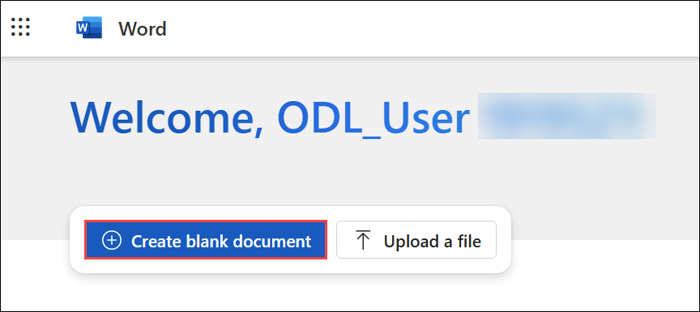

1. In the **What do you want Copilot to draft?** prompt box, paste the following text. Then click **+ Add content (1)** and select the three files **(2)** that were uploaded earlier (Step 3):

    ```text
    Create a Market Analysis report for Mystic Spice Premium Chai Tea using the attached files. Include the product description, market trend analysis, and a promotion plan for Latin America.
    ```

    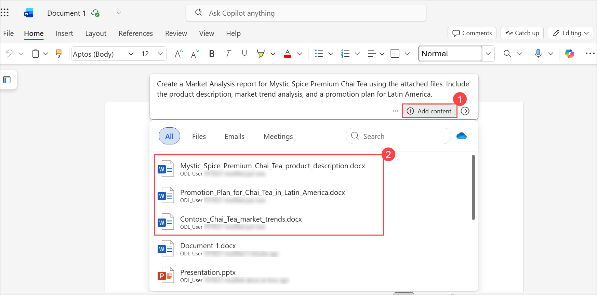

    .png)

    > **NOTE:** Brackets indicate that a document is being referenced. When referencing a document, you can paste the shared link directly or reference the file name if it is available in your OneDrive.

1. Review the result and then click on **Keep it**.

    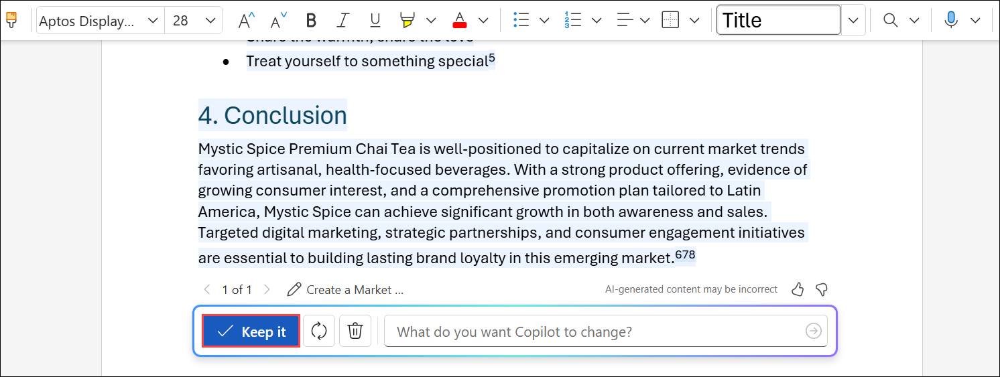

1. Have Copilot create a new section to add social media campaign ideas. Paste the following prompt:

    ```text
    Draft a new section for social media campaigns to promote Mystic Spice Premium Chai Tea. Include a brief description of 2-3 campaign ideas, each with a unique focus. For each campaign, provide a tagline that reflects its theme and resonates with our target audience of young professionals and tea enthusiasts.
    ```

1. When you’re done, click the **drop-down (1)** icon in the top-left corner of the page. Enter **LATAM_Market_Analysis (2)** as the file name, then click anywhere outside the field to save it. 

    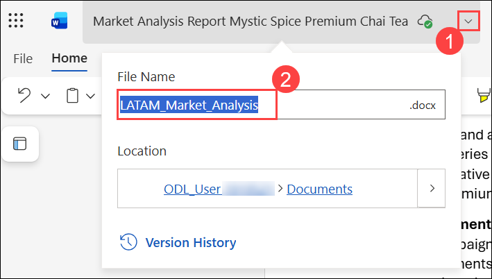

## Task 2: Copilot Chat

In this task, you'll use Copilot Chat to evaluate the effectiveness of proposed social media campaigns and refine strategies for cultural relevance in the LATAM market.

1. Open a browser and navigate to [M365copilot.com](https://m365copilot.com/).

1. Ensure **Web** mode is selected.

    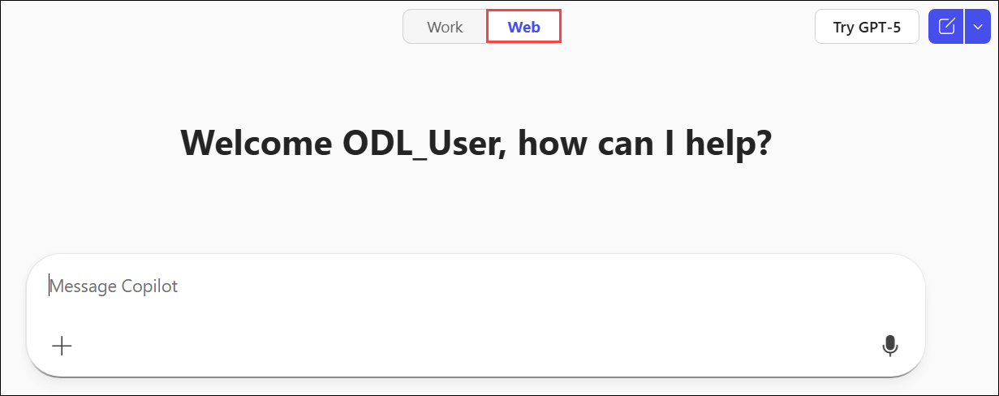

1. In the prompt window, type the following:

    ```text
    Review the social media campaigns outlined in the Market Analysis Report for Mystic Spice Premium Chai Tea.docx. Evaluate which campaign might resonate best with the LATAM market based on cultural relevance, target audience preferences, and alignment with regional trends. Provide reasons for your choice and suggest any adjustments to improve its impact.
    ```

    > **NOTE:** Do not submit the prompt yet. Move to the next step to upload the file.

1. Click **+ Add content and agents (1)** and select **Attach cloud files (2)**, and select the **LATAM_Market_Analysis.docx (3)**, and the click on **Upload (4)**. Then submit the prompt.

    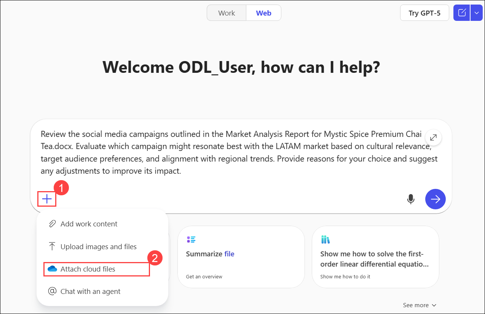

    .png)

1. Copilot should recommend one of the campaigns to focus on and provide suggestions for improvement. In the next prompt, we want Copilot to suggest a marketing campaign slogan for this new idea:

    ```text
    Generate a catchy marketing slogan for the [Campaign name - e.g., 'Morning Motivation'] campaign that highlights its unique value proposition and resonates with the LATAM market. Ensure the slogan reflects a vibrant and culturally relevant tone that appeals to young professionals.
    ```

    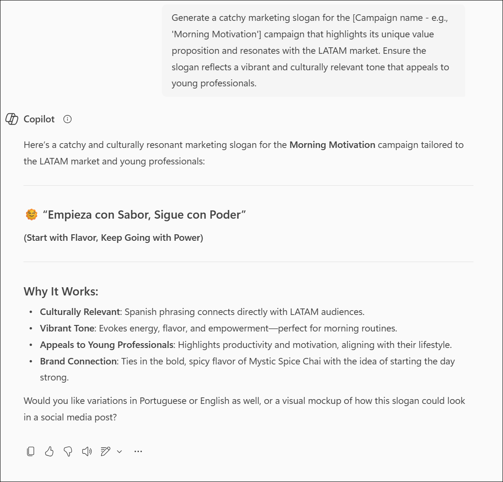

## Task 3: Copilot in Excel

In this task, you'll use Copilot in Excel to analyze social media engagement data, calculate average sales per campaign view, and identify correlations between engagement and sales. You'll also explore viewership trends from September to December to guide future marketing decisions.

1. Ensure you have downloaded [Contoso_Chai_Tea_market_trends_2023.xlsx](https://github.com/MicrosoftLearning/MS-4021-Copilot-Immersion-Experience/raw/master/Contoso_Chai_Tea_market_trends_2023.xlsx) and open the document in Excel (either on the web or desktop application).

1. Click on the **Apps (1)** fromt he left navigative apne and then select **Excel (2)** under Apps section.

    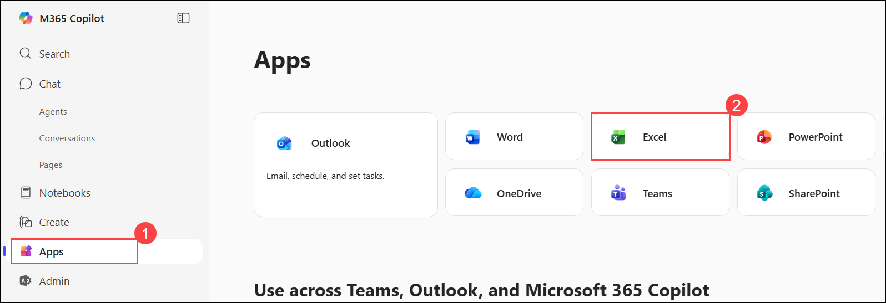

1. In the **Excel** window, click **Upload a file (1)**. In the Open dialog, select **`Contoso_Chai_Tea_social_marketing_trends.xlsx` (2)** and click **Open (3)**.

    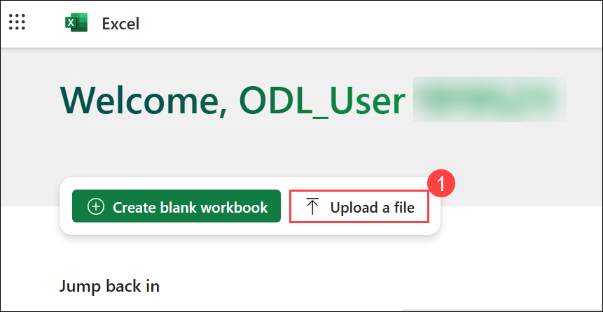

    .png)

1. Click the `Search for tools, help, and more (Alt + Q)` bar **(1)** at the top of the window, select **Copilot (2)**, and then click **App Skills (3)** to open the Copilot pane.

    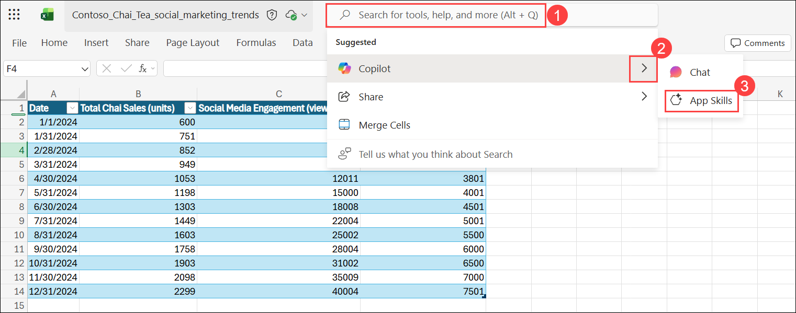

1. Paste the following prompt into Copilot pane:

    ```text
    On average, how many sales do we get per social media campaign view?
    ```

    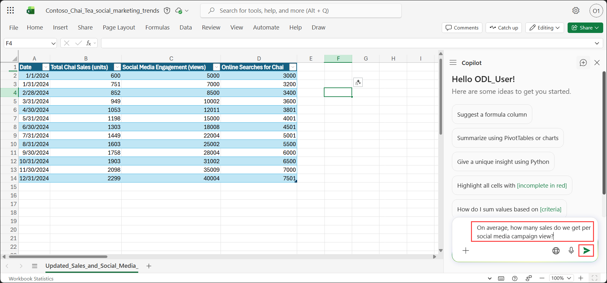

    .png)

1. Next, ask Copilot to compare sales to social media engagement:

    ```text
    Can you show a correlation between social media engagement and sales?
    ```

1. Next, type in the following prompt:

    ```text
    How many social media campaign views did we have from September to December?
    ```

## Summary

In this lab, you’ve:

- Used Copilot in Word to create a market analysis report and brainstorm culturally relevant social media campaigns for the LATAM region.
- Used Copilot Chat to evaluate campaign effectiveness, refine messaging, and generate a compelling slogan aligned with regional preferences.
- Used Copilot in Excel to analyze social media engagement data, calculate average sales per campaign view, and identify trends to guide future marketing efforts.

### You have successfully completed the exercise. Click on Next >> to proceed with the next exercise.

