# Operations

### Estimated Duration: Minutes

## Overview

In this lab, you’re acting as an Operations Manager at Contoso, responsible for vendor procurement and project execution. Your goal is to review past RFPs, extract key selection criteria, and draft a new Request for Proposal (RFP) for an upcoming initiative. Using Microsoft 365 Copilot, you will analyze existing documents in Word, summarize project requirements and vendor criteria in Copilot Chat, and draft a professional email in Outlook to share the RFP with potential suppliers.

## Objectives

- Task 1: Copilot in Word
- Task 2: Copilot Chat
- Task 3: Copilot in Outlook

## Task 1: Copilot in Word

In this task, you'll start by asking Copilot in Word some questions about a Request for Proposal (RFP) document.

1. Download the following files by clicking on the **Download file** button:

    - [Contoso_Completed_RFP.docx](https://github.com/MicrosoftLearning/MS-4021-Copilot-Immersion-Experience/raw/master/ResourceFiles/Contoso_Completed_RFP.docx)

    - [Project_Guidelines_Contoso.docx](https://github.com/MicrosoftLearning/MS-4021-Copilot-Immersion-Experience/raw/master/ResourceFiles/Project_Guidelines_Contoso.docx)

    - [Contoso_RFP_Template.docx](https://github.com/MicrosoftLearning/MS-4021-Copilot-Immersion-Experience/raw/master/ResourceFiles/Contoso_RFP_Template.docx)

        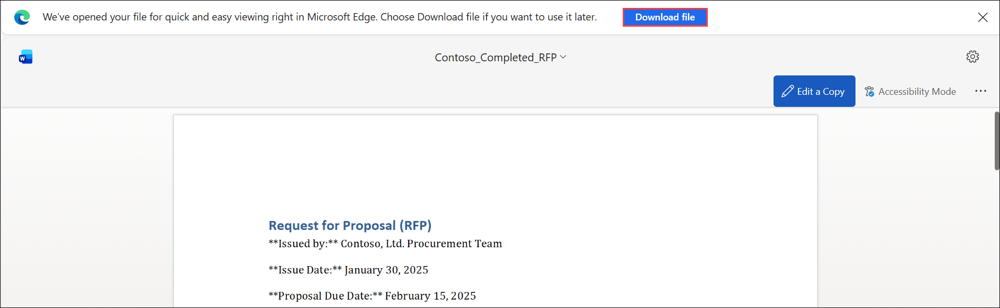

1. Click on the **Apps (1)** from the left navigative pane and then select **Word (2)** under Apps section.

    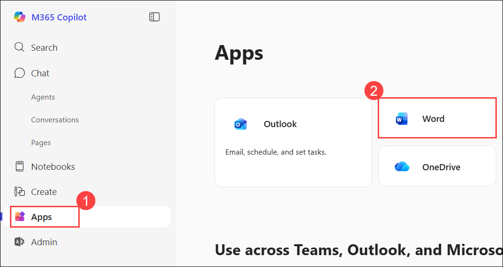

1. Click on the **Upload a file (1)** button, and from the Open dialog, select the file `Contoso_Completed_RFP.docx` **(2)** and click on **Open (3)**.

    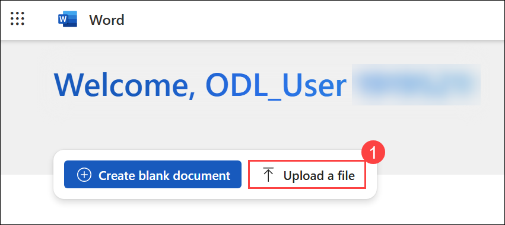

    .png)

1. Select the **Copilot (1)** icon in the Word ribbon to open up the chat pane.

1. In the Chat pane, select or enter **(2)** the prompt:

   ```text
   Summarize this document
   ```

   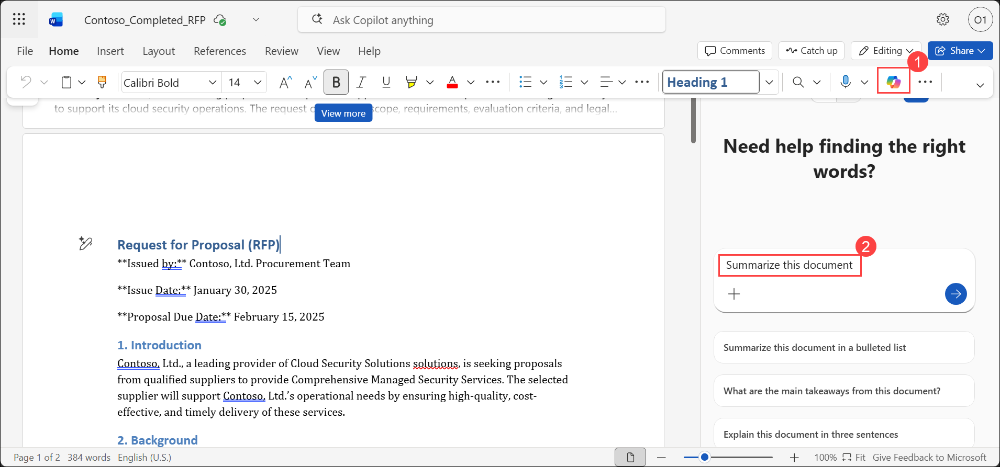

1. Next, enter the following prompt:

   ```text
   Analyze this document and generate a categorized list of required items needed to create an RFP.
   ```

1. Next, ask Copilot to create an RFP template by entering:

   ```text
   Analyze this document and create an RFP template based on the content.
   ```

    > **NOTE:** There is no need to copy the generated content, as we will be using a pre-created template document in the following demo. However, you can showcase how to copy Copilot's response or insert it into the document if relevant to your audience.

## Task 2: Copilot Chat

In this task, you'll use Copilot Chat to summarize project requirements for a new RFP.

1. Open a browser and navigate to [M365copilot.com](https://m365copilot.com/).  

1. Ensure **Web** mode is selected.

    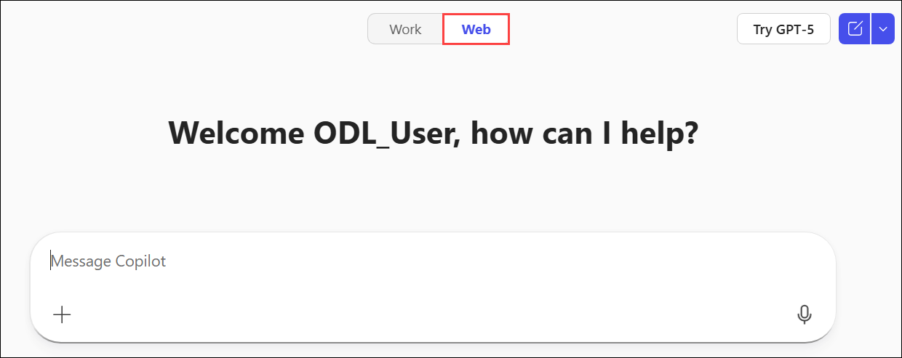

1. Paste the following prompt and the click on the **+ Add content and agents (1)** icon, and select **Upload images and files (2)**. From the Open dialgue, select the file `Project_Guidelines_Contoso.docx` **(3)** and then click **Open (4)**:

   ```text
   Summarize highlighting the key objectives, scope, implementation timeline, budget, compliance needs, and vendor selection criteria in a bulleted list.
   ```

    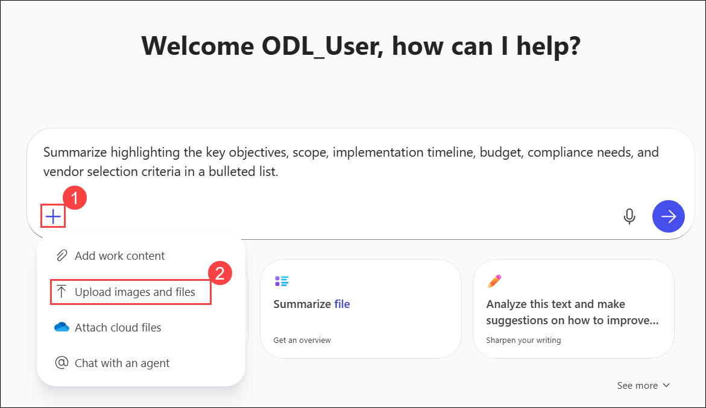

    .png)
    
1. Review the response. 

    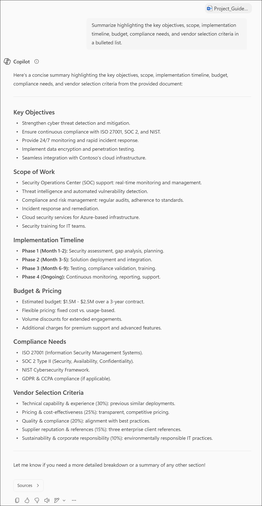

1. Next, ask Copilot to extract vendor selection criteria:

    ```text
    Extract and summarize the key vendor selection criteria from this document, including weight percentages and evaluation factors.
    ```

1. Next, instruct Copilot to generate an RFP using the project guidelines and include the file **`Contoso_RFP_Template.docx`**, similar to how we added **Project_Guidelines_Contoso.docx** earlier in Step 3.

    ```text
    Using the project requirements outlined above, draft an RFP using the following template:
    ```
    
    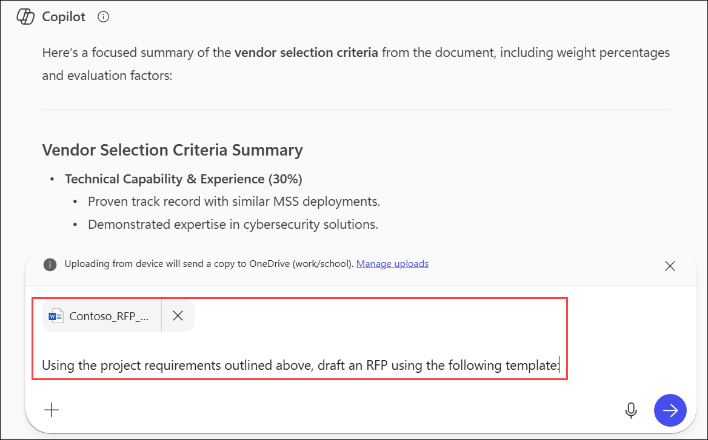

1. Use the **Copy response** icon to copy the generated RFP to your clipboard for the next demo.

    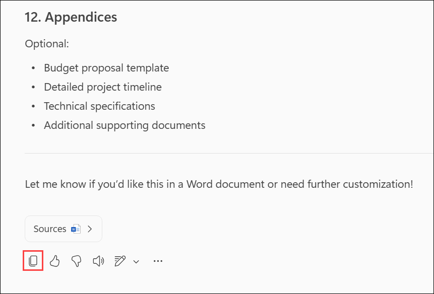

1. Optionally, ask Copilot to export the generated RFP to a Word document.

## Task 3: Copilot in Outlook

In this task, you'll use Copilot in Outlook to draft an email to potential suppliers summarizing the RFP document.

1. Click on the **Apps (1)** fromt he left navigative apne and then select **Outlook (2)** under Apps section.

    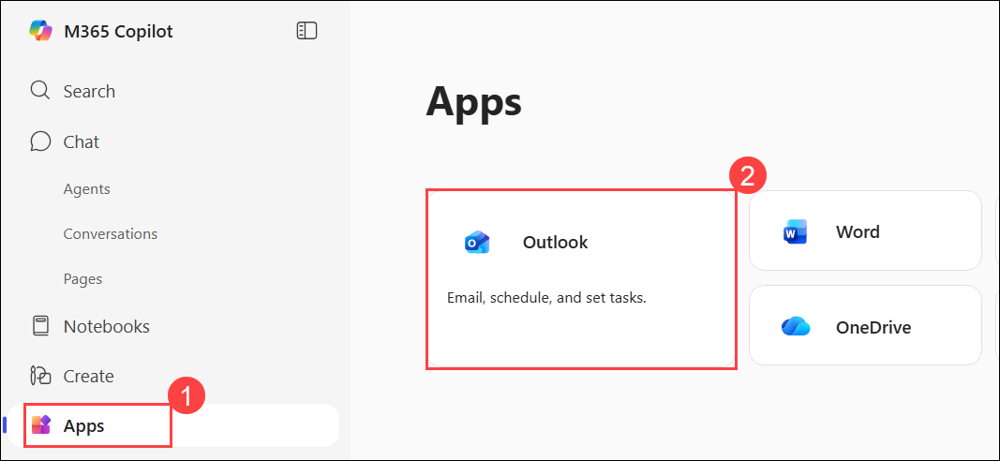

1. On the Outlook homepage, select **New Email**.

    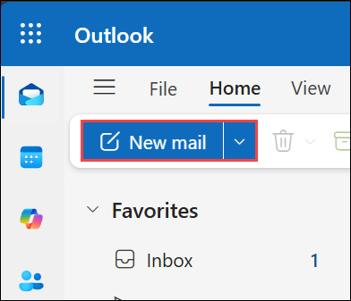

1. Click the **Copilot (1)** icon in the Outlook ribbon, then select **Draft (2)** from the drop-down menu.

    .png)

1. In the **"What do you want this email to say?"** prompt window, paste the following:

   ```text
   Draft an email to potential suppliers summarizing the RFP below:

   [paste contents of RFP]
   ```

   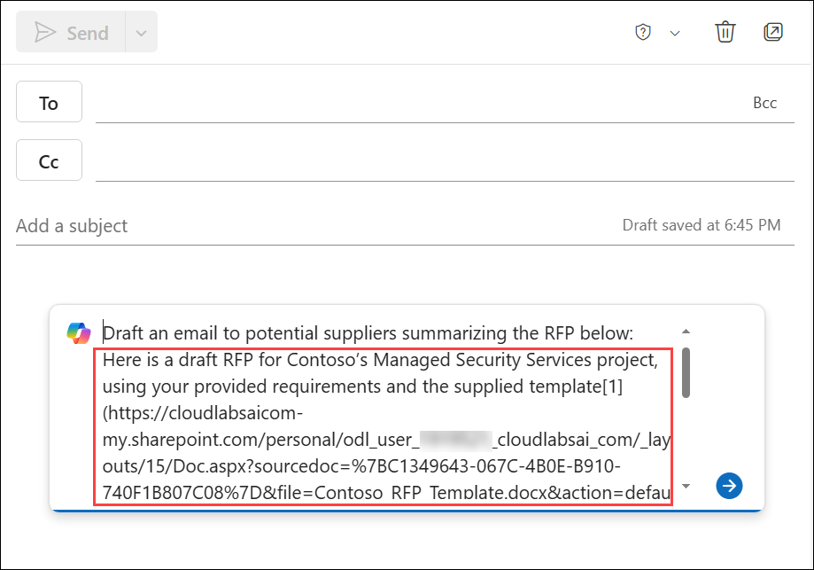

    > **NOTE:** Paste the RFP contents that you copied from the previous demo.

1. After the draft is generated, use the **Modify content** options to adjust the tone, length, or formality, or click **Keep it** if you’re satisfied with Copilot’s output.

    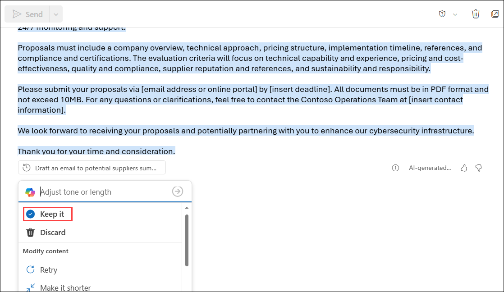

## Summary

In this lab, you’ve:

- Used Copilot in Word to review a completed RFP, extract required components, and explore how Copilot can assist in creating RFP templates.
- Used Copilot Chat to summarize project guidelines, identify vendor selection criteria, and generate a new RFP using a provided template.
- Used Copilot in Outlook to draft a clear and professional email summarizing the RFP for potential suppliers, ready for distribution.

### Congratulations! You've successfully completed the Hands-on lab.
