# Lab-01: Brainstorm ideas using Microsoft 365 Copilot Chat

### Estimated Duration: 30 Minutes

## Overview

In this lab, you will leverage **Microsoft 365 Copilot Chat** to brainstorm innovative ideas and conduct market research for a new product or business in your chosen industry. You’ll interact with Copilot to identify market gaps, research key competitors, and seamlessly export research findings into Word documents for further analysis and summarization. By completing these tasks, you’ll gain practical experience in using Copilot’s AI-powered features to generate, refine, and organize strategic business insights within the Microsoft 365 ecosystem.

## Objectives

- Task 1: Brainstorm Ideas

- Task 2: Conduct Market Research

> **Important**: This exercise provides prompts that you can use to work with Copilot. You should use these as a *starting point* for your exploration of Copilot. You are encouraged to modify these prompts and add prompts of your own to engage in an iterative dialog with Copilot and refine the results it produces. You may not end with exactly the output that is described in the exercise instructions, but that's OK - the point is to experiment with Copilot.

## Task 1: Brainstorm Ideas

In this task, you’ll use Microsoft 365 Copilot Chat to brainstorm new product or business ideas by identifying gaps and emerging trends in a chosen industry. You’ll generate, review, and export Copilot’s insights to a Word document, leveraging features like summaries, insights, and discussion tools for deeper analysis. By completing this task, you’ll create research notes and summaries to support ongoing business planning and decision-making.

1. Navigate to this link https://m365.cloud.microsoft/chat

1. When M365 Copilot portal is opened, make sure you are in **Chat (1)** window and ensure that **Work tab (2)** is selected.

    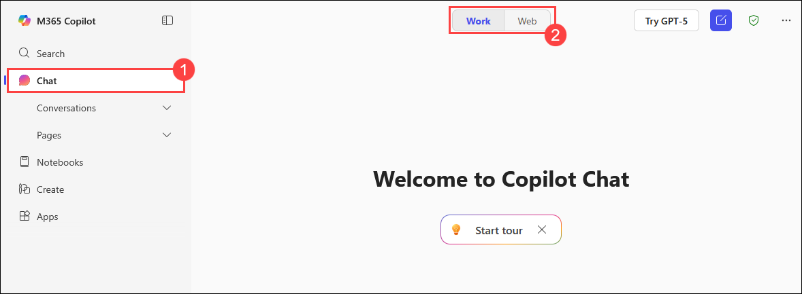

1. Copy the following **prompt (1)** and paste it in the chat window. Also, replace the text within brackets with your choice (***e.g.,*** replace [specific market or industry] with Artificial Intelligence industry) and click on **Send (2)**:

    ```
    Can you help me identify gaps in the [specific market or industry] that could be potential opportunities for a new product or company? I’m looking for underserved areas or emerging trends that could be capitalized on.
    ```

    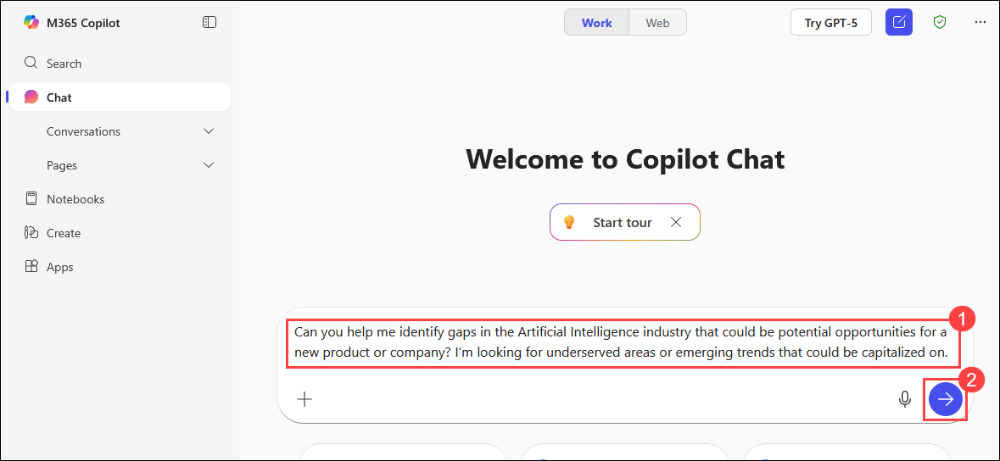

1. Copilot will provide response based on the prompt and industry provided. Go through the response.

    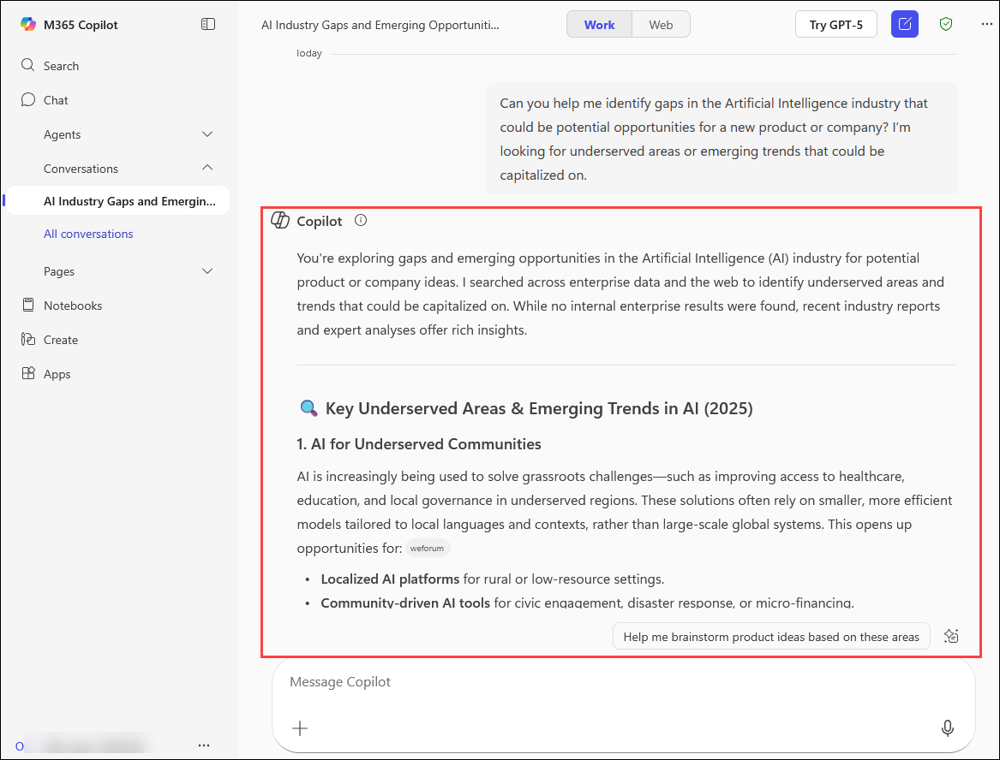

1. Scroll down to the bottom of the response and select **Edit in Pages** option.

    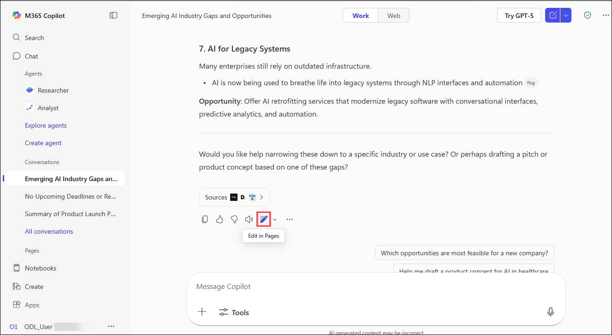

1. The same content will be opened in pages. From the top right side of the pages, click **Open in word**.

    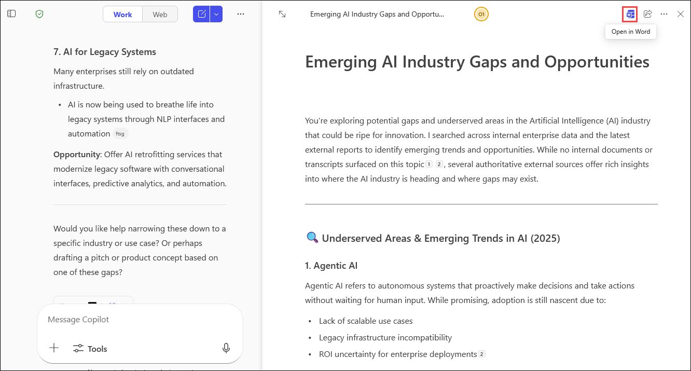

1. Wait for the Copilot to create a word file and export the draft.

    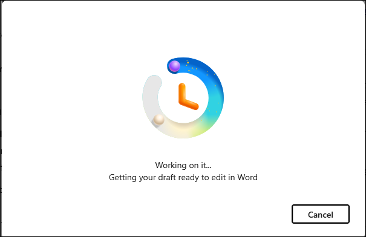

1. Once the draft word file is ready, click **Open Word** button.

    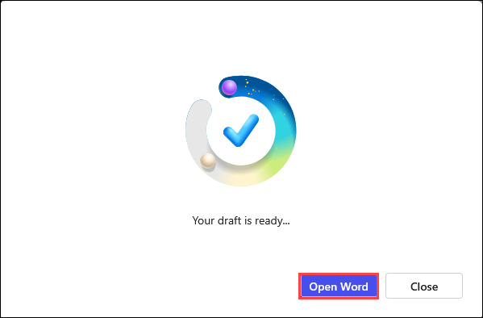

1. When you open the word file, if any pop-up appears, click on **Close**.

    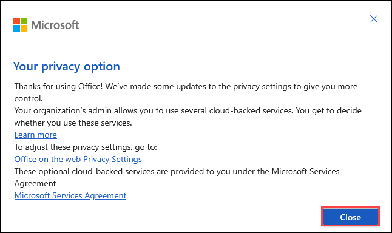

    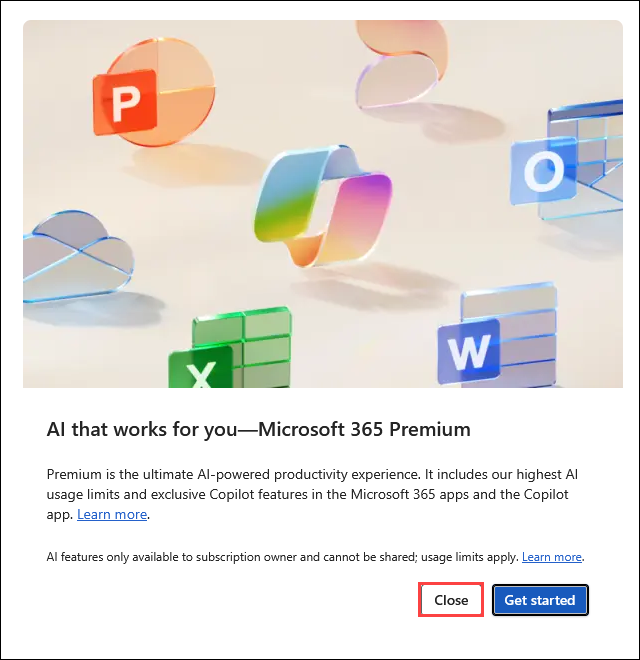


1. Check the content exported by copilot to the word file. Also, click on **View more** option to see the **Summary** of the word file.

    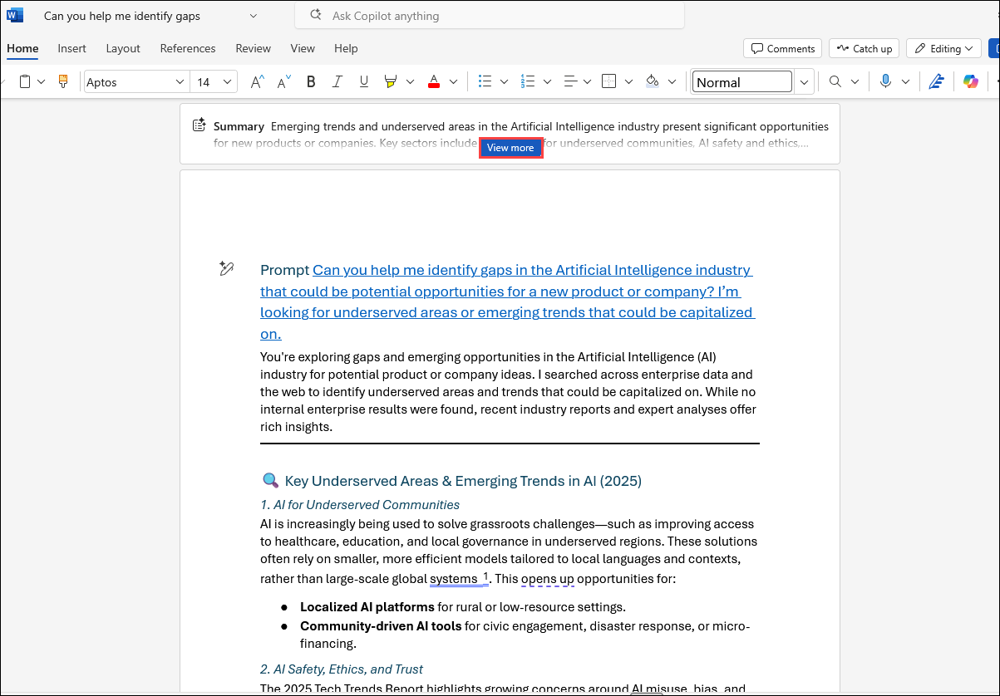

1. After opening the **Summary** created by Copilot, you can customise the summarise by selecting different options like **Standard, Brief and Detailed (1)**. There are other options like **Insights, Discussion and Activity (2)** available by Copilot.

    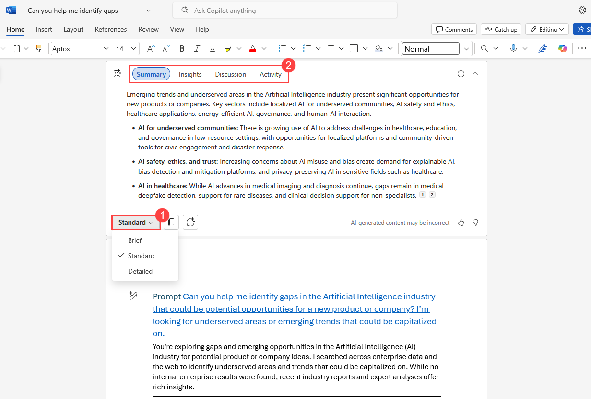

1. Click on the **File name (1)** and rename the file name as **Copilot Research (2)**.

    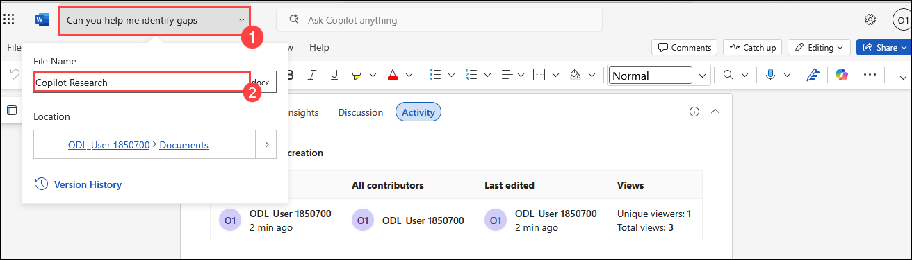

## Task 2: Conduct Market Research

In this task, you’ll use Microsoft 365 Copilot Chat to research key competitors within your selected industry and obtain structured market analysis. Copilot’s generated insights are then copied into your research Word document, forming a central resource for future business planning. By completing this task, you will organize competitor information and establish vital market research notes to inform your business strategy

1. Navigate back to this link https://m365.cloud.microsoft/chat

1. Click on **Chat** to open new chat.

    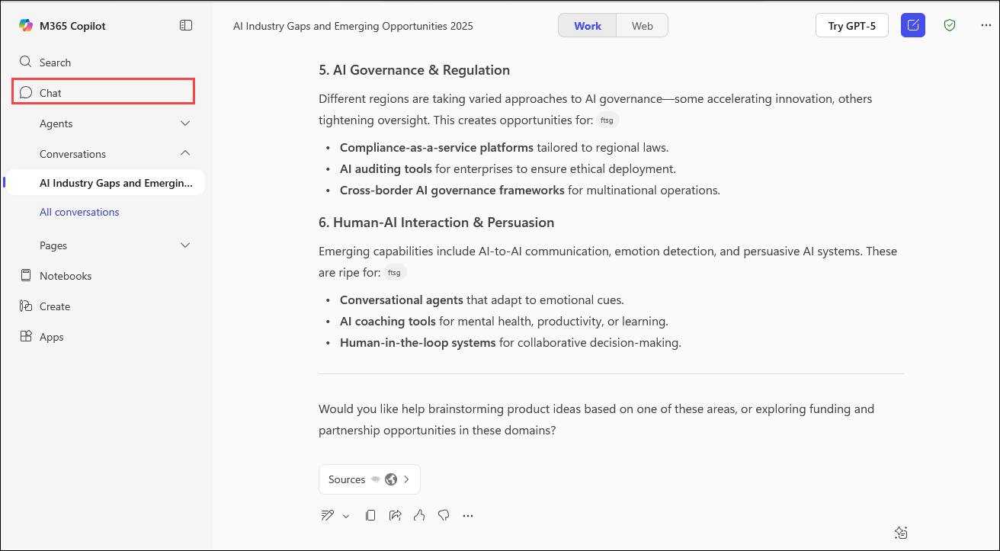

1. Copy the following **prompt (1)** to research competitors and paste it in the chat window. Also, replace the text within brackets with your specific choice (***e.g.,*** replace [industry or market segment] with Artificial Intelligence industry) and click on **Send (2)**

    ```
    I'd like to explore the [industry or market segment] sector. Who are the key competitors?
    ```

    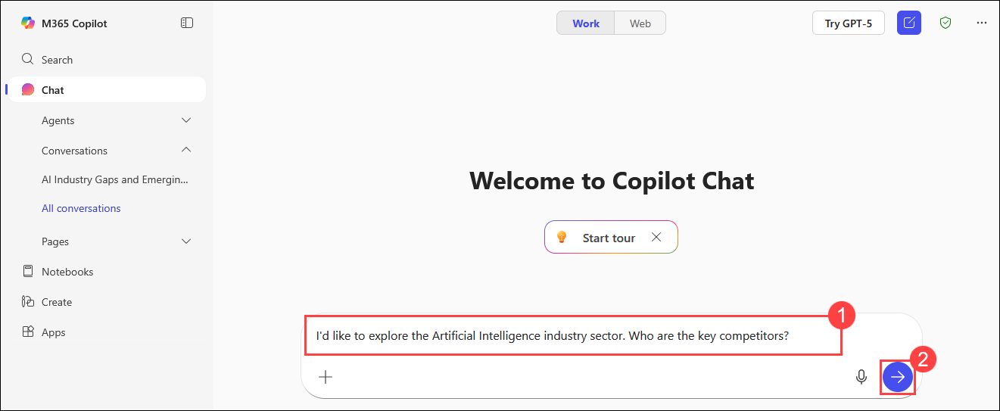

1. Copilot will provide response based on the prompt and industry provided. Go through the response.

    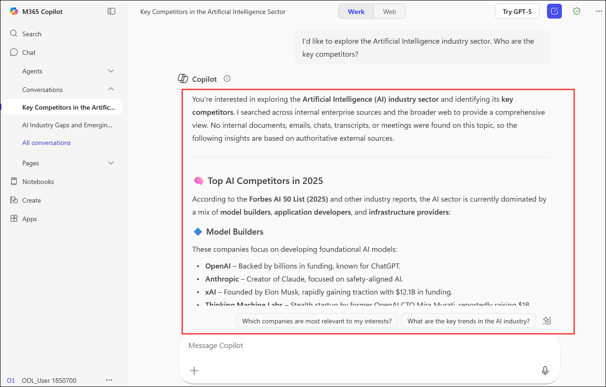

1. Scroll down to the bottom of the response and select **Copy response** option.

    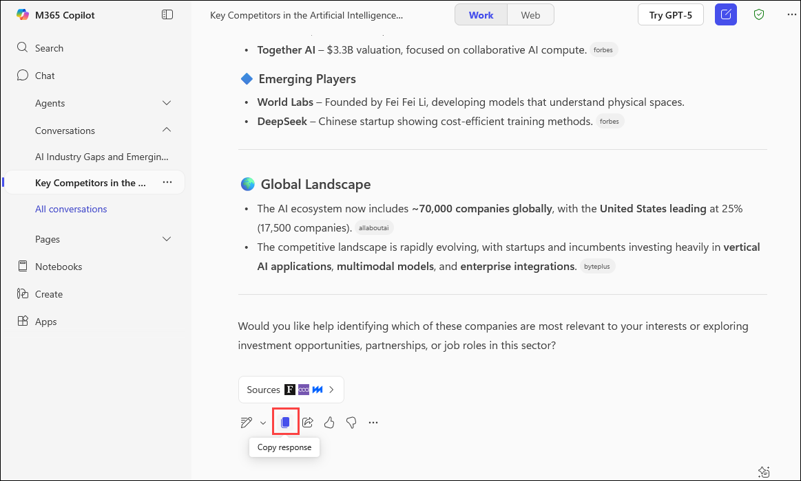

1. Navigate back to **Copilot Research** word document created in previous task and paste the copied copilot response. Make sure this file is saved as we are using this in upcoming exercises.

    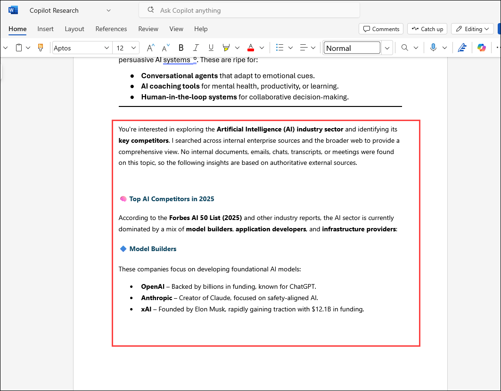

## Summary

In this lab, you explored how Microsoft 365 Copilot Chat streamlines the process of generating and organizing business research. You used Copilot to identify opportunities and gaps in a chosen industry, researched key competitors, and exported these insights to Word documents for deeper analysis. By completing these tasks, you experienced how Copilot enhances productivity and strategic planning by providing actionable market research and supporting documentation in real-world scenarios.

### You have successfully completed the lab, click on Next >> to proceed with the next exercise.

