# Lab-02: Develop a concept using Microsoft 365 Copilot in Word

### Estimated Duration: 30 Minutes

## Overview

In this lab, you will use **Microsoft 365 Copilot in Word** to develop and refine a concept for a new company, building on previous research. You’ll draft a comprehensive concept document, then iterate and enhance it using Copilot’s chat features to make the proposal more concise and persuasive. By completing this lab, you’ll gain practical experience leveraging Copilot to draft, edit, and polish business documents, improving clarity and appeal for professional audiences

## Objectives

- **Task 1:** Draft the Concept Document

- **Task 2:** Iterate and Revise the Document

## Task 1: Draft the Concept Document

In this task, you’ll use Microsoft 365 Copilot in Word to draft a comprehensive concept document for a new company, leveraging previously gathered research. By completing it, you’ll have a well-structured foundation outlining the company’s mission, vision, values, offerings, and market positioning to support further business development.

1. Open the previously saved **Copilot Research.docx** document, which contains foundational research and ideas.

    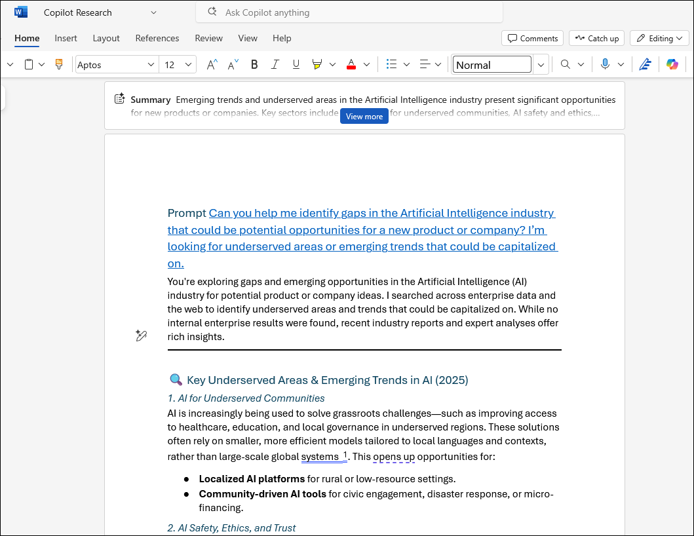

1. Copy the shareable link to this document by clicking **Share (1)** and selecting **Copy Link (2)**.

    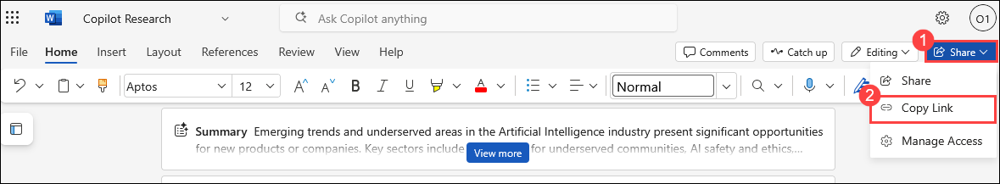

1. A dialog box **Link created** will show up with the file url, click on **Copy** and save this link in notepad as it is used in further steps.

    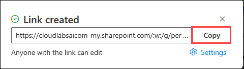

1. Navigate back to M365 Copilot portal, select **Apps (1)** from the left panel and select **Word (2)** from the list of apps.

    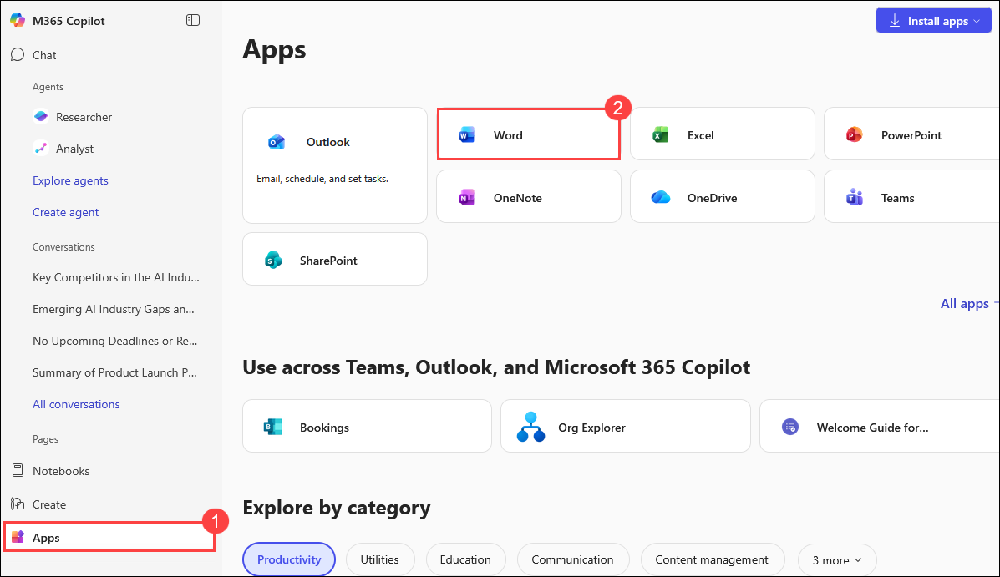

1. You will be redirected to microsoft word website. Click on **Create blank documant** button for new word file creation.

    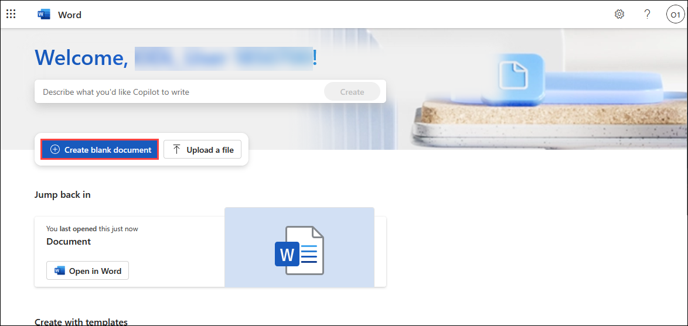

1. A new word file will be created and opened.

    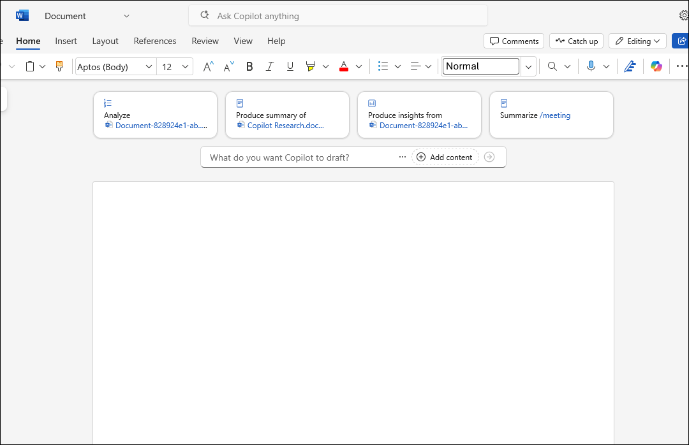

1. Type the following **prompt (1)** and replace the text within brackets with the **Copilot Research.docx** file link copied in previous steps. Then click on **Send (2)**.

    ```
    Draft a concept for our new company Contoso LLC referencing [link to Copilot Research.docx], including its mission, vision, core values, offerings, target audience, and unique market edge.
    ```

    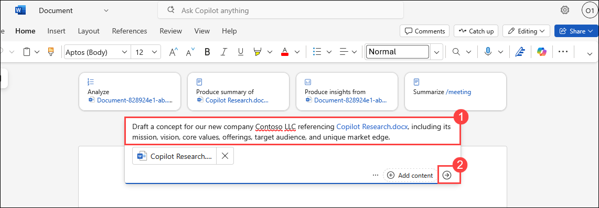

1. Wait for the copilot to generate the draft.

    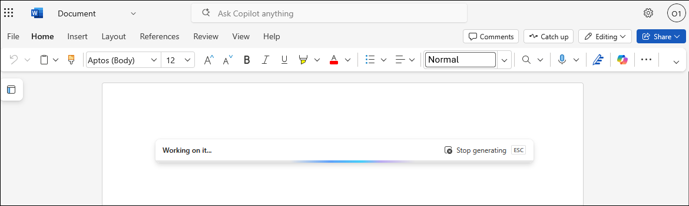

1. Once the draft is generated, review the draft and if all content is good, scroll down and click on **Keep it**.

    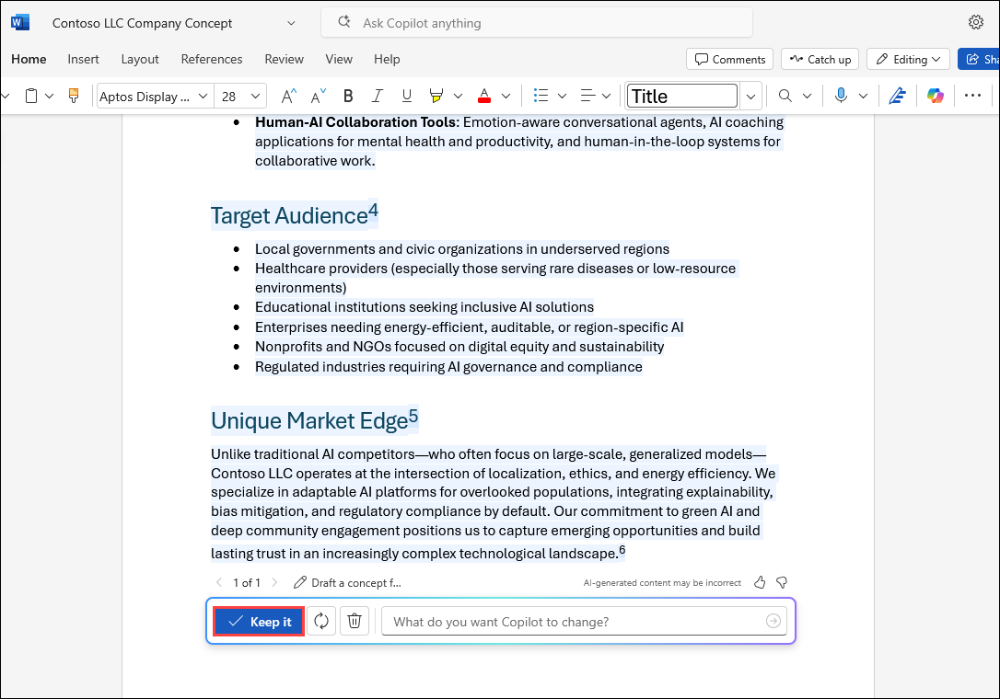

1. Click on the **file name (1)** at the top left corner and rename the file as **Product Concept (2)** and save the file. You’ll use this document in the next exercise.

    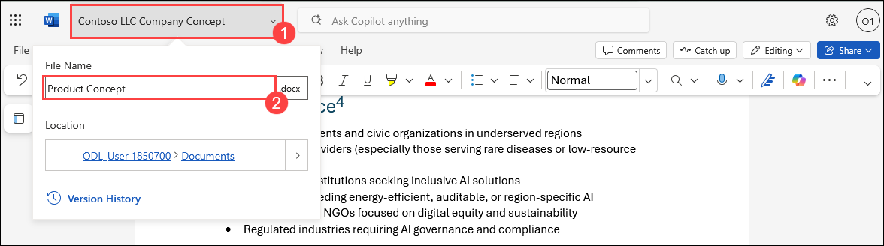

## Task 2: Iterate and Revise the Document

In this task, you’ll use Microsoft 365 Copilot in Word to iterate and revise a concept document by refining its persuasiveness and improving the summary for greater clarity and impact. By completing it, you’ll have a polished and compelling concept ready to engage potential sponsors and stakeholders.

1. From the top right tool bar, click on **Copilot (1)** icon and the **Copilot Chat (2)** window will show up at the right side.

    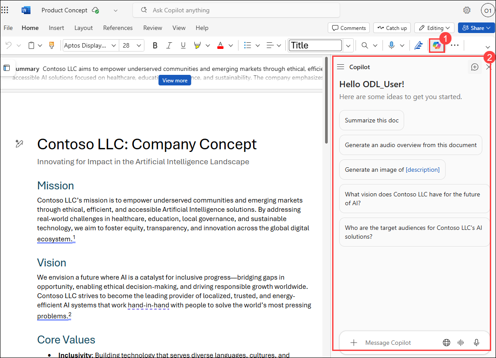

1. Copy the following **prompt (1)** and paste it in the chat window and click on **Send (2)**.

    ```
    Can you refine this concept by making it more persuasive for potential sponsors?
    ```

    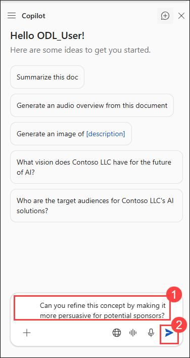

1. Copilot will provide a response in the chat panel. Click on **Insert (1)** button at the end of the response and the content will be **pasted (2)** in your word file.

    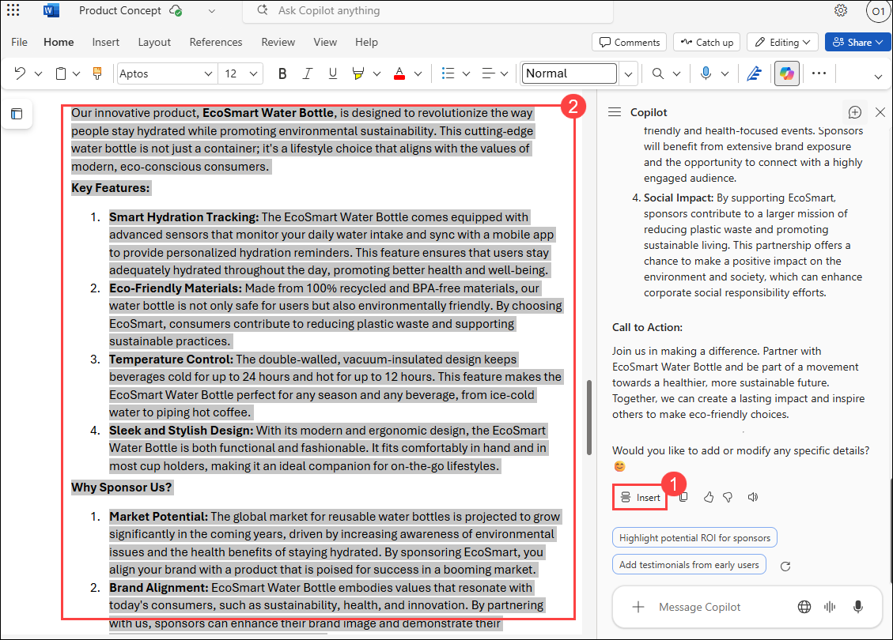

1. Copy the following **prompt (1)** and paste it in the chat window and click on **Send (2)**.

    ```
    Improve the summary to make it more concise and impactful.
    ```

    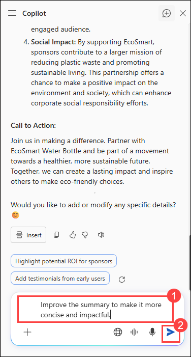

1. Copilot will provide a response in the chat panel. Click on **Insert (1)** button at the end of the response and the content will be **pasted (2)** in your word file.

    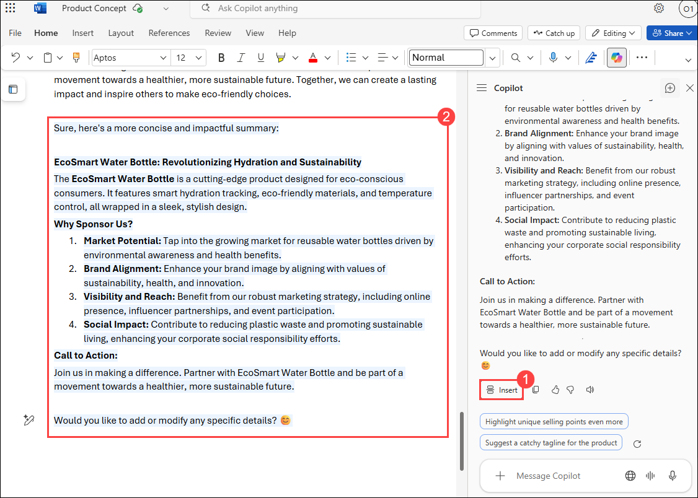

## Summary

In this lab, you explored how Microsoft 365 Copilot can assist in developing and refining a business concept using Word. You drafted a detailed concept document based on prior research and iteratively revised it to enhance persuasiveness and clarity. By completing these tasks, you experienced how Copilot supports document creation and improvement, boosting productivity and communication in business development processes.

### You have successfully completed the lab, click on Next >> to proceed with the next exercise.

