# Lab 03: Create a presentation using Microsoft 365 Copilot in PowerPoint

### Estimated Duration: 35 Minutes

## Overview

In this lab, you will explore how **Microsoft 365 Copilot in PowerPoint** can be used to transform a business concept document into a professional presentation. You’ll create a slide deck from the concept document, then enhance and refine it with Copilot’s suggestions on slide order, engagement improvements, and additional content for challenges and mitigation strategies. By completing these tasks, you’ll gain hands-on experience using Copilot to efficiently develop impactful presentations that support clear and persuasive business communication.

## Objectives

- Task 1: Create Presentation from Concept Document

- Task 2: Enhance and Refine Presentation

## Task 1: Create Presentation from Concept Document

In this task, you’ll use Microsoft 365 Copilot in PowerPoint to create a professional presentation by converting a detailed concept document into well-structured slides. By completing it, you’ll have a comprehensive slide deck that visually communicates your business concept, ready to engage an audience effectively.

1. Copy the shareable link to this document by clicking **Share (1)** and selecting **Copy Link (2)**.

    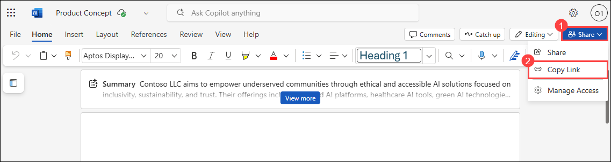

1. A dialog box **Link copied** will show up where the file url link will be copied automatically, save this link in notepad as it is used in further steps.

    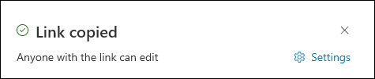

1. Naviagete back to M365 Copilot portal, select **Apps (1)** from the left panel and select **PowerPoint (2)** from the list of apps.

    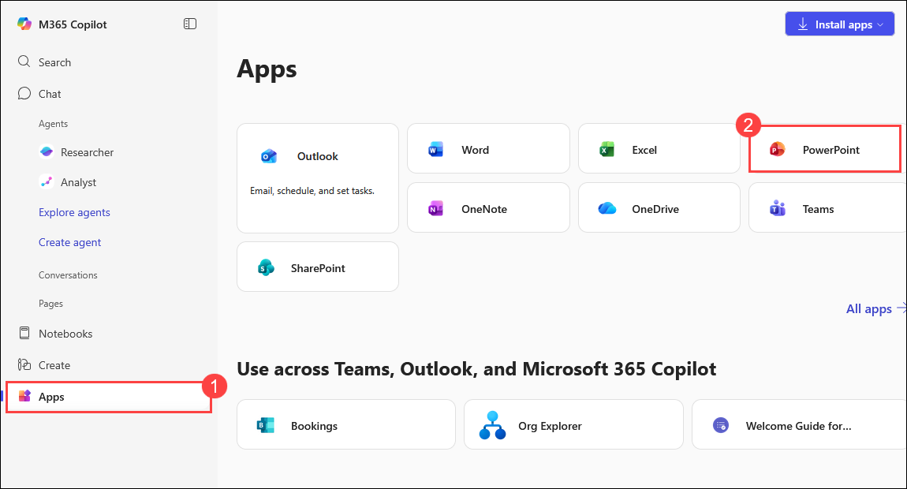

1. You will be redirected to microsoft powerpoint website. Click on **Create blank presentation** button for new powerpoint file creation.

    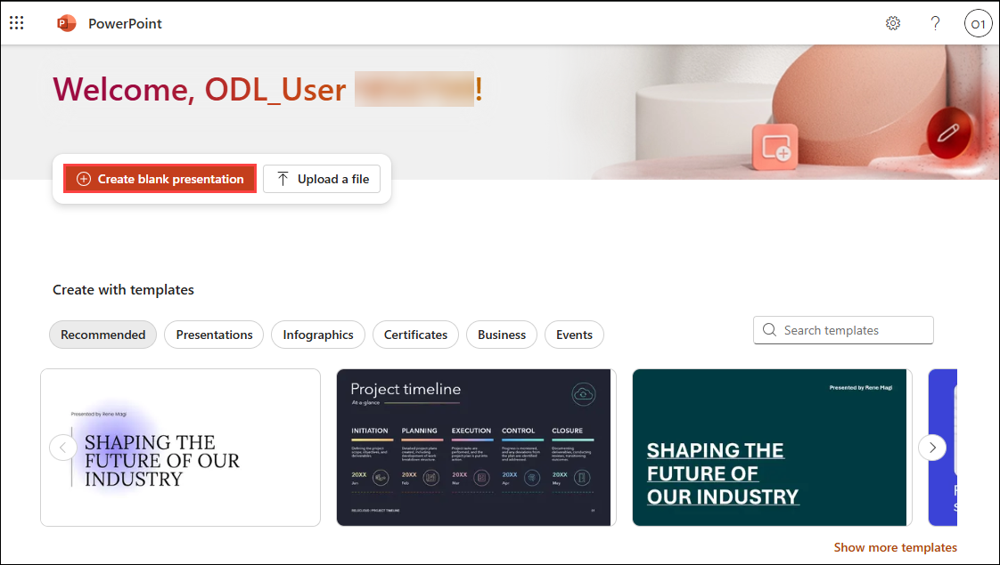

1. A new powerpoint file will be created and opened. Click on **Copilot (1)** icon in the first slide and then click on **Create a new presentation with file (2)** option.

    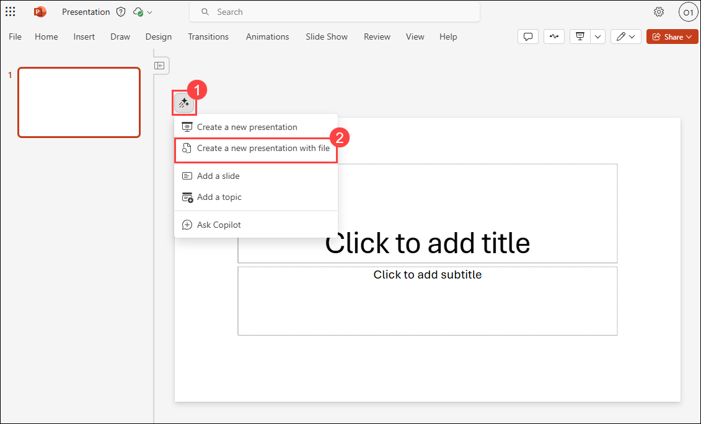

1. Type the following **prompt (1)** and replace the text within brackets with the **Product Concept.docx** file link copied in previous steps. Then click on **Send (2)**. You can also change a design theme by clicking on the **Change Design (3)** option before sending the prompt. 

    ```
    Create a presentation from [Link to Product Concept.docx].
    ```

    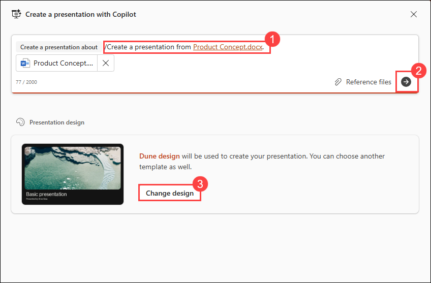

1. Then, copilot will create a presentation outline based on the concept document provided. Review the **outline (1)** and if everything looks good, click on **Generate slides (2)** button.

    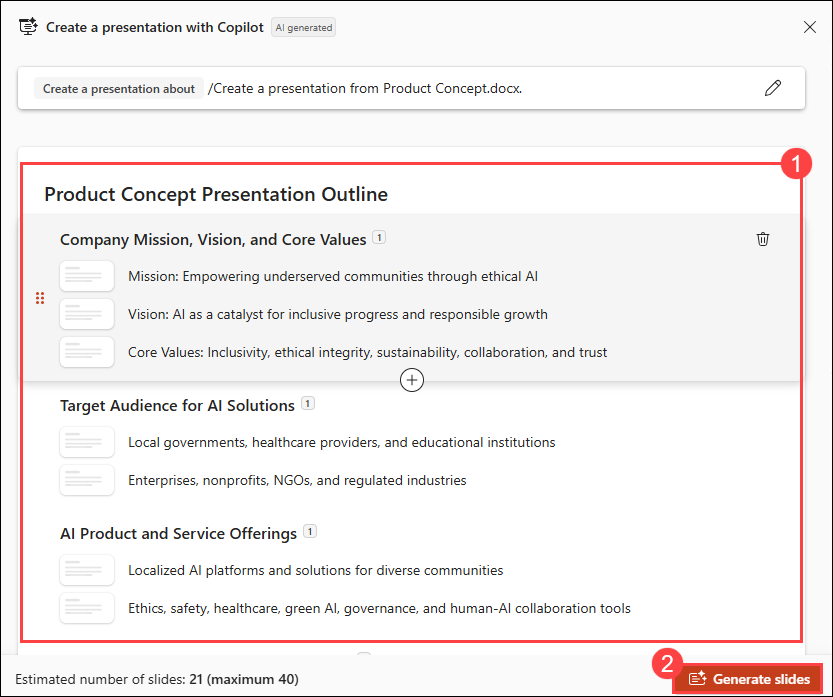

1. Wait for the copilot to generate the presentation slides.

    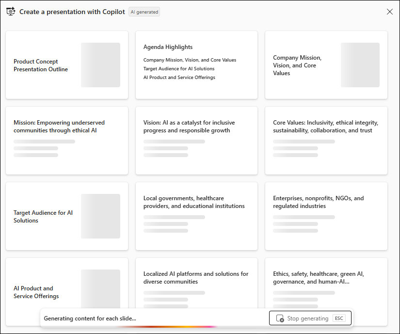

1. Once the presentation slides are generated, review the slides created by copilot. If everything looks good, click on **Keep it** button.

    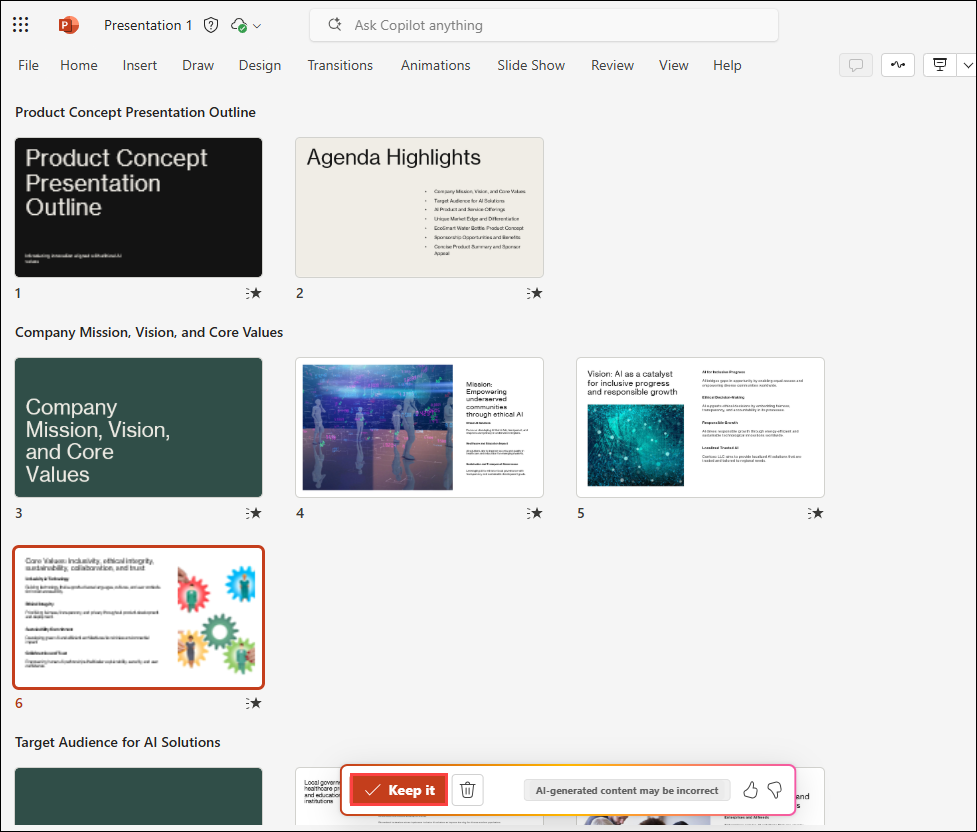

## Task 2: Enhance and Refine Presentation

In this task, you’ll use Microsoft 365 Copilot in PowerPoint to enhance and refine a presentation by optimizing slide order, improving engagement through specific suggestions, and adding slides that address potential challenges and mitigation strategies. By completing it, you’ll have a polished, impactful presentation tailored to effectively communicate your business concept.

1. Click on **Normal view** from the bottom right corner to switch the view to edit mode.

    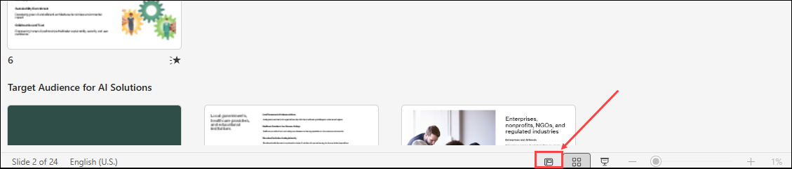

1. From the top left corner, select **Home (1)** tab and then click on **Copilot (2)** icon to open the copilot chat window.

    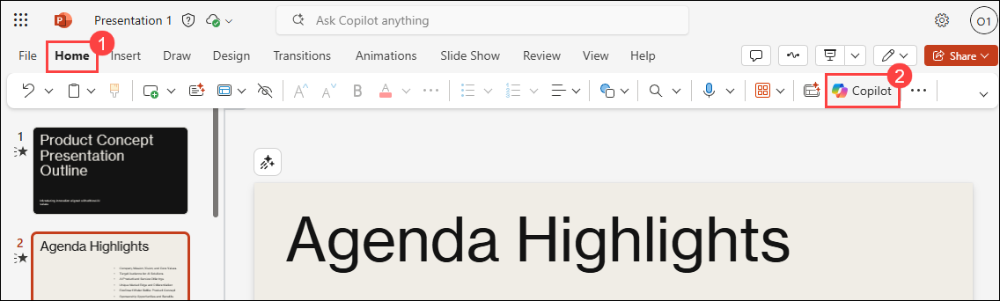

1. Copy the following **prompt (1)** and paste it in the chat window and click on **Send (2)**.

    ```
    What’s the best order to present this information for maximum impact?
    ```

    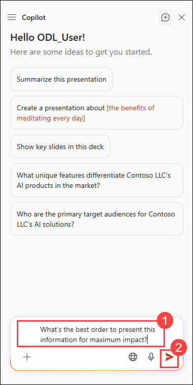

1. Copilot will provide a response in the chat panel. Use this suggestion to reorganize the slides for creating more impact.

    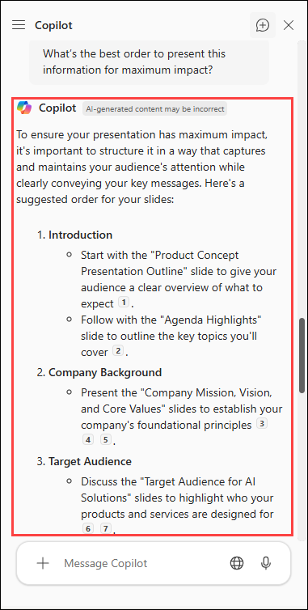

1. Copy the following **prompt (1)** and paste it in the chat window and click on **Send (2)**.

    ```
    Give me specific examples from this presentation on how I can improve it for better engagement.
    ```

    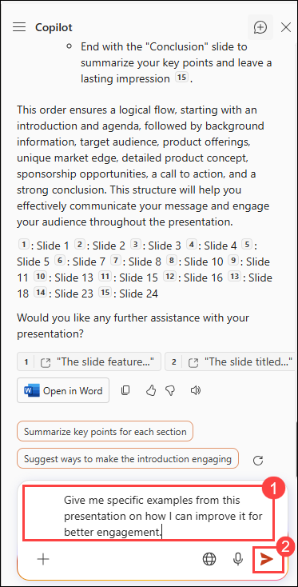

1. Copilot will provide a response in the chat panel. Use these suggestions to add improvements for readers engagement.

    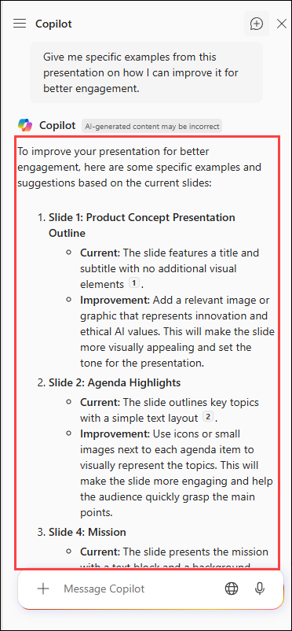

1. Copy the following **prompt (1)** and paste it in the chat window and click on **Send (2)**.

    ```
    Add 2 slides detailing potential challenges this new product may face, and include a slide that outlines key strategies to mitigate those challenges.
    ```

    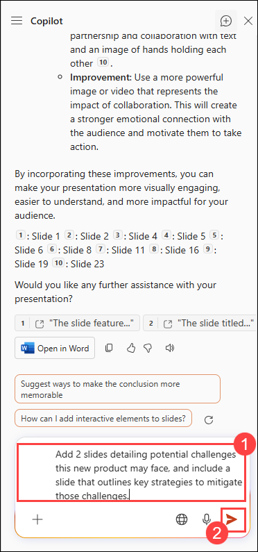

1. Copilot will add slides to address critical aspects of your concept, such as potential challenges and strategies. You can see the **new slides** added in the slide panel on the left side.

    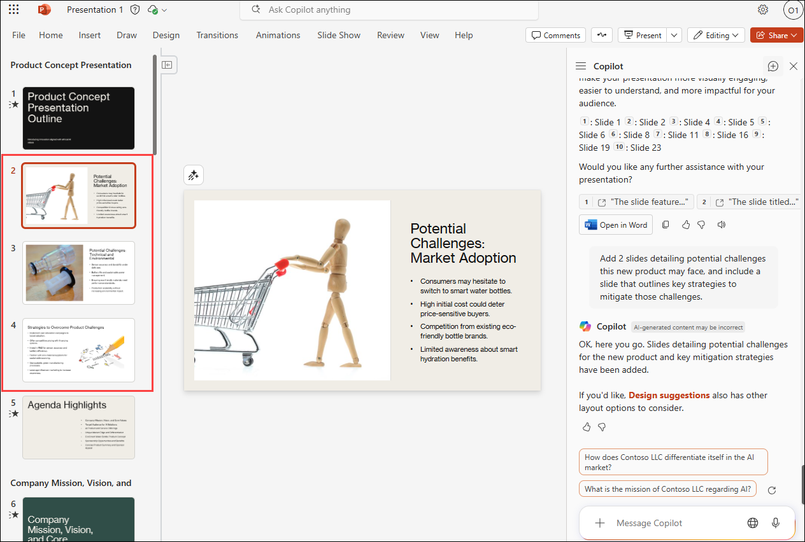

1. Finally, click on the **file name (1)** at the top left corner and rename the file as **Product Presentation (2)** and save the file. You’ll use this presentation in the next exercise.

    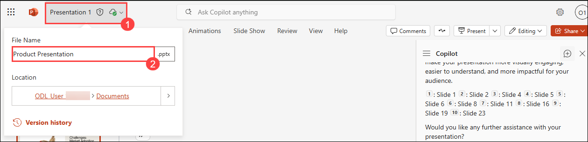

## Summary

In this lab, you explored how Microsoft 365 Copilot can facilitate the creation and refinement of a business presentation. You used Copilot in PowerPoint to generate a slide deck from a detailed concept document, then enhanced the presentation by optimizing slide order, improving engagement, and adding critical content on challenges and strategies. By completing these tasks, you experienced how Copilot supports efficient and impactful communication, enhancing productivity and creativity in business presentations.

### Congratulations! You've successfully completed the Hands-on lab.
