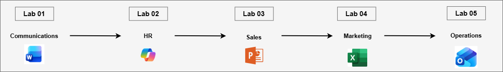
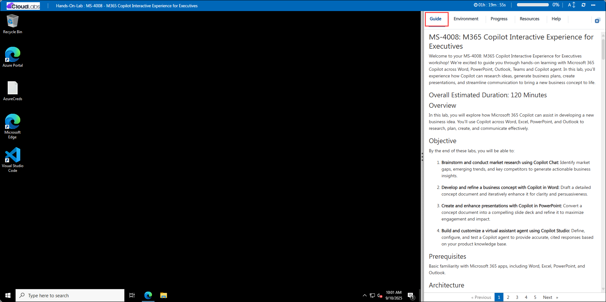

# MS-4021 : Copilot for Departmental Excellence

Welcome to your MS-4021 : Copilot for Departmental Excellence workshop! We’re excited to guide you through hands-on learning with Microsoft 365 Copilot across Word, Excel, Outlook, PowerPoint, and Copilot Chat. In this lab, you’ll experience how Copilot streamlines everyday workflows, analyzing data, drafting professional documents, managing emails, and building presentations with ease. You’ll see how Copilot connects insights, communication, and creativity across Microsoft 365, empowering you to work faster, think clearer, and make smarter business decisions.

### Overall Estimated Duration: 2 Hours

## Overview

In this lab, you will explore how Microsoft 365 Copilot enhances productivity, communication, and business insights across Excel, Word, Outlook, and PowerPoint. You’ll use Copilot to analyze EV charger sales data, generate professional reports, draft and summarize emails, and design presentations, all through natural language prompts. The lab showcases how Copilot integrates data analysis, content creation, and collaboration into a unified workflow, helping you work smarter and deliver results faster.

## Objectives

By the end of these exercises, you will be able to:

* **Leverage Copilot in Excel for financial and operational analysis:** Use natural language prompts to analyze EV charger sales data, uncover performance trends, calculate key metrics, and visualize insights without manual formula creation.

* **Generate and refine business content using Copilot in Word:** Transform structured data into compelling narratives, create professional reports, and summarize analysis results into executive-ready documents directly from your Excel insights.

* **Plan and organize meetings efficiently with Copilot in Outlook:** Draft agendas, summarize email threads, and coordinate schedules using AI-driven suggestions to improve communication and meeting productivity.

* **Design impactful presentations with Copilot in PowerPoint:** Convert text-based ideas, reports, or Word documents into visually engaging presentations with AI-generated layouts, images, and talking points.

* **Integrate Copilot across Microsoft 365 apps for seamless workflow automation:** Move fluidly between Excel, Word, Outlook, and PowerPoint to connect data, communication, and content creation into a unified, AI-enhanced productivity experience.

## Prerequisites

Basic understanding of Microsoft 365 apps, particularly Word, Excel, PowerPoint, Outlook, and Copilot Chat.
Familiarity with business communication, sales strategy, or marketing workflows will be helpful but not mandatory.

## Architecture

This lab demonstrates how Microsoft 365 Copilot connects workflows across Excel, Word, Outlook, and PowerPoint to enhance data analysis, communication, and presentation creation through AI-driven assistance.

* **Copilot in Excel:** Used to analyze EV charger sales data, calculate key performance metrics, and visualize financial trends. It automates analysis, identifies insights, and supports informed decision-making.

* **Copilot in Word:** Converts analytical insights into structured business documents, such as financial summaries and reports. It refines tone and structure for professional communication.

* **Copilot in Outlook:** Streamlines communication by drafting, summarizing, and replying to emails with context awareness. It ensures clarity and consistency in stakeholder correspondence.

* **Copilot in PowerPoint:** Transforms written reports and data summaries into visually engaging presentations. It helps organize key points, generate slide content, and apply design consistency automatically.

* **Copilot Integration Across Microsoft 365:** Connects data, content, and communication tools into a cohesive workflow. Insights generated in Excel can flow into Word reports, email summaries in Outlook, and presentation materials in PowerPoint—creating an end-to-end AI-powered productivity ecosystem.

## Architecture Diagram: 

## Explanation of Components

* **Copilot in Excel:** Acts as an intelligent data analysis assistant that automates complex calculations, identifies sales and performance trends, and generates visual insights. It helps users quickly transform raw financial data into actionable summaries and forecasts.

* **Copilot in Word:** Converts structured data or insights from Excel into professional business documents. It assists in drafting, summarizing, and refining content to create reports, executive summaries, or proposals with clear tone and logical flow.

* **Copilot in Outlook:** Streamlines communication by composing, summarizing, and prioritizing emails. It understands message context to draft precise responses, summarize long threads, and maintain a professional tone in daily correspondence.

* **Copilot in PowerPoint:** Builds visually appealing presentations from Word documents, Excel summaries, or meeting notes. It helps organize ideas, suggest layouts, and format slides automatically, turning key insights into compelling narratives.

* **Copilot Integration Across Microsoft 365:** Serves as the connective layer between Excel, Word, Outlook, and PowerPoint. It ensures data consistency, context continuity, and efficient cross-application workflows, allowing users to move seamlessly from analysis to reporting, communication, and presentation.

## Getting Started with the Lab

Welcome to your MS-4021: Copilot for Departmental Excellence Workshop! We've prepared a seamless environment for you to explore and learn.

## Accessing Your Lab Environment
 
Once you're ready to dive in, your virtual machine and **Guide** will be right at your fingertips within your web browser.
 

## Virtual Machine & Lab Guide
 
Your virtual machine is your workhorse throughout the workshop. The lab guide is your roadmap to success.

## Exploring Your Lab Resources
 
To get a better understanding of your lab resources and credentials, navigate to the **Environment** tab.
 

## Lab Guide Zoom In/Zoom Out
 
To adjust the zoom level for the environment page, click the **A↕: 100%** icon located next to the timer in the lab environment.

## Utilizing the Split Window Feature
 
For convenience, you can open the lab guide in a separate window by selecting the **Split Window** button from the Top right corner.
 

## Managing Your Virtual Machine
 
Feel free to **Start, Stop, or Restart (2)** your virtual machine as needed from the **Resources (1)** tab. Your experience is in your hands!
 

## Let's Get Started with Microsoft 365 Copilot Portal
 
1. On your virtual machine, click on the M365-Copilot icon as shown below:

     

2. You'll see the **Sign into Microsoft Azure** tab. Here, enter your credentials:
 
   - **Email/Username:** <inject key="AzureAdUserEmail"></inject>
 
      
 
3. Next, provide your password:
 
   - **Password:** <inject key="AzureAdUserPassword"></inject>
 
     
 
4. If prompted to **Stay signed in**, you can click **No.**

    

## Support Contact
 
The CloudLabs support team is available 24/7, 365 days a year, via email and live chat to ensure seamless assistance at any time. We offer dedicated support channels explicitly tailored for both learners and instructors, ensuring that all your needs are promptly and efficiently addressed.
 
Learner Support Contacts:
 
- Email Support: cloudlabs-support@spektrasystems.com
- Live Chat Support: https://cloudlabs.ai/labs-support

Click on **Next** from the lower right corner to move on to the next page.

   

## Happy Learning !!