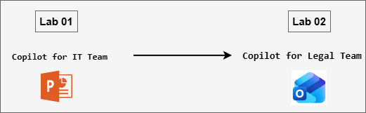
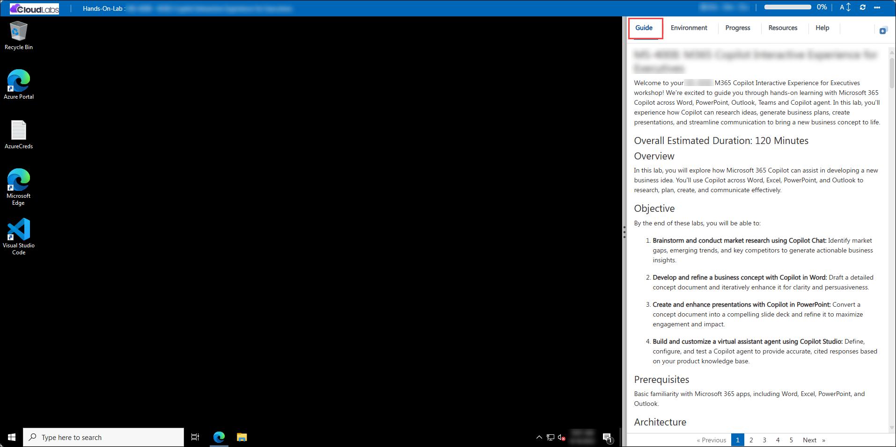
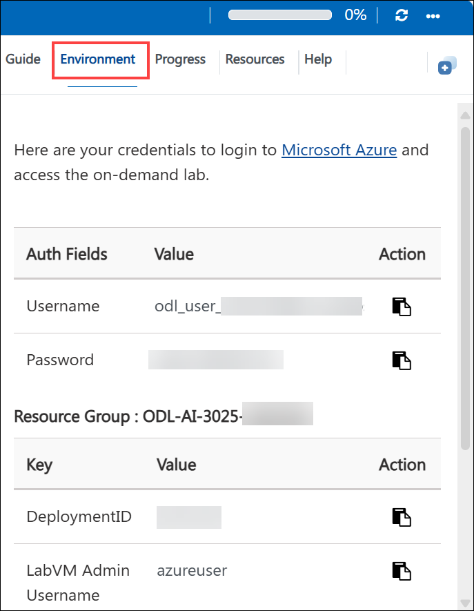
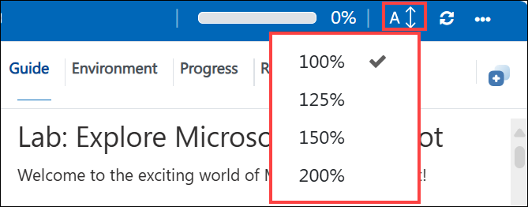
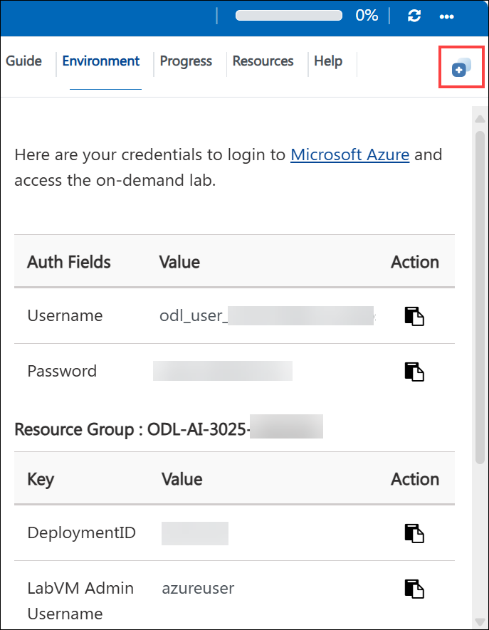
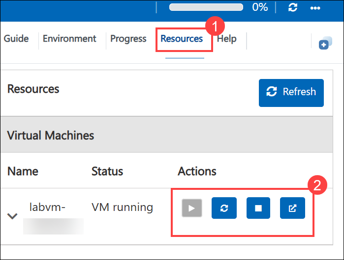
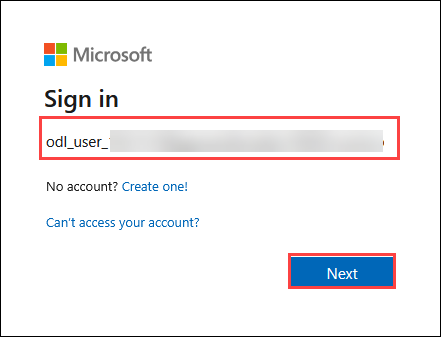
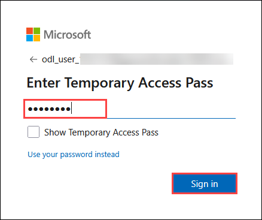
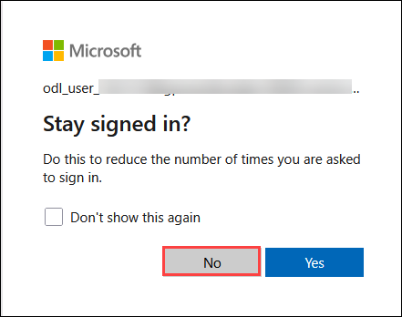

# MS-4021 : Copilot for IT and Compliance Teams

Welcome to your MS-4021: Copilot for IT and Compliance Teams workshop! In this lab, you’ll see how Copilot can streamline technical project management in an enterprise environment. You’ll work across Copilot Chat, Word, and PowerPoint to design and document the deployment of a new network security product.

### Overall Estimated Duration: 75 Minutes

## Lab Overview

In this lab, you’ll explore how Microsoft 365 Copilot supports IT and Legal professionals in managing complex projects and regulatory analysis. You’ll use Copilot across Chat, Word, PowerPoint, and Outlook to plan and document an IT product deployment, evaluate compliance with emerging AI regulations, generate executive summaries, and communicate recommendations effectively. The lab demonstrates how Copilot streamlines planning, documentation, and communication across technical and legal workflows.

## Lab Objectives

By the end of these labs, you will be able to:

- **Develop structured IT project plans using Copilot Chat and Word:** Create detailed implementation plans for deploying enterprise technology solutions, including milestones, risks, timelines, and resource allocation.

- **Transform technical documentation into professional presentations using Copilot in PowerPoint:** Convert complex project plans into clear, visually engaging slide decks for executive and stakeholder communication.

- **Conduct legal and regulatory research using Copilot Chat:** Analyze emerging regulations, such as the EU AI Act, to identify compliance requirements, classify risks, and summarize key obligations.

- **Draft executive summaries and professional communications using Copilot in Word and Outlook:** Convert research findings into polished legal briefs, executive reports, and leadership-ready emails with clarity and precision.

- **Apply Microsoft 365 Copilot across multiple apps to streamline IT and legal workflows:** Move seamlessly between Chat, Word, PowerPoint, and Outlook to enhance analysis, documentation, and communication efficiency across technical and regulatory domains.

## Prerequisites

Basic understanding of Microsoft 365 apps, particularly Word, PowerPoint, Outlook, and Copilot Chat.
Familiarity with IT project planning or legal and compliance documentation will be helpful but not mandatory.

## Architecture

This lab demonstrates how Microsoft 365 Copilot integrates AI-driven assistance across Chat, Word, PowerPoint, and Outlook to enhance IT project management and legal compliance workflows.

* **Copilot Chat:** Serves as the starting point for research and planning. In the IT scenario, it helps create detailed project implementation plans; in the Legal scenario, it analyzes regulations such as the EU AI Act and summarizes key compliance requirements.

* **Copilot in Word:** Expands and refines Copilot Chat outputs into comprehensive, structured documents. It’s used to formalize IT project plans and draft executive summaries of legal findings for leadership review.

* **Copilot in PowerPoint:** Converts finalized project documentation into professional presentations, automatically generating slides, layouts, and speaker notes for stakeholder communication.

* **Copilot in Outlook:** Transforms finalized reports into polished, professional emails for executive communication, summarizing assessments, next steps, and proposed actions.

## Architecture Diagram: 

## Explanation of Components

* **Copilot Chat:** Conversational AI workspace used for planning, research, and ideation. In the IT scenario, it builds detailed project implementation plans with milestones, risks, and timelines. In the Legal scenario, it analyzes regulatory frameworks like the EU AI Act to identify compliance requirements and assess risks.

* **Copilot in Word:** AI-powered document assistant that refines and structures complex content. It’s used to transform project plans or legal research outputs into comprehensive reports, executive summaries, and structured documentation ready for review or presentation.

* **Copilot in PowerPoint:** Intelligent presentation generator that converts detailed Word documents into professional slide decks. It automatically organizes content, creates speaker notes, and designs visually engaging layouts for stakeholder or leadership communication.

* **Copilot in Outlook:** Communication assistant that helps draft professional emails and summarize key points from reports. It enables concise, polished communication of project updates or legal assessments, ensuring clear alignment with executive and organizational priorities.

## Getting Started with the Lab

Welcome to your MS-4021: Copilot for IT and Compliance Teams Workshop! We've prepared a seamless environment for you to explore and learn.

## Accessing Your Lab Environment
 
Once you're ready to dive in, your virtual machine and **Guide** will be right at your fingertips within your web browser.
 

## Virtual Machine & Lab Guide
 
Your virtual machine is your workhorse throughout the workshop. The lab guide is your roadmap to success.

## Exploring Your Lab Resources
 
To get a better understanding of your lab resources and credentials, navigate to the **Environment** tab.
 

## Lab Guide Zoom In/Zoom Out
 
To adjust the zoom level for the environment page, click the **A↕: 100%** icon located next to the timer in the lab environment.

## Utilizing the Split Window Feature
 
For convenience, you can open the lab guide in a separate window by selecting the **Split Window** button from the Top right corner.
 

## Managing Your Virtual Machine
 
Feel free to **Start, Stop, or Restart (2)** your virtual machine as needed from the **Resources (1)** tab. Your experience is in your hands!
 

## Let's Get Started with Microsoft 365 Copilot Portal
 
1. On your virtual machine, click on the M365-Copilot icon as shown below:

     

2. You'll see the **Sign into Microsoft Azure** tab. Here, enter your credentials:
 
   - **Email/Username:** <inject key="AzureAdUserEmail"></inject>
 
      
 
3. Next, provide your password:
 
   - **Password:** <inject key="AzureAdUserPassword"></inject>
 
     
 
4. If prompted to **Stay signed in**, you can click **No.**

    

## Support Contact
 
The CloudLabs support team is available 24/7, 365 days a year, via email and live chat to ensure seamless assistance at any time. We offer dedicated support channels explicitly tailored for both learners and instructors, ensuring that all your needs are promptly and efficiently addressed.
 
Learner Support Contacts:
 
- Email Support: cloudlabs-support@spektrasystems.com
- Live Chat Support: https://cloudlabs.ai/labs-support

Click on **Next** from the lower right corner to move on to the next page.

   

## Happy Learning !!