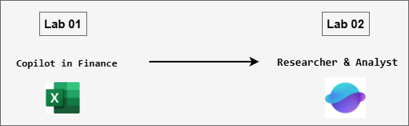

# MS-4021 : Copilot for Financial and Analytical Insights

Welcome to your MS-4021: Copilot for Financial and Analytical Insights workshop! We’re excited to guide you through hands-on learning with Microsoft 365 Copilot across Word, Excel, Copilot Chat, and built-in agents like Researcher and Analyst. In this lab, you’ll experience how Copilot can analyze financial data, generate insights, build marketing strategies, and uncover customer trends, empowering you to turn complex business challenges into informed, actionable decisions.

### Overall Estimated Duration: 1 Hour

## Overview

In this lab, you will explore how Microsoft 365 Copilot and specialized Copilot agents enhance data analysis, research, and strategic decision-making. You’ll use Copilot in Excel, Word, and Chat, along with the Researcher and Analyst agents, to analyze sales data, generate financial insights, conduct market research, and create actionable business strategies. The lab demonstrates how Copilot unifies analytics, documentation, and intelligence gathering to support informed business planning and execution.

## Objectives

By the end of these labs, you will be able to:

- **Perform data-driven financial analysis using Copilot in Excel and Word:** Analyze EV charger sales data, identify performance trends, calculate key financial metrics, and generate professional summaries and reports directly from natural language prompts.

- **Compare company performance and generate insights using Copilot Chat:** Benchmark financial outcomes against industry standards and competitors, synthesize results into executive-level summaries, and export findings into structured Word documents for reporting.

- **Develop structured marketing strategies using the Researcher agent:** Combine internal data, competitor intelligence, and web research to generate a comprehensive, well-cited marketing plan for product launches or campaigns.

- **Apply data science techniques with the Analyst agent:** Identify high-value customer segments, perform financial modeling, and create data visualizations that support strategic business decisions.

- **Integrate Microsoft 365 Copilot tools and agents for end-to-end business intelligence:** Seamlessly transition between Excel, Word, Chat, and Copilot agents to streamline analysis, research, and strategy development across finance and marketing workflows.

## Prerequisites

Basic understanding of Microsoft 365 apps, particularly Word, Excel, and Copilot Chat.
Familiarity with financial data analysis, sales reports, or basic marketing concepts will be helpful but not mandatory.

## Architecture

This lab demonstrates how Microsoft 365 Copilot and integrated Copilot agents connect workflows across Excel, Word, and Chat to drive data analysis, business insight generation, and strategic planning.

* **Copilot in Excel:** Used to analyze EV charger sales and financial data. Copilot helps calculate revenue, identify performance trends, and create visualizations, automating data interpretation and highlighting key business insights.

* **Copilot in Word:** Transforms analytical outputs from Excel or Chat into structured business reports, financial summaries, and strategy documents. It refines tone, structure, and clarity for executive communication.

* **Copilot Chat:** Serves as the intelligence layer for synthesis and strategic reasoning. It compares company performance, performs industry research, and generates executive summaries or strategic recommendations.

* **Researcher Agent:** Gathers and organizes external market intelligence, such as competitor analysis, customer trends, and industry forecasts—to support marketing and product strategy development.

* **Analyst Agent:** Applies data science techniques to segment customers, model financial performance, and visualize results, enabling data-driven decision-making and actionable business insights.

## Architecture Diagram: 

## Explanation of Components

* **Copilot in Excel:** Intelligent data analysis assistant that automates calculations, creates visualizations, and identifies trends in financial or sales data. It simplifies tasks like revenue breakdowns, performance tracking, and forecasting, turning raw data into meaningful business insights.

* **Copilot in Word:** AI-powered document assistant used to convert analytical data or research findings into clear, well-structured reports. It refines tone, improves readability, and organizes insights into professional summaries suitable for executive audiences.

* **Copilot Chat:** Conversational analysis and research tool that connects multiple sources of information. It synthesizes outputs from Word and Excel, conducts market research, compares performance across competitors, and generates executive-level recommendations or talking points.

* **Researcher Agent:** Specialized Copilot agent designed for gathering and interpreting market intelligence. It finds credible sources, summarizes trends, and builds research-backed marketing or business strategies.

* **Analyst Agent:** Focused on data-driven insights, this agent uses structured analysis techniques to segment customers, model financial outcomes, and visualize data, supporting deeper strategic and operational decisions.

## Getting Started with the Lab

Welcome to your MS-4021: Copilot for Financial and Analytical Insights Workshop! We've prepared a seamless environment for you to explore and learn.

## Accessing Your Lab Environment
 
Once you're ready to dive in, your virtual machine and **Guide** will be right at your fingertips within your web browser.
 

## Virtual Machine & Lab Guide
 
Your virtual machine is your workhorse throughout the workshop. The lab guide is your roadmap to success.

## Exploring Your Lab Resources
 
To get a better understanding of your lab resources and credentials, navigate to the **Environment** tab.
 

## Lab Guide Zoom In/Zoom Out
 
To adjust the zoom level for the environment page, click the **A↕: 100%** icon located next to the timer in the lab environment.

## Utilizing the Split Window Feature
 
For convenience, you can open the lab guide in a separate window by selecting the **Split Window** button from the Top right corner.
 

## Managing Your Virtual Machine
 
Feel free to **Start, Stop, or Restart (2)** your virtual machine as needed from the **Resources (1)** tab. Your experience is in your hands!
 

## Let's Get Started with Microsoft 365 Copilot Portal
 
1. On your virtual machine, click on the M365-Copilot icon as shown below:

     

2. You'll see the **Sign into Microsoft Azure** tab. Here, enter your credentials:
 
   - **Email/Username:** <inject key="AzureAdUserEmail"></inject>
 
      
 
3. Next, provide your password:
 
   - **Password:** <inject key="AzureAdUserPassword"></inject>
 
     
 
4. If prompted to **Stay signed in**, you can click **No.**

    

## Support Contact
 
The CloudLabs support team is available 24/7, 365 days a year, via email and live chat to ensure seamless assistance at any time. We offer dedicated support channels explicitly tailored for both learners and instructors, ensuring that all your needs are promptly and efficiently addressed.
 
Learner Support Contacts:
 
- Email Support: cloudlabs-support@spektrasystems.com
- Live Chat Support: https://cloudlabs.ai/labs-support

Click on **Next** from the lower right corner to move on to the next page.

   

## Happy Learning !!