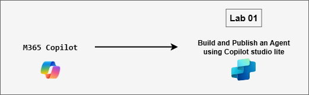

# MS-4021 : Building Custom AI Experiences with Copilot Studio

Welcome to your MS-4021: Building Custom AI Experiences with Copilot Studio workshop! We’re excited to guide you through hands-on learning with Microsoft 365 Copilot across Word, PowerPoint, Outlook, Teams, and Copilot Chat. In this lab, you’ll experience how Copilot can research business ideas, generate strategic plans, create impactful presentations, and streamline communication, helping you transform executive workflows into intelligent, efficient, and insight-driven actions.

### Overall Estimated Duration: 1 Hour

## Overview

In this lab, you will explore how Microsoft 365 Copilot and Copilot Studio Lite empower users to create, customize, and deploy their own AI-powered assistants. You’ll design a specialized Copilot agent by defining its role, tone, and purpose, then connect it to relevant business data for grounded responses. Through hands-on exercises in Word, Teams, and Copilot Chat, you’ll test, refine, and publish your custom agent, seeing firsthand how tailored Copilots can extend Microsoft 365 capabilities, automate knowledge sharing, and drive smarter collaboration across the organization.

## Objectives

By the end of this lab, you will be able to:

- **Access and navigate Copilot Studio Lite:** Launch the Copilot Studio environment and locate the tools needed to build and manage custom Copilot agents.

- **Define and customize a Copilot agent:** Specify your agent’s name, role, tone, and behavioral instructions to align with project or organizational needs.

- **Configure a knowledge-grounded agent:** Upload relevant project documents to create a connected knowledge base that enables accurate, context-aware responses.

- **Test and validate agent performance:** Interact with your custom agent to verify that it understands uploaded content, responds accurately, and maintains the defined tone and purpose.

- **Publish and share the Copilot agent across the organization:** Deploy your agent within Microsoft 365 Copilot, making it available for team collaboration, feedback, and real-world use.

- **Understand how Copilot Studio Lite supports enterprise productivity:** Learn how custom Copilot agents can enhance collaboration, automate domain-specific knowledge sharing, and extend Copilot capabilities within Microsoft 365.

## Prerequisites

Basic understanding of Microsoft 365 apps, particularly Word, Teams, and Copilot Chat.
Familiarity with conversational AI concepts, business workflows, or using Copilot for task automation will be helpful but not mandatory.

## Architecture

This lab demonstrates how Microsoft 365 Copilot and integrated Copilot agents connect workflows across Word, PowerPoint, Outlook, Teams, and Copilot Chat to streamline ideation, communication, and business planning.

* **Copilot in Word:** Assists in drafting business concepts, refining tone, and structuring detailed plans or proposals. It turns raw ideas into professional, well-organized documents ready for review or collaboration.

* **Copilot in PowerPoint:** Converts Word content or Copilot Chat insights into visually engaging presentations. It designs slides, summarizes key points, and formats layouts for executive-ready presentations.

* **Copilot in Outlook:** Simplifies communication by drafting professional emails, coordinating feedback, and scheduling project discussions. It ensures clear, consistent messaging across stakeholders.

* **Copilot in Teams:** Facilitates collaboration by summarizing meeting discussions, generating follow-up actions, and integrating insights from Word and PowerPoint into shared project channels.

* **Copilot Agent:** Acts as the central orchestrator that connects all Copilot experiences, researching market opportunities, summarizing insights, and coordinating outputs across apps to bring new business ideas to life efficiently.

## Architecture Diagram: 

## Explanation of Components

* **Copilot in Word:** AI-powered writing assistant that helps develop structured business concepts, refine tone and clarity, and organize ideas into polished documents. It’s used to draft proposals, summarize discussions, and prepare executive-ready reports.

* **Copilot in PowerPoint:** Visual storytelling companion that converts written plans or ideas into professional presentations. It designs slides, creates visuals, and ensures consistency in messaging and structure for executive presentations.

* **Copilot in Outlook:** Productivity assistant that automates communication tasks, drafting emails, summarizing threads, and coordinating meeting logistics. It keeps collaboration smooth and aligned across teams.

* **Copilot in Teams:** Collaboration-focused assistant that summarizes meetings, identifies next steps, and helps maintain context across conversations. It integrates inputs from Word, PowerPoint, and Chat to keep projects organized.

* **Copilot Chat:** Conversational hub for ideation and research. It helps brainstorm business ideas, refine strategies, and connect insights from multiple apps to form cohesive plans or presentations.

* **Copilot Agent:** Acts as an intelligent orchestrator across Microsoft 365 apps, performing research, synthesizing insights, and guiding workflows that connect content creation, communication, and decision-making.

## Getting Started with the Lab

Welcome to your MS-4021: Building Custom AI Experiences with Copilot Studio Workshop! We've prepared a seamless environment for you to explore and learn.

## Accessing Your Lab Environment
 
Once you're ready to dive in, your virtual machine and **Guide** will be right at your fingertips within your web browser.
 

### Virtual Machine & Lab Guide
 
Your virtual machine is your workhorse throughout the workshop. The lab guide is your roadmap to success.

## Exploring Your Lab Resources
 
To get a better understanding of your lab resources and credentials, navigate to the **Environment** tab.
 

## Lab Guide Zoom In/Zoom Out
 
To adjust the zoom level for the environment page, click the **A↕: 100%** icon located next to the timer in the lab environment.

## Utilizing the Split Window Feature
 
For convenience, you can open the lab guide in a separate window by selecting the **Split Window** button from the Top right corner.
 

## Managing Your Virtual Machine
 
Feel free to **Start, Stop, or Restart (2)** your virtual machine as needed from the **Resources (1)** tab. Your experience is in your hands!
 

## Let's Get Started with Microsoft 365 Copilot Portal
 
1. On your virtual machine, click on the M365-Copilot icon as shown below:

     

2. You'll see the **Sign into Microsoft Azure** tab. Here, enter your credentials:
 
   - **Email/Username:** <inject key="AzureAdUserEmail"></inject>
 
      
 
3. Next, provide your password:
 
   - **Password:** <inject key="AzureAdUserPassword"></inject>
 
     
 
4. If prompted to **Stay signed in**, you can click **No.**

    

## Support Contact
 
The CloudLabs support team is available 24/7, 365 days a year, via email and live chat to ensure seamless assistance at any time. We offer dedicated support channels explicitly tailored for both learners and instructors, ensuring that all your needs are promptly and efficiently addressed.
 
Learner Support Contacts:
 
- Email Support: cloudlabs-support@spektrasystems.com
- Live Chat Support: https://cloudlabs.ai/labs-support

Click on **Next** from the lower right corner to move on to the next page.

   

## Happy Learning !!