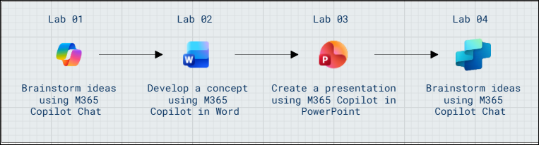

# MS-4021: M365 Copilot Interactive Experience for Executives

Welcome to your MS-4021: M365 Copilot Interactive Experience for Executives workshop! We’re excited to guide you through hands-on learning with Microsoft 365 Copilot across Word, PowerPoint, Outlook, Teams and Copilot agent. In this lab, you’ll experience how Copilot can research ideas, generate business plans, create presentations, and streamline communication to bring a new business concept to life.

## Overall Estimated Duration: 120 Minutes

## Lab Overview

In this lab, you will explore how Microsoft 365 Copilot can assist in developing a new business idea. You’ll use Copilot across Word, Excel, PowerPoint, and Outlook to research, plan, create, and communicate effectively.

## Lab Objectives 

By the end of these labs, you will be able to:

- **Brainstorm and conduct market research using Copilot Chat:** Identify market gaps, emerging trends, and key competitors to generate actionable business insights.

- **Develop and refine a business concept with Copilot in Word:** Draft a detailed concept document and iteratively enhance it for clarity and persuasiveness.

- **Create and enhance presentations with Copilot in PowerPoint:** Convert a concept document into a compelling slide deck and refine it to maximize engagement and impact.

## Prerequisites 

Basic familiarity with Microsoft 365 apps, including Word, Excel, PowerPoint, and Outlook.

## Architecture

The lab workflow demonstrates how Microsoft 365 Copilot orchestrates AI-powered productivity across multiple applications to support business ideation and execution:

- **Copilot Chat:** Facilitates brainstorming and market research by generating insights, identifying industry gaps, and researching competitors. Findings are exported to Word for further analysis.

- **Copilot in Word:** Assists in drafting and refining a comprehensive business concept document. Copilot iteratively enhances clarity, persuasiveness, and structure based on user prompts and prior research.

- **Copilot in PowerPoint:** Transforms the concept document into a professional presentation. Copilot automates slide creation, suggests optimal order, and adds content to improve engagement and address challenges.

## Architecture Diagram: 

   

## Explanation of Components

- **Copilot Chat:** AI-powered chat interface for brainstorming ideas, conducting market research, and generating strategic insights. Enables users to identify industry gaps, research competitors, and export findings for further analysis.

- **Copilot in Word:** Document creation and refinement tool that leverages Copilot to draft, edit, and polish business concept documents. Supports iterative enhancement for clarity, persuasiveness, and professional appeal.

- **Copilot in PowerPoint:** Presentation builder that transforms concept documents into structured slide decks. Copilot automates slide generation, suggests optimal order, and adds content to improve engagement and address business challenges.

## Getting Started with the Lab

Welcome to your MS-4021: M365 Copilot Interactive Experience for Executives Workshop! We've prepared a seamless environment for you to explore and learn.

## Accessing Your Lab Environment
 
Once you're ready to dive in, your virtual machine and **Guide** will be right at your fingertips within your web browser.
 

## Virtual Machine & Lab Guide
 
Your virtual machine is your workhorse throughout the workshop. The lab guide is your roadmap to success.

## Exploring Your Lab Resources
 
To get a better understanding of your lab resources and credentials, navigate to the **Environment** tab.
 

## Lab Guide Zoom In/Zoom Out
 
To adjust the zoom level for the environment page, click the **A↕: 100%** icon located next to the timer in the lab environment.

## Utilizing the Split Window Feature
 
For convenience, you can open the lab guide in a separate window by selecting the **Split Window** button from the Top right corner.
 

## Managing Your Virtual Machine
 
Feel free to **Start, Stop, or Restart (2)** your virtual machine as needed from the **Resources (1)** tab. Your experience is in your hands!
 

## Let's Get Started with Microsoft 365 Copilot Portal
 
1. On your virtual machine, click on the M365-Copilot icon as shown below:

     

2. You'll see the **Sign into Microsoft Azure** tab. Here, enter your credentials:
 
   - **Email/Username:** <inject key="AzureAdUserEmail"></inject>
 
      
 
3. Next, provide your password:
 
   - **Password:** <inject key="AzureAdUserPassword"></inject>
 
     
 
4. If prompted to **Stay signed in**, you can click **No.**

    

## Support Contact
 
The CloudLabs support team is available 24/7, 365 days a year, via email and live chat to ensure seamless assistance at any time. We offer dedicated support channels explicitly tailored for both learners and instructors, ensuring that all your needs are promptly and efficiently addressed.
 
Learner Support Contacts:
 
- Email Support: cloudlabs-support@spektrasystems.com
- Live Chat Support: https://cloudlabs.ai/labs-support

Click on **Next** from the lower right corner to move on to the next page.

   

## Happy Learning !!