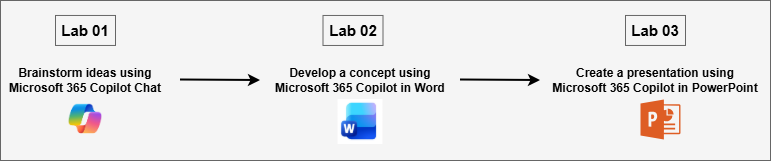

# MS-4021: M365 Copilot Interactive Experience for Executives

Welcome to your MS-4021: M365 Copilot Interactive Experience for Executives workshop! We’re excited to guide you through hands-on learning with Microsoft 365 Copilot across Word, PowerPoint, Outlook, Teams and Copilot agent. In this lab, you’ll experience how Copilot can research ideas, generate business plans, create presentations, and streamline communication to bring a new business concept to life.

## Overall Estimated Duration: 90 Minutes

## Lab Overview

In this hands-on lab, you’ll see how **Microsoft 365 Copilot** connects creativity, research, and communication across Copilot Chat, Word, and PowerPoint. You’ll start by using **Copilot Chat** to brainstorm ideas and research your target market. Then, you’ll use **Copilot in Word** to shape those insights into a clear, well-structured business concept. Finally, you’ll use **Copilot in PowerPoint** to turn that concept into a polished, professional presentation.
By the end, you’ll understand how Microsoft 365 Copilot helps you move seamlessly from idea to strategy to presentation, all within a single, connected workspace.

## Lab Objectives

By the end of these labs, you will be able to:

* **Use Copilot Chat for ideation and research:** Generate innovative business ideas, identify market opportunities, and organize research findings for further development.

* **Build and refine a concept with Copilot in Word:** Transform research insights into a structured business concept document, improving clarity, tone, and persuasiveness.

* **Design and polish a presentation with Copilot in PowerPoint:** Convert your concept document into a professional, engaging presentation ready for pitching or collaboration.

## Prerequisites

Basic familiarity with **Microsoft 365 apps**, including **Word**, **PowerPoint**, and **Copilot Chat**.
Access to a **Microsoft 365 account** with **Copilot enabled** is also required.

## Architecture

The lab workflow showcases how **Microsoft 365 Copilot** unifies AI-driven creativity and productivity across Copilot Chat, Word, and PowerPoint to turn ideas into actionable business outcomes:

* **Copilot Chat:** Acts as the starting point for brainstorming and research. It helps identify market opportunities, analyze competitors, and gather insights that shape the foundation of your business concept.

* **Copilot in Word:** Serves as the development layer where research insights are refined into a structured, compelling concept document. Copilot assists in drafting, editing, and improving clarity and tone.

* **Copilot in PowerPoint:** Functions as the presentation layer, converting the concept document into an engaging slide deck. Copilot automates slide creation, organizes flow, and enhances visuals to strengthen communication and impact.

## Architecture Diagram: 

   

## Explanation of Components

* **Copilot Chat:** The conversational workspace for ideation and research. It helps users brainstorm business ideas, explore market opportunities, analyze competitors, and summarize insights that can be exported into Word for deeper development.

* **Copilot in Word:** The document refinement environment where initial ideas are shaped into a coherent business concept. Copilot assists in drafting, reorganizing content, improving clarity and tone, and ensuring the document is concise and persuasive.

* **Copilot in PowerPoint:** The presentation design tool that converts written concepts into impactful visuals. Copilot automates slide creation, suggests structure and flow, and enriches slides with additional context to communicate ideas effectively.

## Getting Started with the Lab

Welcome to your MS-4021: M365 Copilot Interactive Experience for Executives Workshop! We've prepared a seamless environment for you to explore and learn.

## Accessing Your Lab Environment
 
Once you're ready to dive in, your virtual machine and **Guide** will be right at your fingertips within your web browser.
 

## Virtual Machine & Lab Guide
 
Your virtual machine is your workhorse throughout the workshop. The lab guide is your roadmap to success.

## Exploring Your Lab Resources
 
To get a better understanding of your lab resources and credentials, navigate to the **Environment** tab.
 

## Lab Guide Zoom In/Zoom Out
 
To adjust the zoom level for the environment page, click the **A↕: 100%** icon located next to the timer in the lab environment.

## Utilizing the Split Window Feature
 
For convenience, you can open the lab guide in a separate window by selecting the **Split Window** button from the Top right corner.
 

## Managing Your Virtual Machine
 
Feel free to **Start, Stop, or Restart (2)** your virtual machine as needed from the **Resources (1)** tab. Your experience is in your hands!
 

## Let's Get Started with Microsoft 365 Copilot Portal
 
1. On your virtual machine, click on the M365-Copilot icon as shown below:

     

2. You'll see the **Sign into Microsoft Azure** tab. Here, enter your credentials:
 
   - **Email/Username:** <inject key="AzureAdUserEmail"></inject>
 
      
 
3. Next, provide your password:
 
   - **Password:** <inject key="AzureAdUserPassword"></inject>
 
     
 
4. If prompted to **Stay signed in**, you can click **No.**

    

## Support Contact
 
The CloudLabs support team is available 24/7, 365 days a year, via email and live chat to ensure seamless assistance at any time. We offer dedicated support channels explicitly tailored for both learners and instructors, ensuring that all your needs are promptly and efficiently addressed.
 
Learner Support Contacts:
 
- Email Support: cloudlabs-support@spektrasystems.com
- Live Chat Support: https://cloudlabs.ai/labs-support

Click on **Next** from the lower right corner to move on to the next page.

   

## Happy Learning !!