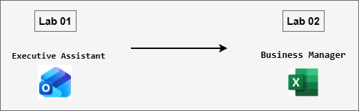

# MS-4021 : Copilot Immersion Experience

Welcome to your MS-4021: Copilot Immersion Experience workshop! In this lab, you’ll experience how Microsoft 365 Copilot works across Word, Excel, Outlook, and Copilot Chat to simplify real-world business tasks. You’ll analyze financial and sales data, summarize key insights, research industry trends, and organize executive meetings, seeing firsthand how Copilot transforms everyday workflows into efficient, insight-driven actions.

## Lab Overview

In this lab, you will explore how Microsoft 365 Copilot enhances productivity and decision-making across real business scenarios. You’ll use Copilot in Word, Excel, Chat, and Outlook to analyze company data, generate executive summaries, research industry insights, and organize professional meetings, all designed to streamline analysis, communication, and strategic planning.

## Lab Objectives

By the end of these labs, you will be able to:

- **Analyze and summarize business data using Copilot in Word and Excel:** Extract key insights from large datasets and documents, summarize critical information, and highlight trends or issues impacting business performance.

- **Generate executive-level insights and communication materials using Copilot Chat:** Refine detailed analyses into concise executive summaries, actionable talking points, and research-backed strategic recommendations.

- **Plan and organize professional meetings using Copilot in Outlook:** Automate meeting scheduling, generate structured agendas, and align discussions around financial performance, product strategy, and improvement opportunities.

- **Apply Microsoft 365 Copilot across multiple apps to streamline decision-making:** Use AI-assisted workflows to transition seamlessly between Word, Excel, Chat, and Outlook, enhancing productivity, collaboration, and strategic communication.

## Prerequisites 

Basic understanding of Microsoft 365 apps, particularly Word, Excel, Outlook, and Copilot Chat.
Familiarity with interpreting business or financial data (e.g., sales reports, meeting summaries) will be helpful but not mandatory.

## Architecture

This lab demonstrates how Microsoft 365 Copilot connects insights and workflows across Word, Excel, Copilot Chat, and Outlook to streamline executive support, data analysis, and strategic communication.

- **Copilot in Word:** Used to analyze detailed documents such as earnings call transcripts. Copilot identifies key themes, summarizes complex discussions, and extracts speaker-specific insights to prepare executive summaries and reports.

- **Copilot in Excel:** Helps analyze sales data, calculate revenue, visualize performance trends, and identify underperforming products. Copilot automates analysis across worksheets and assists in highlighting key metrics and problem areas.

- **Copilot Chat:** Acts as a research and refinement hub. It takes outputs from Word or Excel, synthesizes findings into executive summaries, performs market or trend analysis, and generates strategic talking points or questions for discussion.

- **Copilot in Outlook:** Automates meeting preparation. Copilot schedules discussions, drafts professional agendas, and ensures executives or team members are equipped with relevant insights and structured talking points.

## Architecture Diagram: 

## Explanation of Components

- **Copilot in Word:** AI-assisted document tool used to analyze and summarize large text-based files like earnings call transcripts. It identifies key insights, extracts speaker highlights, and generates structured summaries or reports tailored for executive communication.

- **Copilot in Excel:** Intelligent data analysis companion that automates calculations, visualizations, and performance summaries. It can quickly derive revenue insights, highlight underperforming products, and identify recurring customer issues without manual formulas or scripting.

- **Copilot Chat:** Conversational research and synthesis tool that helps refine data or document outputs into actionable insights. It can conduct industry research, summarize findings, generate concise executive briefings, and propose strategic questions or next steps.

- **Copilot in Outlook:** AI-driven productivity assistant that automates meeting scheduling, follow-up coordination, and agenda creation. It ensures meetings are purposeful and aligned with business priorities by drafting structured agendas and identifying discussion topics from prior analyses.

## Getting Started with the Lab

Welcome to your MS-4021 : Strategic Leadership with Microsoft Copilot Workshop! We've prepared a seamless environment for you to explore and learn.

## Accessing Your Lab Environment
 
Once you're ready to dive in, your virtual machine and **Guide** will be right at your fingertips within your web browser.
 

## Virtual Machine & Lab Guide
 
Your virtual machine is your workhorse throughout the workshop. The lab guide is your roadmap to success.

## Exploring Your Lab Resources
 
To get a better understanding of your lab resources and credentials, navigate to the **Environment** tab.
 

## Lab Guide Zoom In/Zoom Out
 
To adjust the zoom level for the environment page, click the **A↕: 100%** icon located next to the timer in the lab environment.

## Utilizing the Split Window Feature
 
For convenience, you can open the lab guide in a separate window by selecting the **Split Window** button from the Top right corner.
 

## Lab Progress

You can use the **Progress** tab to track your progress while working on the lab. A score will be provided after successful validation.

## Managing Your Virtual Machine
 
Feel free to **Start, Stop, or Restart (2)** your virtual machine as needed from the **Resources (1)** tab. Your experience is in your hands!
 

## Let's Get Started with Microsoft 365 Copilot Portal
 
1. On your virtual machine, click on the M365-Copilot icon as shown below:

     

2. You'll see the **Sign into Microsoft Azure** tab. Here, enter your credentials:
 
   - **Email/Username:** <inject key="AzureAdUserEmail"></inject>
 
      
 
3. Next, provide your password:
 
   - **Password:** <inject key="AzureAdUserPassword"></inject>
 
     
 
4. If prompted to **Stay signed in**, you can click **No.**

    

## Support Contact
 
The CloudLabs support team is available 24/7, 365 days a year, via email and live chat to ensure seamless assistance at any time. We offer dedicated support channels explicitly tailored for both learners and instructors, ensuring that all your needs are promptly and efficiently addressed.
 
Learner Support Contacts:
 
- Email Support: cloudlabs-support@spektrasystems.com
- Live Chat Support: https://cloudlabs.ai/labs-support

Click on **Next** from the lower right corner to move on to the next page.

   

## Happy Learning !!
